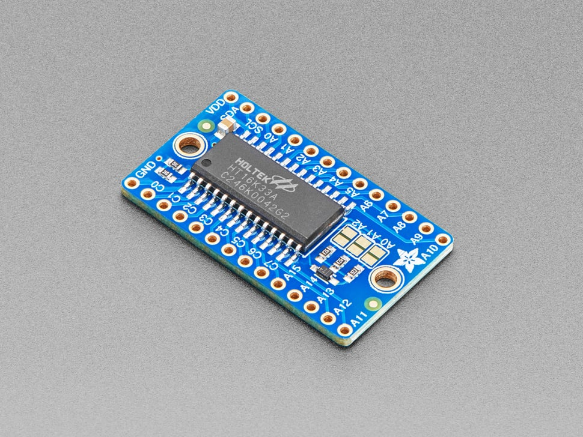
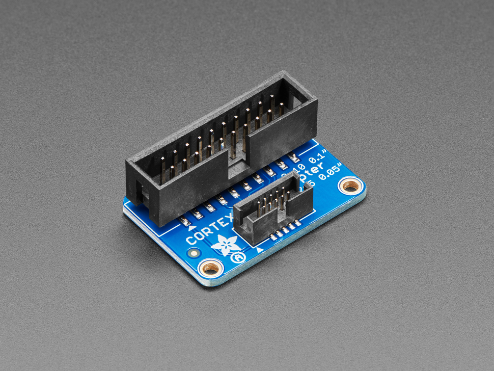
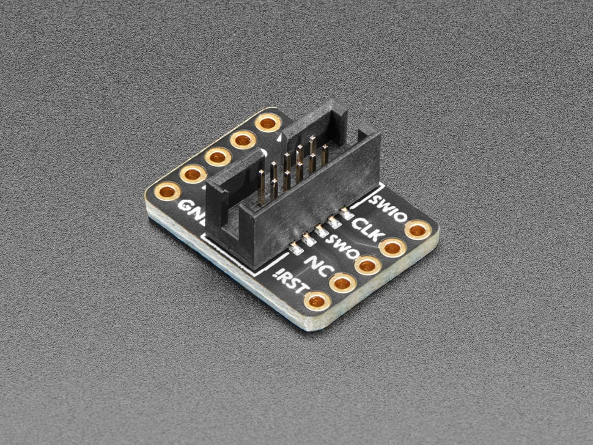
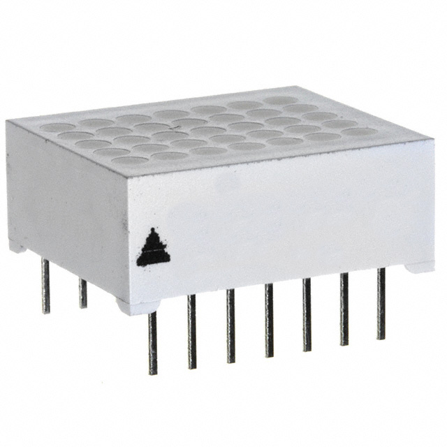
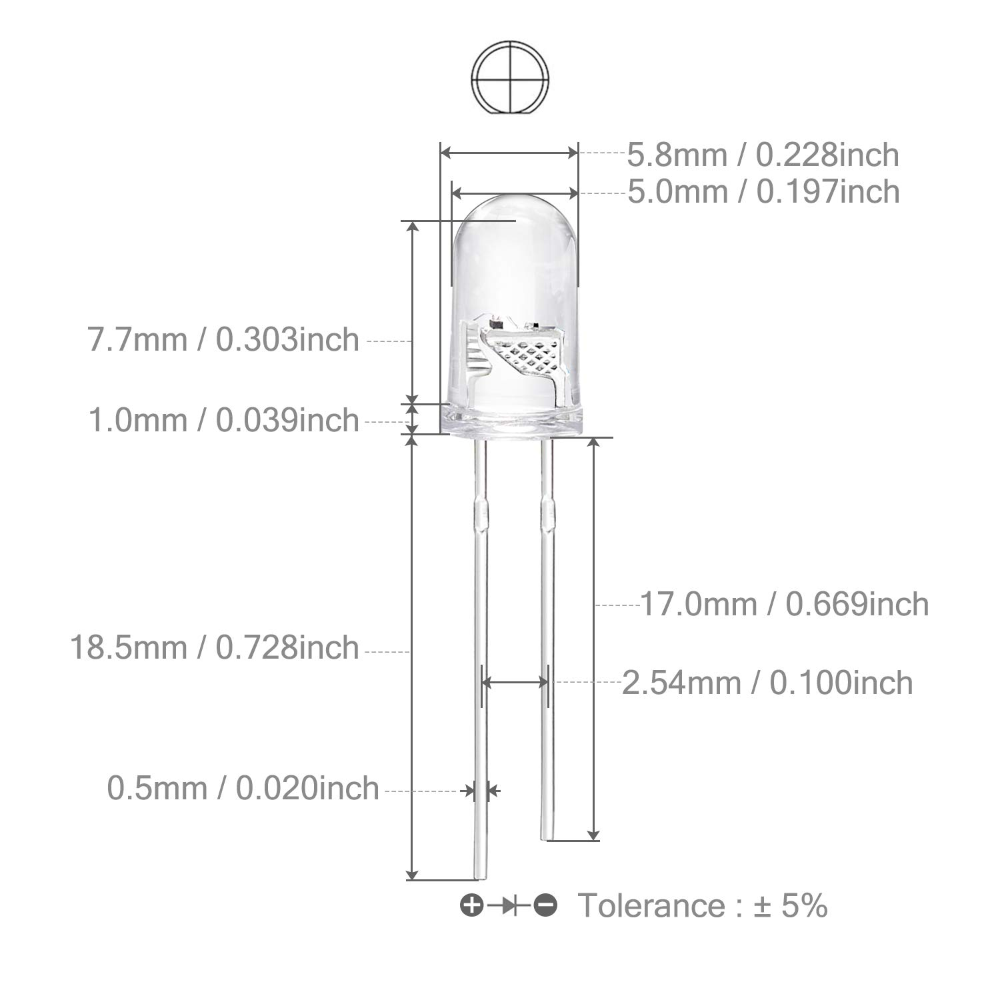
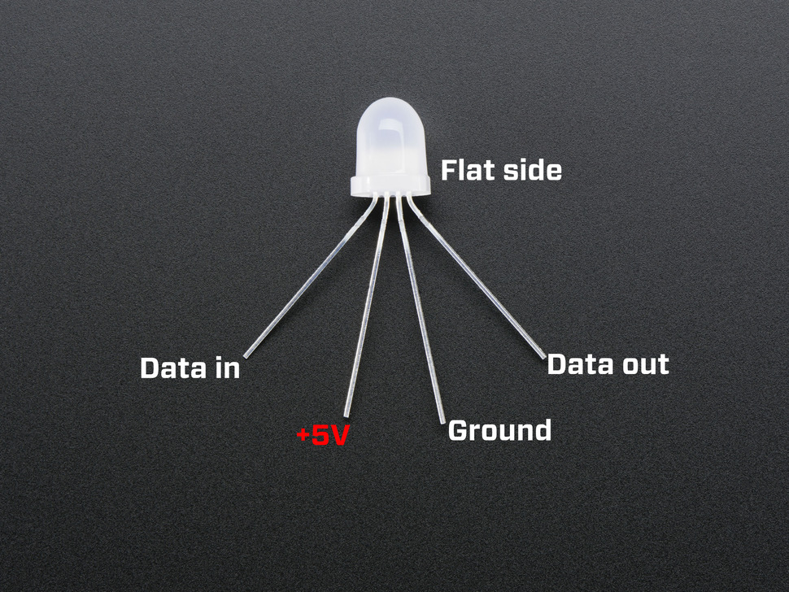
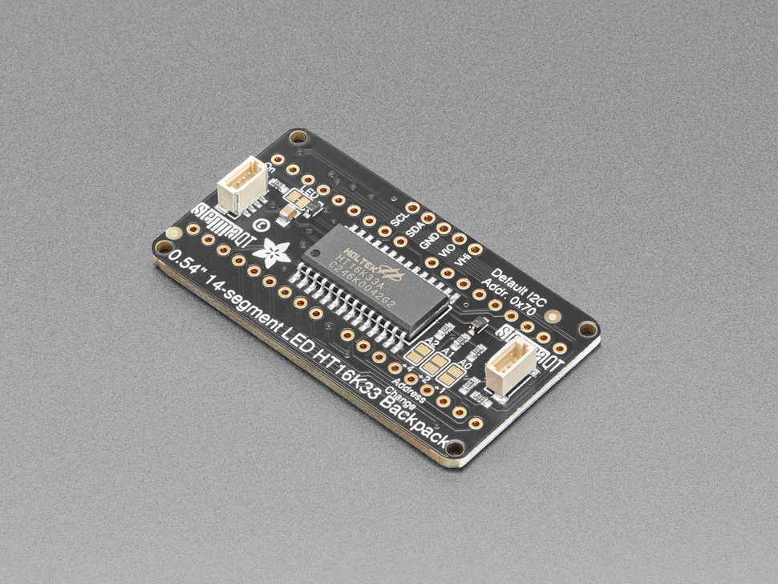

# Cabinet-1

## Bin 1

- [[empty]]

## Bin 2

- [[empty]]

## Bin 3

- [[empty]]

## Bin 4 - LED Backpacks

- Holtek HT16K33 Breakout
  - https://www.adafruit.com/product/1427
    - 

## Bin 5 - Programming / Debugging Tools

- CNV-SOP16 SOP ZOF for programming 8-pin DIP ICs
  - https://www.adafruit.com/product/1283
  - 
- JTAG (2x10 2.54mm) to SWD (2x5 1.27mm) Cable Adapter Board
  - https://www.adafruit.com/product/2094
  - 
- SWD (2x5 1.27mm) Cable Breakout Board
  - https://www.adafruit.com/product/2743
  - 
- SEGGER J-Link EDU Mini - JTAG/SWD Debugger
  - https://www.adafruit.com/product/3571
  - 
- Pomona 5253 2x3 IC Socket Adapter
  - https://www.digikey.com/en/products/detail/pomona-electronics/5253/737207
  - .jpg)

## Bin 6 - LED Displays

- LED Displays & Accessories 5x7 Super Red 0.68", 1-CHARACTER
  - https://mou.sr/3HPdlKe
  - 
- HT16K33 LED Backpack
  - https://www.adafruit.com/product/1427 similar to this

## Bin 7 - Blinking LEDs

- 5mm RGB Multicolor Slow Blinking (Multi Color Changing) LED
  - https://a.co/d/iTNaIKf
  - 

## Bin 8 - RGB LEDs

- 8mm (10mm?) large RGB LED - may be RGB or Neopixel
  - https://www.adafruit.com/product/1734
  - 

## Bin 9 - LEDs

- 5mm LED Red
- 5mm LED Blue
- 5mm LED White

## Bin 10 - Neopixel LEDs

- 5mm Neopixel RGB LED

## Bin 11 - UV & IR LEDs

- 5mm UV LED
- 5mm IR LED

## Bin 12 - LEDs

- 5mm Yellow Flicker LED
- 5mm White Flicker LED
- 3mm Rectangular Warm White LED
- 3mm Rectangular White LED

## Bin 13 - LEDs

- 5mm Yellow Flashing LED
- Adafruit LED Sequin

## Bin 14 - LED Rings

- RGB Neopixel LED Rings

## Bin 15 - Alpha Numeric Displays

- .54" 14 Segment LED HT16K33 Backpack
  - Quantity: 1
  - https://www.adafruit.com/product/2159
  - 
- Quad Alphanumeric Display - White 0.54" Digits w/ I2C Backpack - STEMMA QT / Qwiic
  - Quantity: 2
  - https://www.adafruit.com/product/2157
  - 

## Bin 16 - Featherwings

- DS3231 Precision RTC FeatherWing - RTC Add-on For Feather Boards
  - Quantity: 5
  - https://www.adafruit.com/product/3028
  - 
- Adalogger FeatherWing - RTC + SD Add-on For All Feather Boards
  - Quantity: 1
  - https://www.adafruit.com/product/2922
  - 
- Music Maker FeatherWing w/ Amp - MP3 OGG WAV MIDI Synth Player - Stereo 3W Amplifier
  - Quantity: 1
  - https://www.adafruit.com/product/3436
  - 

## Bin 17

## Bin 18

## Bin 19

## Bin 20

## Bin 21

## Bin 22

## Bin 23

## Bin 24

## Bin 25

## Bin 26

## Bin 27

## Bin 28

## Bin 29

## Bin 30

## Bin 31

## Bin 32

## Bin 33

## Bin 34

## Bin 35

## Bin 36

## Bin 37

## Bin 38

## Bin 39

## Bin 40

## Bin 41

## Bin 42

## Bin 43

## Bin 44
