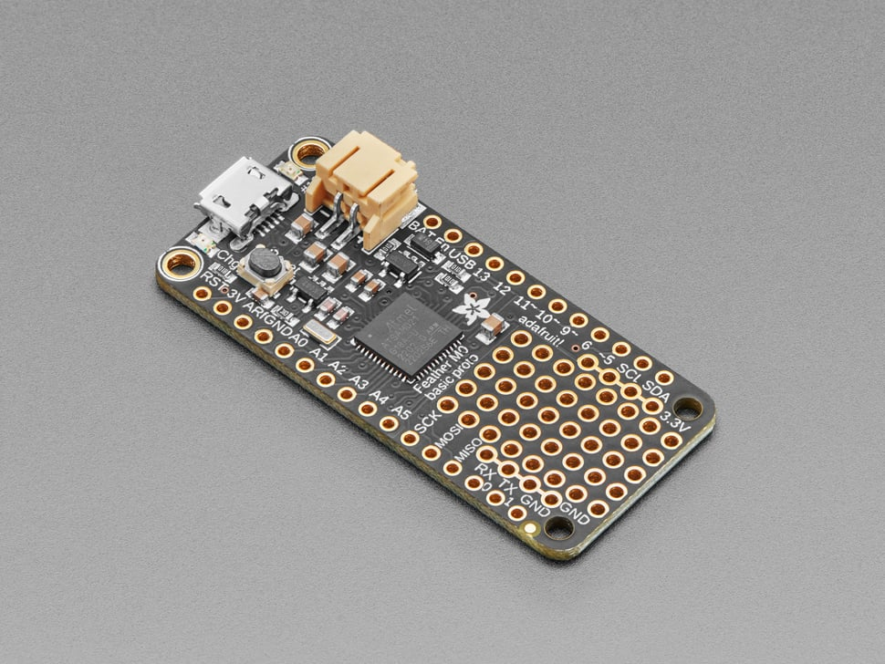

# Adafruit Feather M0 Basic Proto

## Details

- **Location**: Cabinet-1, Bin 29
- **Category**: Feather Boards
- **Type**: ATSAMD21 Development Board with Prototyping Area (Feather Form Factor)
- **Microcontroller**: ATSAMD21G18 ARM Cortex-M0+ @ 48MHz
- **Brand**: Adafruit
- **Part Number**: 2772
- **Quantity**: 1
- **Product URL**: https://www.adafruit.com/product/2772

## Description

The Adafruit Feather M0 Basic Proto features an ATSAMD21G18 ARM Cortex M0+ processor with built-in USB and includes a prototyping area for custom circuits. It's perfect for projects that need a few extra components soldered directly to the board without requiring a separate breadboard or FeatherWing.

## Specifications

- **Microcontroller**: ATSAMD21G18 @ 48MHz with 3.3V logic/power
- **Memory**: 256KB Flash, 32KB SRAM (no EEPROM)
- **GPIO Pins**: 20 total
- **ADC**: 6x 12-bit analog inputs
- **DAC**: 1x 10-bit analog output
- **PWM**: PWM outputs on all pins
- **Peripherals**: Hardware Serial, I2C, SPI support
- **USB**: Native USB support with bootloader and serial debugging
- **Power**: 3.3V regulator with 500mA peak current output
- **Clock**: 32.768 KHz crystal for clock generation & RTC
- **Special Features**: Built-in prototyping area

## Dimensions

- **Board Size**: 51mm x 23mm x 8mm (2.0" x 0.9" x 0.28")
- **Weight**: 4.6g (light as a large feather!)
- **Form Factor**: Standard Feather compatible

## Image

## Features

- Standard Feather form factor compatible with all FeatherWings
- Built-in prototyping area for custom circuits
- Native USB support with bootloader and serial debugging
- Built-in 100mA LiPoly charger with charging status LED
- Pin #13 red LED for general purpose blinking
- Real Time Clock (RTC) with 32.768 KHz crystal
- 4 mounting holes and reset button
- Power/enable pin for low-power applications
- Battery voltage monitoring through analog pin
- Arduino IDE compatible with SAMD21 core
- Same processor as Arduino Zero

## Prototyping Features

- Small prototyping area for custom components
- Perfect for adding buttons, sensors, or small circuits
- May eliminate need for separate breadboard in simple projects
- Standard 0.1" (2.54mm) hole spacing
- Connected to board power and ground

## Programming

- **Arduino IDE**: Full Arduino support with SAMD21 core
- **USB Bootloader**: Easy programming via USB
- **Native USB**: Can act as keyboard, mouse, serial device
- **CircuitPython**: Limited support (M0 Express recommended instead)

## Tags

microcontroller, atsamd21, feather, prototyping, arduino, battery-charging, adafruit, m0-basic, cortex-m0

## Notes

This board is ideal for projects that need a few extra components but don't require a full FeatherWing. The prototyping area allows for direct soldering of buttons, sensors, or small circuits. While it supports CircuitPython, the M0 Express is recommended for CircuitPython projects due to its additional SPI Flash storage. Perfect for Arduino projects requiring custom hardware integration.
