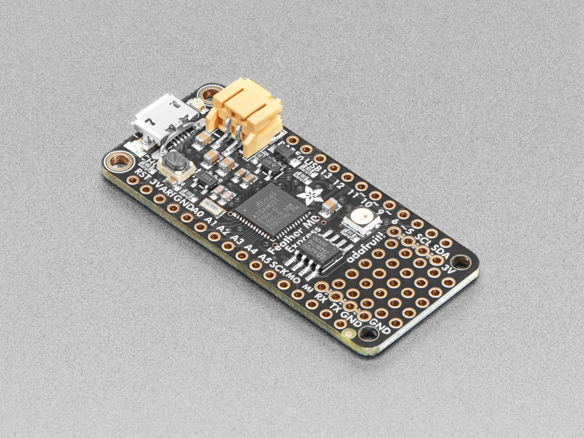

# Adafruit Feather M0 Express

## Details

- **Location**: Cabinet-1, Bin 29
- **Category**: Feather Boards
- **Type**: ATSAMD21 Development Board (Feather Form Factor)
- **Microcontroller**: ATSAMD21G18 ARM Cortex-M0+ @ 48MHz
- **Brand**: Adafruit
- **Part Number**: 3403
- **Quantity**: 3
- **Product URL**: https://www.adafruit.com/product/3403

## Description

The Adafruit Feather M0 Express features an ATSAMD21G18 ARM Cortex M0+ processor with built-in USB, making it perfect for CircuitPython and Arduino projects. It includes 2MB SPI Flash storage, a Mini NeoPixel, and prototyping space, making it an excellent choice for learning and development.

## Specifications

- **Microcontroller**: ATSAMD21G18 @ 48MHz with 3.3V logic/power
- **Memory**: 256KB Flash, 32KB SRAM (no EEPROM)
- **External Storage**: 2MB SPI Flash for CircuitPython files and data logging
- **GPIO Pins**: 20 total
- **ADC**: 6x 12-bit analog inputs
- **DAC**: 1x 10-bit analog output
- **PWM**: PWM outputs on all pins
- **Peripherals**: Hardware Serial, I2C, SPI support
- **USB**: Native USB support with UF2 bootloader
- **Power**: 3.3V regulator with 500mA peak current output
- **Clock**: 32.768 KHz crystal for clock generation & RTC

## Dimensions

- **Board Size**: 51mm x 23mm x 8mm (2.0" x 0.9" x 0.28")
- **Weight**: 5g (light as a large feather!)
- **Form Factor**: Standard Feather compatible

## Image

## Features

- Standard Feather form factor compatible with all FeatherWings
- Pre-loaded with UF2 bootloader for easy programming
- Drag-and-drop programming - appears as USB storage device
- CircuitPython support with 2MB Flash for file storage
- Arduino IDE compatible (bossa-compatible)
- Built-in 100mA LiPoly charger with charging status LED
- Pin #13 red LED for general purpose blinking
- Mini NeoPixel for colorful status indication
- Real Time Clock (RTC) with 32.768 KHz crystal
- 4 mounting holes and reset button
- Power/enable pin for low-power applications
- Small prototyping area for custom circuits

## Programming Options

- **CircuitPython**: Drag-and-drop Python programming with 2MB storage
- **Arduino IDE**: Full Arduino support with SAMD21 core
- **UF2 Bootloader**: Mass storage programming interface
- **PXT MakeCode**: Block-based programming support

## Tags

microcontroller, atsamd21, feather, circuitpython, arduino, m0-express, battery-charging, adafruit, neopixel, spi-flash, uf2

## Notes

This was Adafruit's first board designed specifically for CircuitPython, though newer boards like the M4 series offer better performance. The 2MB SPI Flash acts as storage for CircuitPython scripts and libraries, or can be used as a tiny hard drive in Arduino projects. The UF2 bootloader makes programming incredibly easy - just drag firmware files to the board. Perfect for beginners learning CircuitPython or Arduino programming.
