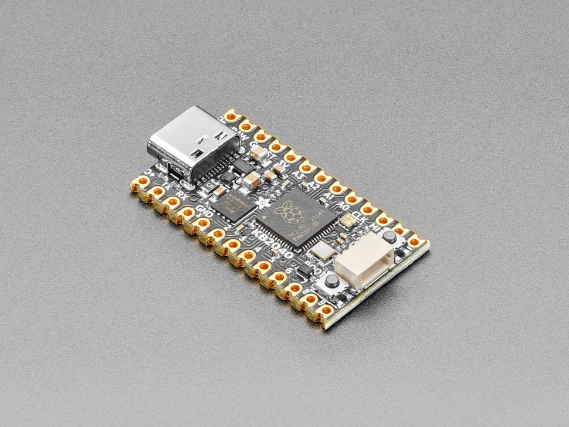

# Adafruit KB2040 - RP2040 Kee Boar Driver

## Details

- **Location**: Cabinet-1, Bin 32
- **Category**: Microcontroller Boards
- **Type**: RP2040 Development Board (Pro Micro Compatible)
- **Microcontroller**: RP2040 (Dual ARM Cortex-M0+ @ 125MHz)
- **Brand**: Adafruit
- **Part Number**: 5302
- **Quantity**: 6
- **Product URL**: https://www.adafruit.com/product/5302

## Description

A wild Kee Boar appears! The KB2040 is an Arduino Pro Micro-shaped board designed specifically for keyboard builds with the RP2040 microcontroller. Perfect for mechanical keyboard enthusiasts who want to use CircuitPython for their keeb builds. Features the same size and form-factor as a Pro Micro breakout with nearly-identical pinout.

## Specifications

- **Microcontroller**: RP2040 32-bit Cortex M0+ dual core @ ~125 MHz
- **Logic/Power**: 3.3V
- **Memory**: 264 KB RAM, 8 MB SPI FLASH, No EEPROM
- **Crystal**: 12 MHz for perfect timing
- **GPIO Pins**: 20 total (18 on castellated/pin breakout pads, 2 on QT port)
- **ADC**: Four 12-bit ADCs
- **Peripherals**: Two I2C, Two SPI, Two UART
- **PWM**: 16 PWM outputs
- **USB**: USB Type C connector with built-in ROM bootloader
- **Regulator**: 3.3V with 500mA peak current output
- **Special Features**: RGB NeoPixel, Boot button, Reset button

## Dimensions

- **Board Size**: 35.0mm x 17.8mm x 4.9mm (1.4" x 0.7" x 0.2")
- **Weight**: 2.8g (0.1oz)
- **Form Factor**: Pro Micro compatible

## Image

## Features

- Pro Micro-compatible form factor and pinout
- STEMMA QT connector compatible with SparkFun Qwiic
- RGB NeoPixel for status indication
- Both Reset and Bootloader select buttons
- Extra D+ and D- breakouts for alternative USB connections
- RAW output for powering NeoPixels or other 5V devices
- Jumper for skipping 500mA fuse (up to 2A from USB)
- Castellated pads for direct PCB mounting
- Perfect for keyboard matrices up to 100 keys or 5x15 layouts

## Tags

microcontroller, rp2040, kb2040, kee-boar, pro-micro-compatible, stemma-qt, usb-c, adafruit, keyboard, circuitpython, neopixel

## Notes

Ideal for mechanical keyboard builds and CircuitPython projects. The board comes in different colors (black, purple, pink) depending on production batch. May come with different regulators due to parts shortages but maintains at least 500mA capability.
