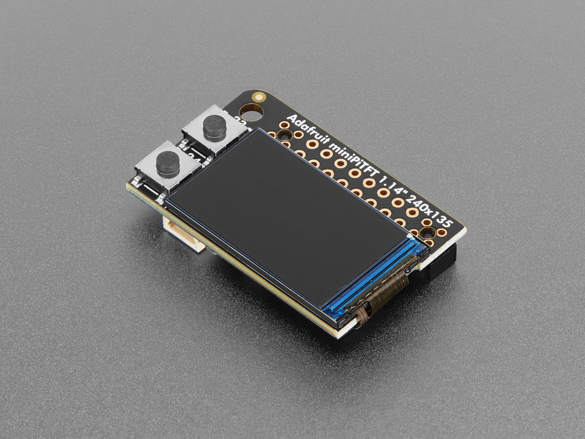

# Adafruit Mini PiTFT - 135x240 Color TFT Add-on for Raspberry Pi

## Details
- **Location**: Cabinet-1, Bin 21
- **Category**: TFT Displays
- **Type**: Color TFT Display Module
- **Size**: 1.14 inch diagonal
- **Resolution**: 135x240 pixels
- **Quantity**: 1
- **Product URL**: https://www.adafruit.com/product/4393

## Description
Adafruit Mini PiTFT is a compact full-color TFT display designed specifically for Raspberry Pi computers. Features a 240x135 pixel IPS display with excellent visibility at all angles, two tactile buttons, and a STEMMA QT connector for easy sensor integration.

## Specifications
- **Display Size**: 1.14 inch diagonal
- **Resolution**: 240x135 pixels (landscape orientation)
- **Driver IC**: ST7789
- **Interface**: SPI (Serial Peripheral Interface)
- **Display Type**: IPS TFT (In-Plane Switching)
- **Colors**: Full color (16-bit, 65K colors)
- **Operating Voltage**: 3.3V to 5V
- **Current Consumption**: ~50mA (typical)
- **Viewing Angle**: Wide angle IPS technology
- **Update Rate**: ~15 FPS
- **Dimensions**: 38.6mm x 24.5mm x 7.6mm

## Image

## Features
- **Full Color Display**: 16-bit color depth with 65K colors
- **IPS Technology**: Excellent viewing angles and contrast
- **Compact Design**: Perfect for Raspberry Pi Zero projects
- **Pre-assembled**: Comes completely assembled and tested
- **Two Tactile Buttons**: GPIO-connected buttons for user interface
- **STEMMA QT Connector**: I2C connector for easy sensor integration
- **Fast SPI Interface**: High-speed display updates
- **Raspberry Pi HAT**: Direct plug-in compatibility

## Pinout & Connections
- **SPI Interface**: Uses Raspberry Pi SPI port
- **GPIO Buttons**: Two tactile buttons on GPIO pins
- **STEMMA QT**: I2C connector (Qwiic compatible)
- **Power**: Powered directly from Raspberry Pi
- **40-pin Header**: Standard Raspberry Pi GPIO connection

## Applications
- Raspberry Pi status displays
- IoT device interfaces
- Portable Pi projects
- Data visualization
- System monitoring
- Weather stations
- Digital photo frames
- Retro gaming displays
- Industrial control panels
- Educational projects

## Compatibility
- **Raspberry Pi**: All models (Zero, 3, 4, 5, etc.)
- **Operating Systems**: Raspberry Pi OS, Ubuntu, etc.
- **Programming**: Python, C/C++
- **Libraries**: Adafruit CircuitPython, PIL/Pillow
- **Kernel Driver**: ST7789 driver support

## Software Support
- **Python Library**: Adafruit CircuitPython DisplayIO
- **Kernel Driver**: Built-in ST7789 support
- **Console Output**: Can be used as system console
- **Graphics**: PIL/Pillow imaging library support
- **Examples**: Extensive Adafruit learning guides

## Interface Requirements
- **SPI Connection**: Uses Pi's hardware SPI
- **Power Supply**: Powered from Pi's 3.3V/5V rails
- **GPIO Pins**: Minimal pin usage, leaves most pins free
- **No External Power**: Powered directly from Raspberry Pi

## Notes
- **Pre-assembled**: No soldering required
- **IPS Display**: Superior viewing angles compared to TN displays
- **Fast Updates**: 15 FPS update rate for animations
- **Compact Size**: Ideal for portable projects
- **Button Interface**: Two buttons for simple user interaction
- **STEMMA QT**: Easy expansion with I2C sensors

## Usage Tips
- Install Adafruit's Python libraries for easy setup
- Can be configured as console output for system messages
- Use PIL/Pillow for custom graphics and animations
- STEMMA QT connector allows easy sensor integration
- Buttons can be used for navigation or control

## Programming Examples
- System status display
- Weather information display
- Sensor data visualization
- Simple menu systems
- Image slideshow
- Real-time data monitoring

## Comparison with OLED Displays
- **Color vs Monochrome**: Full color vs single color OLED
- **Size**: Larger than typical OLED modules
- **Interface**: SPI vs I2C
- **Power**: Higher power consumption than OLED
- **Brightness**: Better visibility in bright conditions

## Included Components
- Mini PiTFT display module
- Pre-installed on PCB (no assembly required)
- Two tactile buttons
- STEMMA QT connector

## Tags
tft-display, spi, st7789, color, raspberry-pi, adafruit, pitft, stemma-qt
