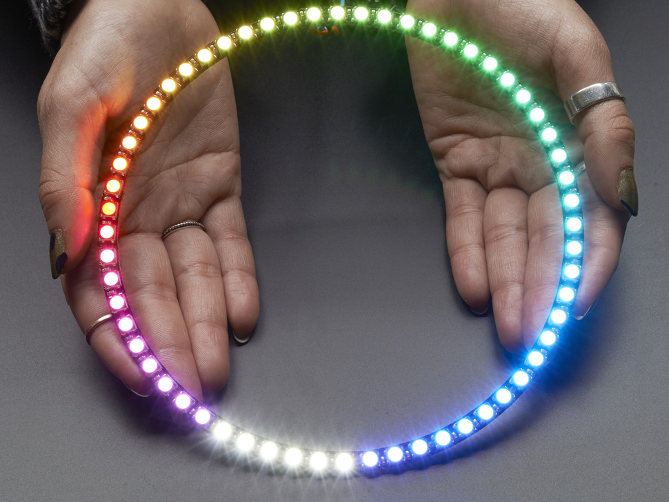

# Adafruit NeoPixel 1/4 60 Ring - 15x RGBW LEDs (Cool White)

## Details

- **Location**: Cabinet-1, Bin 33
- **Category**: Neopixel LEDs
- **Part Number**: Adafruit 2875
- **Size**: 1/4 Ring (15 LEDs)
- **Color**: RGBW (Red, Green, Blue, White - Cool White ~6000K)
- **Voltage**: 5V DC
- **Current**: 18mA per LED (270mA max for all 15 LEDs)
- **Quantity**: 8
- **Product URL**: https://www.adafruit.com/product/2875
- **DigiKey URL**: https://www.digikey.com/en/products/detail/adafruit-industries-llc/2875/5878290

## Description

This is a quarter section of a larger 60-LED NeoPixel ring featuring 15 individually addressable RGBW LEDs. Each LED contains red, green, blue, and white elements for excellent lighting effects. The white LEDs use cool white phosphor (~6000K). Four of these quarter rings can be soldered together to create a complete 60-LED ring with 6.2" outer diameter.

The NeoPixels use the SK6812 LED with integrated driver chip, allowing control of all LEDs with just one microcontroller pin using the 800 KHz protocol. Each LED can be controlled with 8-bit PWM per channel (32-bit color overall).

## Specifications

- **LED Type**: SK6812 (5050 package)
- **Supply Voltage**: 5V DC
- **Current per LED**: ~18mA constant current
- **Maximum Current**: 270mA (all 15 LEDs at full brightness)
- **PWM Frequency**: ~400 Hz
- **Protocol**: 800 KHz serial (NeoPixel compatible)
- **Interface**: Serial (Shift Register)
- **White LED Color Temperature**: Cool White (~6000K)
- **Outer Diameter** (full ring): 157mm / 6.2"
- **Inner Diameter** (full ring): 145mm / 5.7"
- **Thickness**: 3.25mm / 0.13"
- **Weight**: 4.1g per quarter section

## Image

## Applications

- Decorative lighting projects
- Wearable electronics
- Interactive art installations
- Status indicators with multiple colors
- Accent lighting for displays
- RGB+White mood lighting
- Cosplay and costume lighting
- Photography light rings (when assembled into full circle)

## Assembly Notes

- Four quarter rings can be soldered together to make a complete 60-LED ring
- Connect GND and 5V pins between all sections
- Chain DIN to DOUT for three sections, leaving one DIN as the input
- Requires NeoPixel library with RGBW support
- Standard RGB NeoPixel libraries will produce incorrect results

## Tags

neopixel, rgbw, addressable, led-ring, sk6812, cool-white, adafruit, quarter-ring, 15-led
