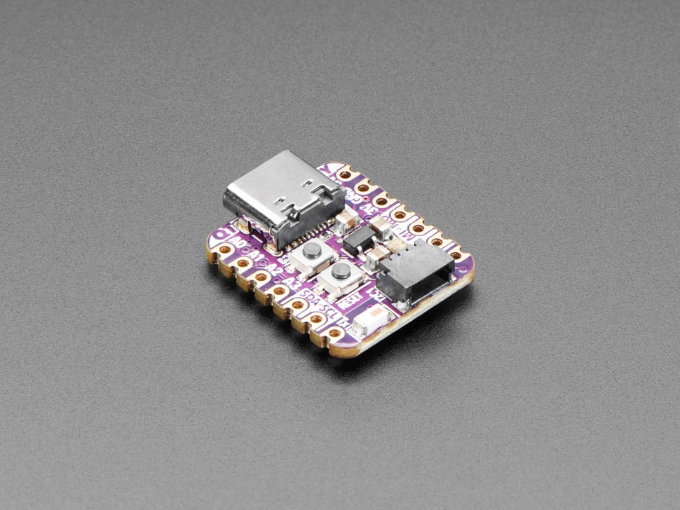

# Adafruit QT Py ESP32 Pico - WiFi Dev Board with STEMMA QT

## Details

- **Location**: Cabinet-1, Bin 26
- **Category**: Microcontroller Boards
- **Type**: WiFi & Bluetooth Development Board with STEMMA QT
- **Microcontroller**: ESP32-PICO-V3-02
- **Brand**: Adafruit
- **Part Number**: 5395
- **Quantity**: 1
- **Product URL**: https://www.adafruit.com/product/5395

## Description

The super-hero QT Py board featuring the ESP32 Pico V3 02! This thumbnail-sized PCB features an all-in-one ESP32 chip with dual-core 240MHz Tensilica processor, WiFi, Bluetooth Classic + BLE, 8MB Flash, and 2MB PSRAM. Compatible with Seeed Xiao form factor with castellated pads for direct PCB mounting.

## Specifications

- **Part Number**: 5395
- **Microcontroller**: ESP32-PICO-V3-02 (all-in-one package)
- **Architecture**: Xtensa LX6 32-bit dual-core
- **Clock Speed**: 240MHz
- **Operating Voltage**: 3.3V
- **Flash Memory**: 8MB
- **PSRAM**: 2MB
- **Dimensions**: 22.0mm x 17.9mm x 5.9mm
- **Weight**: 2.3g

## Image

## Features

- **Dual-Core ESP32**: 240MHz Tensilica processor with dual cores
- **Wireless Connectivity**: WiFi 802.11 b/g/n + Bluetooth Classic + BLE
- **All-in-One Package**: ESP32-PICO-V3-02 integrates everything in one chip
- **STEMMA QT Connector**: Plug-and-play I2C sensor connectivity
- **USB-C Connector**: Modern connector for programming and power
- **RGB NeoPixel**: Built-in addressable LED with power control
- **Xiao Compatible**: Same pinout and form factor as Seeed Xiao
- **Castellated Pads**: Can be soldered directly to PCB
- **Reset & Boot Buttons**: Easy programming and debugging

## Pin Configuration

- **Digital I/O**: 13 GPIO pins (11 on breakout, 2 on QT connector)
- **Analog Inputs**: 10 pins (12-bit ADC)
- **Analog Outputs**: 2 pins (dual 8-bit DACs on A0/A1)
- **PWM**: Available on any pin
- **I2C**: Two ports (breakout pads + STEMMA QT)
- **SPI**: Hardware SPI on high-speed peripheral pins
- **UART**: Hardware UART in addition to USB-serial
- **I2S**: Hardware I2S on any pins
- **Capacitive Touch**: 8 pins with no additional components

## Power Specifications

- **Operating Voltage**: 3.3V
- **Input Voltage**: 5V (USB-C) or up to 6V (battery pads)
- **Regulator**: 3.3V with 600mA peak output
- **Current Consumption**: 
  - Light sleep: ~4mA
  - Deep sleep: ~70µA
- **Battery Support**: Underside pads with diode protection

## Wireless Capabilities

### WiFi
- **Standards**: 802.11 b/g/n (2.4GHz)
- **Modes**: Station, Access Point, Station+AP
- **Security**: WEP, WPA, WPA2, WPA3
- **Range**: Typical indoor WiFi range

### Bluetooth
- **Classic Bluetooth**: Full Bluetooth support
- **Bluetooth Low Energy (BLE)**: Ultra-low power wireless
- **Protocols**: SPP, HID, A2DP, and more
- **Range**: Up to 10m (Class 2)

## Applications

- IoT sensor nodes with WiFi and Bluetooth connectivity
- Wireless sensor networks
- Smart home controllers
- Bluetooth audio projects
- STEMMA QT sensor networks
- Arduino WiFi/Bluetooth projects
- Portable data loggers
- Dual-wireless communication hubs

## Programming

- **Arduino IDE**: Full support with ESP32 board package
- **ESP-IDF**: Espressif development framework
- **MicroPython**: Native support
- **USB Programming**: No external programmer needed (USB-to-serial converter)
- **Libraries**: WiFi, Bluetooth, HTTP, MQTT, sensor libraries

## STEMMA QT Ecosystem

- **Plug-and-Play**: No soldering required for I2C sensors
- **Chainable**: Multiple sensors can be daisy-chained
- **Compatible**: Works with SparkFun Qwiic and Seeed Grove I2C
- **Extensive**: Large ecosystem of compatible sensors and displays

## Advantages

- **Dual-Core Performance**: More processing power than single-core variants
- **Dual Wireless**: Both WiFi and Bluetooth in one tiny package
- **All-in-One Chip**: ESP32-PICO-V3-02 integrates everything seamlessly
- **Compact Size**: Tiny form factor for space-constrained projects
- **Easy Connectivity**: STEMMA QT eliminates wiring complexity
- **Rich I/O**: Dual DACs and extensive GPIO options
- **Low Power**: Excellent for battery-powered applications

## Hardware Notes

- **USB-to-Serial**: Uses CH9102F converter (not native USB like ESP32-S2)
- **Cannot act as USB HID**: No native USB support (use Bluetooth instead)
- **Regulator**: May use different regulator than AP2112K due to supply chain
- **Driver**: Windows/Mac drivers available for CH9102F

## Comparison with Other QT Py Boards

- **vs ESP32-S2**: Dual-core + Bluetooth vs single-core + native USB
- **vs ESP32-C3**: Dual-core Xtensa vs single-core RISC-V
- **vs XIAO ESP32C3**: More flash/PSRAM, dual-core, but larger size

## Notes

- Dual-core ESP32 provides more processing power than single-core variants
- Bluetooth Classic + BLE enables rich wireless communication options
- ESP32-PICO-V3-02 is an all-in-one solution with integrated components
- 8MB Flash + 2MB PSRAM allows for complex applications
- Perfect for projects requiring both WiFi and Bluetooth connectivity
- STEMMA QT connector makes sensor integration effortless
- Compatible with Xiao ecosystem accessories

## Tags

microcontroller, esp32-pico, wifi, bluetooth, qt-py, stemma-qt, usb-c, adafruit, iot, dual-core
