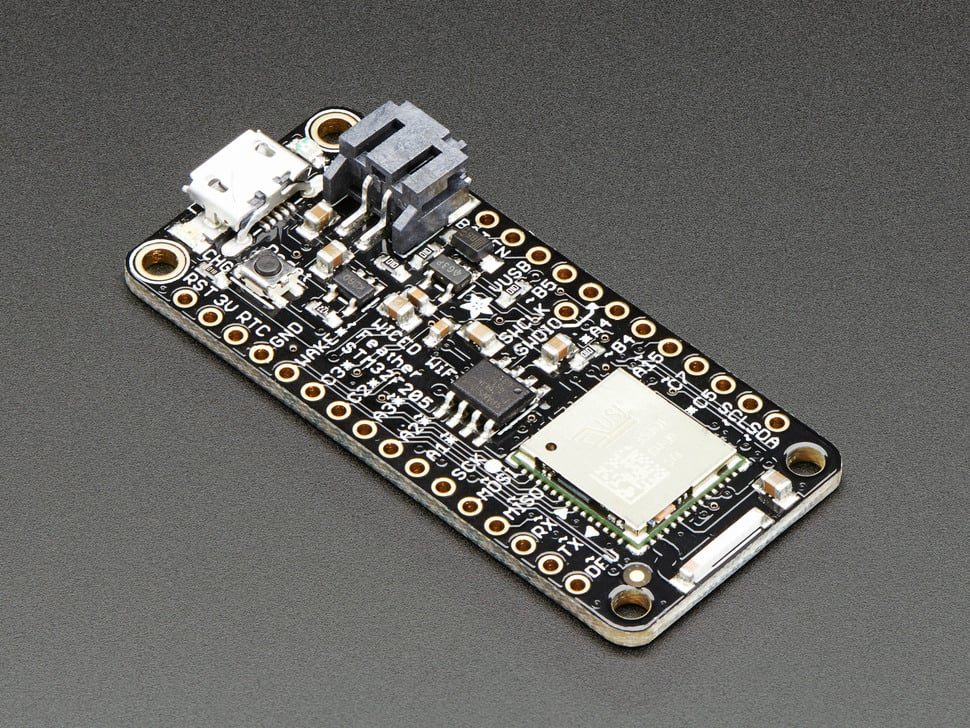

# Adafruit WICED WiFi Feather STM32F205

## Details

- **Location**: Cabinet-1, Bin 29
- **Category**: Feather Boards
- **Type**: STM32F205 Development Board with WiFi (Feather Form Factor)
- **Microcontroller**: STM32F205RG ARM Cortex-M3 @ 120MHz
- **Brand**: Adafruit
- **Part Number**: 3056
- **Quantity**: 1
- **Status**: Discontinued (replaced by ESP32 Feather)
- **Product URL**: https://www.adafruit.com/product/3056

## Description

The Adafruit WICED WiFi Feather was Adafruit's most powerful Feather board, based on Cypress (formerly Broadcom) WICED platform with STM32F205 ARM Cortex M3 processor. It featured TLS 1.2 support for secure connections and was designed for advanced WiFi projects requiring enterprise-grade security.

## Specifications

- **Microcontroller**: STM32F205RG 120MHz ARM Cortex M3 MCU
- **WiFi**: BCM43362 802.11b/g/n radio with WICED stack
- **Memory**: 128KB SRAM, 1024KB Flash (16KB SRAM, 128KB Flash for user code)
- **External Storage**: 16MBit (2MB) SPI Flash for additional data storage
- **GPIO Pins**: 12 standard GPIO pins (additional via SPI/UART/I2C)
- **ADC**: Up to 8x 12-bit analog inputs
- **DAC**: 2x 12-bit DAC outputs (Pin A4)
- **PWM**: 7 standard PWM outputs (additional via other pins)
- **Peripherals**: Hardware SPI, I2C (with clock-stretching), up to 3 UARTs
- **Security**: TLS 1.2 support for secure HTTPS and TCP connections
- **RTC**: Built-in Real Time Clock with optional external battery

## Dimensions

- **Board Size**: 51mm x 23mm x 8mm (2.0" x 0.9" x 0.28")
- **Weight**: 5.5g
- **Form Factor**: Standard Feather compatible

## Image

## Features

- Standard Feather form factor compatible with all FeatherWings
- Powerful STM32F205 ARM Cortex-M3 processor at 120MHz
- Enterprise-grade WiFi with Cypress WICED stack
- TLS 1.2 encryption for secure communications
- Built-in LiPoly charging and battery monitoring
- Real Time Clock (RTC) with external battery backup option
- Arduino IDE support with custom STM32 core
- Built-in libraries: TCP client/server, HTTP client/server, MQTT client
- AWS IoT compatibility
- Fast firmware updates over USB
- Hardware clock-stretching I2C support

## Tags

microcontroller, stm32f205, feather, wiced, wifi, cypress, broadcom, battery-charging, adafruit, arduino, tls, discontinued

## Notes

**DISCONTINUED** - This board is no longer manufactured and has been replaced by the ESP32 Feather boards. It was designed for advanced users requiring enterprise-grade WiFi security. The STM32F205 processor was more powerful than typical Arduino boards but required specialized libraries. Many AVR-specific libraries would not work with this board. This was considered a "Developer Edition" due to its advanced nature and ongoing firmware development.
