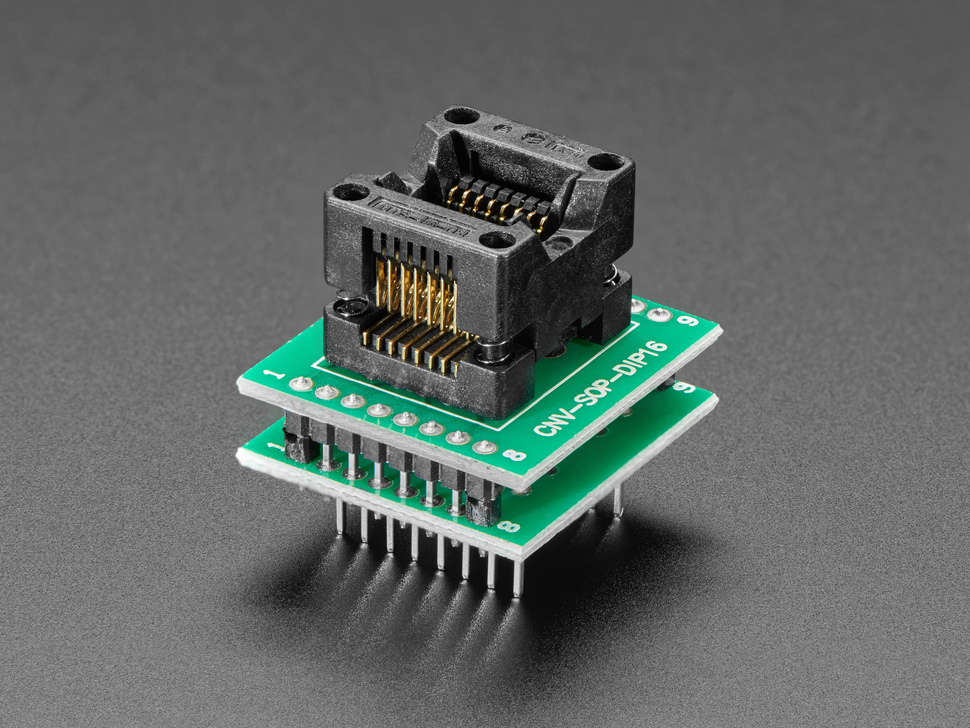

# CNV-SOP16 SOP ZOF Programming Adapter

## Details

- **Location**: Cabinet-1, Bin 5
- **Category**: Programming / Debugging Tools
- **Product URL**: https://www.adafruit.com/product/1283

## Description

CNV-SOP16 SOP ZOF adapter for programming 8-pin DIP ICs. Useful for programming surface mount chips in DIP sockets.

## Image

## Tags

#programming #adapter #sop16 #dip #adafruit
