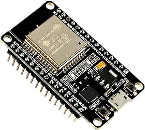

# ESP-WROOM-32 ESP32 ESP-32S Development Board

## Details

- **Location**: Cabinet-1, Bin 31
- **Category**: Development Boards
- **Type**: ESP32 Development Board
- **Microcontroller**: ESP32 (Dual Xtensa LX6 @ 240MHz)
- **Brand**: AITRIP
- **Part Number**: B07WCG1PLV
- **Quantity**: 2
- **Product URL**: https://a.co/d/ciKueeW

## Description

The ESP-WROOM-32 ESP32 ESP-32S Development Board is a 2.4GHz dual-mode WiFi + Bluetooth development board featuring dual cores microcontroller processor integrated with antenna RF AMP filter. It supports AP, STA, and AP+STA modes with ultra-low power consumption and is compatible with Arduino IDE.

## Specifications

- **Microcontroller**: ESP32 dual-core Xtensa LX6 @ up to 240MHz
- **Memory**: 520KB SRAM, 4MB Flash
- **WiFi**: 802.11 b/g/n with integrated antenna
- **Bluetooth**: Bluetooth Classic and BLE (Bluetooth Low Energy)
- **GPIO Pins**: 30 total programmable pins
- **ADC**: 12x 12-bit analog inputs
- **DAC**: 2x 8-bit digital-to-analog converters
- **Touch**: Capacitive touch GPIO pins
- **Peripherals**: I2C, SPI, UART, I2S interfaces
- **USB**: USB-Micro connector for programming and power
- **Power**: 3.3V operating voltage
- **Antenna**: Integrated PCB antenna

## Dimensions

- **Board Size**: 55mm x 28mm (2.17" x 1.10")
- **Weight**: ~10g
- **Form Factor**: Standard ESP32 DevKit compatible

## Image

## Features

- **ESP-WROOM-32 Module**: Certified wireless module with 4MB Flash
- **Dual-Core Performance**: Two Xtensa LX6 cores for multitasking
- **Dual-Mode Connectivity**: WiFi 802.11 b/g/n and Bluetooth Classic/LE
- **Integrated Antenna**: PCB antenna with RF amplifier and filter
- **Multiple Operating Modes**: AP (Access Point), STA (Station), AP+STA
- **Rich Peripherals**: Multiple communication interfaces and GPIO pins
- **Touch Interface**: Capacitive touch-enabled GPIO pins
- **Low Power**: Ultra-low power consumption with multiple sleep modes
- **Arduino Compatible**: Works with Arduino IDE and ESP-IDF

## Connectivity

- **WiFi**: 802.11 b/g/n 2.4GHz with WPA/WPA2 security
- **Bluetooth**: Bluetooth Classic and Low Energy support
- **Antenna**: Integrated PCB antenna with RF amplifier
- **Range**: Good RF performance for IoT applications

## Programming Support

- **Arduino IDE**: Full Arduino support with ESP32 core
- **ESP-IDF**: Official Espressif development framework
- **PlatformIO**: Professional IDE support
- **MicroPython**: Community support available
- **LWIP Protocol**: TCP/IP stack support
- **FreeRTOS**: Real-time operating system support

## Power Management

- **Operating Voltage**: 3.3V
- **Input Voltage**: 5V via USB-Micro
- **Power Consumption**: Ultra-low power with sleep modes
- **Sleep Modes**: Multiple low-power modes available

## Development Features

- **Boot/Reset Buttons**: Easy programming and reset functionality
- **LED Indicators**: Power and user-programmable LEDs
- **Pin Headers**: Standard 2.54mm pitch for breadboard compatibility
- **Compact Design**: Optimized for prototyping and development

## Supported Protocols

- **LWIP**: Lightweight TCP/IP stack
- **FreeRTOS**: Real-time operating system
- **WiFi Protocols**: WPA/WPA2 security
- **Bluetooth Protocols**: Classic and Low Energy profiles

## Tags

microcontroller, esp32, esp-wroom-32, wifi, bluetooth-le, bluetooth-classic, aitrip, arduino, esp-idf, dual-core, iot, development-board

## Notes

This development board is perfect for IoT projects requiring WiFi and Bluetooth connectivity. The ESP32 offers excellent performance with dual-core processing and comprehensive wireless capabilities. The integrated antenna eliminates the need for external antenna connections. Ideal for Arduino IDE development and prototyping of wireless applications. Great value for money with reliable performance.
