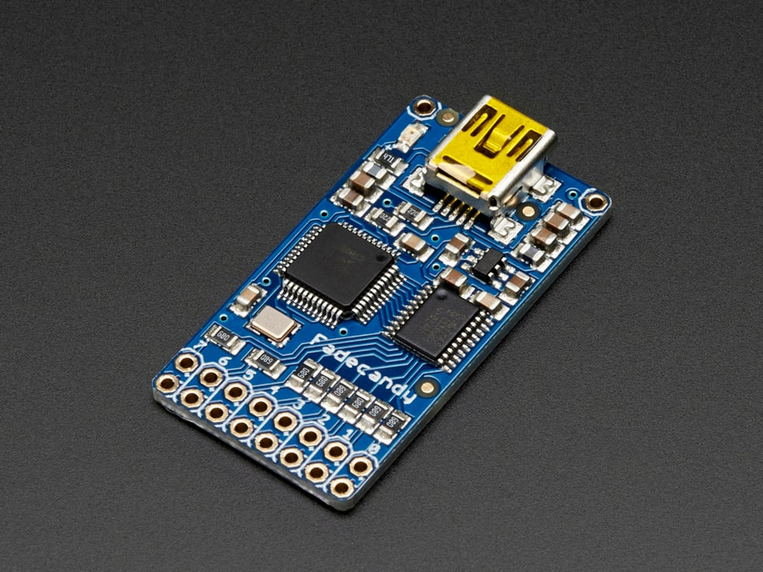

# FadeCandy - Dithering USB-Controlled Driver for RGB NeoPixels

## Details

- **Location**: Cabinet-1, Bin 28
- **Category**: Microcontroller Boards
- **Type**: USB LED Controller
- **Brand**: Adafruit (collaboration with Scanlime)
- **Part Number**: 1689
- **Quantity**: 1
- **Product URL**: https://www.adafruit.com/product/1689

## Description

USB-controlled LED driver featuring advanced dithering and color correction algorithms for high-quality LED art projects. Designed by Micah Scott (Scanlime) in collaboration with Adafruit, FadeCandy provides professional-grade LED control with built-in temporal dithering, gamma correction, and smooth color transitions. Perfect for art installations requiring subtle, high-quality lighting effects.

## Specifications

- **Part Number**: 1689
- **Maximum LEDs**: 512 total (8 channels × 64 LEDs each)
- **LED Channels**: 8 independent outputs
- **LEDs per Channel**: Up to 64 LEDs
- **Dimensions**: 20mm × 38mm
- **Weight**: 4 grams
- **Interface**: USB 2.0 Full Speed
- **Protocol**: Open Pixel Control (OPC)

## Image

## Features

- **Advanced Dithering**: Temporal dithering for smooth color gradients
- **Color Correction**: Built-in gamma correction and color temperature adjustment
- **High Quality**: Professional-grade LED control algorithms
- **USB Interface**: Simple USB connection to computer
- **Open Pixel Control**: Standard protocol for LED art projects
- **Multi-Platform**: Works with Windows, Mac, Linux, Raspberry Pi
- **Real-Time**: Low-latency LED updates for responsive effects

## LED Support

- **WS2811**: Original addressable LED protocol
- **WS2812/WS2812B**: Standard NeoPixel LEDs
- **Compatible**: Works with most WS281x-based LED strips
- **Not Compatible**: RGBW NeoPixels (RGB only)

## Software Ecosystem

- **FadeCandy Server**: Cross-platform server software
- **Open Pixel Control**: Simple network protocol for LED data
- **Python Libraries**: Easy integration with Python projects
- **Processing Support**: Works with Processing creative coding environment
- **JavaScript**: Browser-based LED control capabilities
- **Max/MSP**: Integration with Max for Live and Max/MSP

## Technical Features

- **Temporal Dithering**: Smooth color transitions without banding
- **Gamma Correction**: Perceptually linear brightness control
- **Color Temperature**: Adjustable white point correction
- **Interpolation**: Smooth transitions between colors
- **Error Diffusion**: Advanced dithering algorithms
- **Low Latency**: Optimized for real-time applications

## Hardware Details

- **USB Power**: Powered directly from USB port
- **LED Power**: LEDs require separate 5V power supply
- **Connections**: Screw terminals or pin headers (not included)
- **Isolation**: USB-isolated design for safety
- **Compact**: Small form factor for embedded installations

## Programming & Control

- **FadeCandy Server**: Receives OPC data and controls hardware
- **Network Protocol**: TCP/IP based Open Pixel Control
- **Multiple Clients**: Multiple programs can connect simultaneously
- **Language Support**: Python, Processing, JavaScript, C++, Max/MSP
- **Examples**: Extensive example code and tutorials available

## Applications

- **Art Installations**: Museum and gallery LED art pieces
- **Architectural Lighting**: Building and structure illumination
- **Stage Design**: Theater and concert LED effects
- **Interactive Displays**: Sensor-responsive LED installations
- **Prototyping**: LED effect development and testing
- **Education**: Teaching LED control and color theory

## Advantages

- **Professional Quality**: Superior color rendering and smoothness
- **Easy Integration**: Simple network protocol
- **Cross-Platform**: Works on any computer with USB
- **Battle Tested**: Used in major art installations
- **Open Source**: Hardware and software are open source
- **Community**: Active community and extensive documentation

## Kit Contents

- FadeCandy controller board
- Documentation and quick start guide
- Headers not included (available separately)

## Connection Requirements

- **Headers**: Dual pin headers needed for connections (sold separately)
- **Power**: Separate 5V power supply required for LEDs
- **USB Cable**: Standard USB A to Mini-B cable
- **LEDs**: Compatible WS2811/WS2812 LED strips or modules

## Performance

- **Update Rate**: Up to 400 Hz refresh rate
- **Latency**: Low latency for real-time applications
- **Smoothness**: Temporal dithering eliminates color banding
- **Precision**: 16-bit internal color processing
- **Stability**: Robust USB communication

## Notes

- **Discontinued**: No longer in production by Adafruit
- **Legacy Support**: Software and documentation still available
- **Headers Required**: Soldering required to attach connection headers
- **Power Considerations**: LEDs need adequate 5V power supply
- **RGB Only**: Does not support RGBW NeoPixels
- **Open Source**: Hardware designs and firmware available on GitHub

## Historical Significance

- Collaboration between Adafruit and Micah Scott (Scanlime)
- Used in the Ardent Mobile Cloud Platform at Burning Man
- Pioneered high-quality LED control techniques
- Influenced modern LED controller design
- Part of the Open Pixel Control ecosystem
