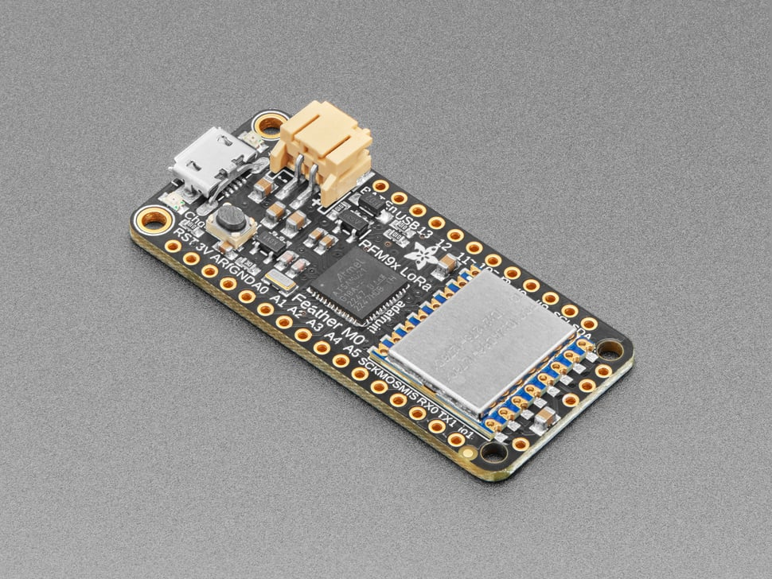

# Adafruit Feather M0 with RFM95 LoRa Radio - 900MHz - RadioFruit

## Details

- **Location**: Cabinet-1, Bin 24
- **Category**: Feather Boards
- **Type**: Wireless Microcontroller with LoRa Radio
- **Microcontroller**: ATSAMD21G18 ARM Cortex M0
- **Radio**: RFM95 LoRa 900MHz
- **Quantity**: 2
- **Product URL**: https://www.adafruit.com/product/3178

## Description

Feather M0 with built-in RFM95 LoRa radio for 900MHz (868/915MHz) long-range wireless communication. Combines the power of the ATSAMD21G18 ARM Cortex M0 processor with LoRa packet radio technology for projects requiring extended wireless range beyond WiFi or Bluetooth.

## Specifications

- **Part Number**: 3178
- **Microcontroller**: ATSAMD21G18 ARM Cortex M0
- **Clock Speed**: 48MHz
- **Operating Voltage**: 3.3V
- **Flash Memory**: 256KB (8x more than Arduino Uno)
- **RAM**: 32KB (16x more than Arduino Uno)
- **Radio**: RFM95 LoRa transceiver
- **Frequency**: 900MHz (868/915MHz configurable)
- **Dimensions**: 51mm x 23mm x 8mm (2.0" x 0.9" x 0.3")
- **Weight**: 5.8g

## Image

## Features

- **Long Range Radio**: LoRa technology for extended wireless range
- **ARM Cortex M0**: Powerful 32-bit processor at 48MHz
- **USB Native**: Built-in USB bootloader and serial debugging
- **Battery Ready**: LiPo connector and charging circuit
- **Rich I/O**: 20 GPIO pins, 8 PWM, 10 analog inputs
- **Standard Interfaces**: Hardware I2C, SPI, UART
- **Feather Compatible**: Works with all FeatherWings

## Radio Specifications

- **Technology**: LoRa (Long Range)
- **Frequency**: 868MHz or 915MHz (software selectable)
- **Power Output**: +5 to +20 dBm (up to 100mW)
- **Range**: 1.2+ miles line-of-sight with wire antennas
- **Current**: ~300µA sleep, ~120mA TX, ~40mA RX
- **Interface**: SPI to microcontroller

## Pin Configuration

- **GPIO Pins**: 20 total
- **PWM Pins**: 8 pins
- **Analog Inputs**: 10 pins (A0-A9)
- **Analog Output**: 1 pin (DAC)
- **I2C**: SDA/SCL pins
- **SPI**: MOSI/MISO/SCK pins
- **UART**: TX/RX pins
- **Power**: 3.3V, GND, EN, VBAT

## Power Management

- **Operating Voltage**: 3.3V
- **Regulator**: 500mA peak current
- **Battery**: 3.7V LiPo connector
- **Charging**: Built-in 100mA LiPo charger
- **Battery Monitor**: Analog pin for voltage monitoring
- **Auto-switching**: USB/battery power switching

## Applications

- IoT sensor networks
- Long-range telemetry
- Remote monitoring systems
- Agricultural sensors
- Environmental monitoring
- Asset tracking
- Smart city applications
- LoRaWAN gateway nodes

## Programming

- **Arduino IDE**: Full support with Feather M0 board package
- **CircuitPython**: Native support
- **Libraries**: RadioHead, LoRa, TTN libraries
- **Bootloader**: USB native bootloader
- **Debug**: Serial over USB

## Compatibility

- **FeatherWings**: Compatible with all Feather add-ons
- **Antennas**: Wire antenna or uFL connector
- **Networks**: Point-to-point or LoRaWAN
- **Protocols**: Custom or The Things Network (TTN)

## Notes

- Requires antenna for radio operation (wire or uFL)
- FCC certified LoRa module with protective metal shield
- Software-configurable frequency within 900MHz band
- Excellent for long-range, low-power wireless projects
- Can achieve 20km+ range with proper antennas and settings
- Perfect for remote sensor applications

## Tags

feather, microcontroller, lora, wireless, m0, rfm95, 900mhz, radiofruit, adafruit
