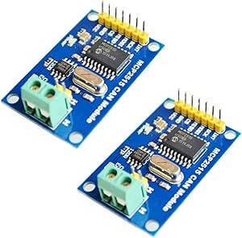

# HiLetgo MCP2515 CAN Bus Modules

## Details

- **Location**: Cabinet-2, Bin 12
- **Category**: Communication Modules
- **Brand**: HiLetgo
- **Model**: MCP2515 CAN Bus Module TJA1050
- **Quantity**: 5 modules (2-pack purchased)
- **Amazon URL**: https://a.co/d/72fPYxq

## Description

HiLetgo MCP2515 CAN Bus modules featuring the MCP2515 CAN controller and TJA1050 CAN transceiver. These modules provide an easy way to add CAN bus communication capability to Arduino and other microcontroller projects, commonly used for automotive OBD-II interfaces and industrial networking applications.

## Key Components

### MCP2515 CAN Controller
- **Function**: Stand-alone CAN controller with SPI interface
- **Manufacturer**: Microchip Technology
- **Features**:
  - Implements CAN 2.0B specification
  - SPI interface for microcontroller communication
  - Message filtering and buffering
  - Error detection and handling
  - Low power modes

### TJA1050 CAN Transceiver
- **Function**: High-speed CAN transceiver
- **Manufacturer**: NXP Semiconductors
- **Features**:
  - Physical layer interface for CAN bus
  - Differential signal transmission
  - Bus fault protection
  - Slope control for EMI reduction
  - Wide common-mode range

## Image



## Technical Specifications

### Communication Protocol
- **Standard**: CAN V2.0B specification
- **Speed**: Up to 1Mb/s communication speed
- **Frame Types**: Standard frame, extended frame, remote frame
- **Data Field**: 0 to 8-byte data field
- **Error Detection**: CRC, frame check, acknowledgment

### Electrical Characteristics
- **Power Supply**: 5V DC
- **Interface**: SPI protocol control
- **Working Current**: 5mA (1µA standby current)
- **Termination**: 120Ω termination resistors included
- **Logic Levels**: 5V compatible (3.3V with modifications)

### Physical Specifications
- **Connector**: Standard 0.1" pin headers
- **Mounting**: Breadboard compatible
- **Dimensions**: Compact PCB module format
- **Indicators**: Power LED indicator

## Applications

### Automotive Projects
- **OBD-II Interface**: Read diagnostic data from vehicles
- **ECU Communication**: Interface with engine control units
- **Vehicle Networks**: Connect to automotive CAN networks
- **Diagnostic Tools**: Build custom automotive diagnostic equipment

### Industrial Applications
- **Machine Control**: Industrial automation networks
- **Sensor Networks**: Distributed sensor systems
- **Process Control**: Manufacturing process monitoring
- **Equipment Interface**: Connect to industrial CAN devices

### Educational Projects
- **CAN Protocol Learning**: Understand automotive communication
- **Network Analysis**: Study CAN bus behavior
- **Protocol Implementation**: Learn industrial networking
- **Embedded Systems**: Microcontroller communication projects

## Arduino Compatibility

### Supported Platforms
- **Arduino Uno**: Direct 5V compatibility
- **Arduino Mega**: Full pin compatibility
- **Arduino Nano**: Compact project integration
- **ESP32**: Requires 3.3V modification (see notes)
- **ESP8266**: Requires external power and modifications

### Required Libraries
- **MCP_CAN Library**: Arduino library for MCP2515
- **CAN-BUS Shield Library**: Alternative library option
- **Custom Libraries**: Various community-developed options

### Wiring Connections
- **VCC**: 5V power supply
- **GND**: Ground connection
- **CS**: SPI Chip Select (configurable pin)
- **SO**: SPI MISO (Master In, Slave Out)
- **SI**: SPI MOSI (Master Out, Slave In)
- **SCK**: SPI Clock
- **INT**: Interrupt pin (optional)

## Usage Notes

### 5V vs 3.3V Operation
- **Native**: Designed for 5V operation
- **3.3V Modification**: Requires hardware modification for ESP32
- **Power Requirements**: May need external power for some boards
- **Logic Level**: Consider level shifters for 3.3V systems

### CAN Bus Network Requirements
- **Termination**: 120Ω resistors at both ends of bus
- **Twisted Pair**: Use proper CAN cable (twisted pair)
- **Ground**: Common ground reference required
- **Length**: Consider cable length limitations

### Common Applications Setup
- **OBD-II**: Requires OBD-II connector and proper pinout
- **Industrial**: Follow CAN bus wiring standards
- **Testing**: Use CAN bus analyzer for debugging
- **Multiple Nodes**: Each node needs unique identifier

## Programming Examples

### Basic CAN Send
```cpp
#include <mcp_can.h>
#include <SPI.h>

MCP_CAN CAN(10); // CS pin

void setup() {
  if(CAN.begin(MCP_ANY, CAN_500KBPS, MCP_16MHZ) == CAN_OK) {
    Serial.println("MCP2515 Initialized Successfully!");
  }
  CAN.setMode(MCP_NORMAL);
}

void loop() {
  byte data[8] = {0x00, 0x01, 0x02, 0x03, 0x04, 0x05, 0x06, 0x07};
  CAN.sendMsgBuf(0x123, 0, 8, data);
  delay(1000);
}
```

### Basic CAN Receive
```cpp
void loop() {
  if(CAN_MSGAVAIL == CAN.checkReceive()) {
    CAN.readMsgBuf(&rxId, &len, rxBuf);
    // Process received data
  }
}
```

## Troubleshooting

### Common Issues
- **No Communication**: Check wiring and termination
- **Power Problems**: Ensure adequate 5V supply
- **ESP32 Compatibility**: May require hardware modifications
- **Library Issues**: Use compatible CAN library versions

### Debug Tips
- **Serial Monitor**: Use for debugging messages
- **Oscilloscope**: Check CAN signal integrity
- **Multimeter**: Verify power and connections
- **CAN Analyzer**: Professional debugging tool

## Advantages

### Design Benefits
- **Complete Solution**: Controller and transceiver integrated
- **Arduino Compatible**: Easy integration with popular platforms
- **Cost Effective**: Affordable CAN bus interface solution
- **Compact**: Small form factor for embedded projects

### Technical Benefits
- **Robust Protocol**: Industrial-grade communication
- **High Speed**: Up to 1Mbps data rate
- **Error Handling**: Built-in error detection and recovery
- **Multi-Node**: Supports multiple devices on same bus

## Limitations

### Hardware Limitations
- **5V Design**: Not directly compatible with 3.3V systems
- **SPI Interface**: Requires SPI pins on microcontroller
- **External Components**: May need additional termination
- **Power Consumption**: Higher than some alternatives

### Software Limitations
- **Library Dependency**: Requires specific CAN libraries
- **Configuration**: Needs proper bit timing setup
- **Debugging**: Limited built-in diagnostic features
- **Documentation**: Some library documentation gaps

## Tags

can-bus, mcp2515, tja1050, automotive, obd2, industrial, communication, hiletgo

## Notes

These modules are excellent for learning CAN bus communication and building automotive diagnostic tools. The combination of MCP2515 controller and TJA1050 transceiver provides a complete CAN interface solution. While designed for 5V operation, they can be modified for 3.3V systems with some hardware changes. Popular for OBD-II projects and industrial automation applications.
