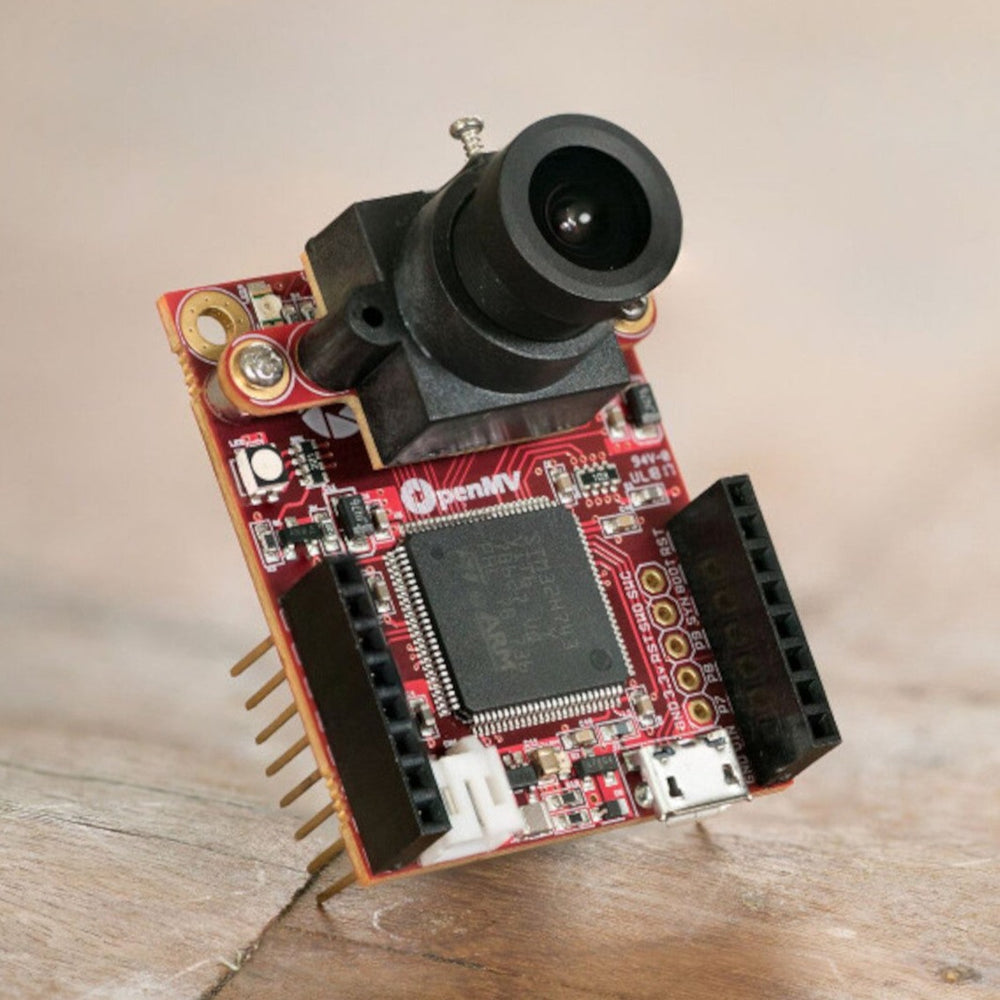
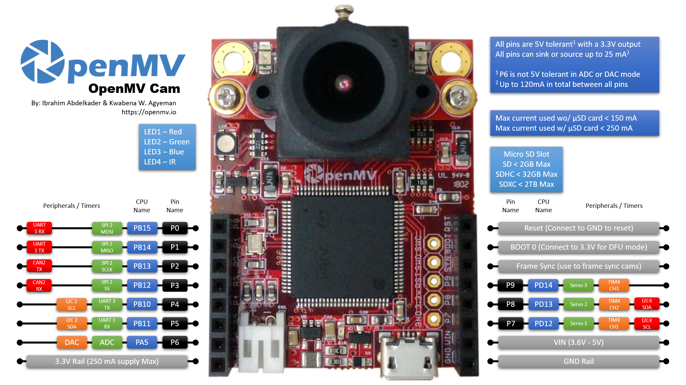

# OpenMV Cam H7 R2

High-performance machine vision camera module with Python programming support for computer vision and AI applications.

_OpenMV Cam H7 R2 - High-performance machine vision camera with STM32H7 processor_

## Overview

The OpenMV Cam H7 R2 is a small, low power microcontroller board that allows easy implementation of machine vision applications in the real world. It runs high-level Python scripts using MicroPython, making it much easier to work with complex machine vision algorithms compared to traditional C/C++ programming.

## Key Features

### Processor

- **STM32H743VI ARM Cortex-M7** running at 480 MHz
- **1MB SRAM** and **2MB Flash memory**
- **Double Precision FPU** for advanced calculations
- **Core Mark Score**: 2400 (comparable to Raspberry Pi 2: 2340)

### Memory Layout

- **1MB Total RAM**:
  - 256KB for .DATA/.BSS/Heap/Stack
  - 512KB Frame Buffer/Stack
  - 256KB DMA Buffers
- **2MB Total Flash**:
  - 128KB Bootloader
  - 128KB Embedded Flash Drive
  - 1792KB Firmware

### Camera System

- **MT9M114 Image Sensor** (included)
- **640x480 resolution** at up to 80 FPS (lower resolutions)
- **40 FPS** for resolutions above 320x240
- **2.1mm lens** on standard M12 mount (replaceable)
- **Removable camera module system** with 8-bit parallel interface

### Supported Image Formats

- **Grayscale**: 640x480 and under
- **RGB565**: 320x240 and under
- **JPEG**: 640x480 and under (both Grayscale and RGB565)
- **BAYER/YUV422** support

## I/O Interfaces

_OpenMV Cam H7 R2 Pinout Diagram - All pins are 5V tolerant with 3.3V output_

### Communication

- **Full Speed USB** (12 Mbps) - appears as Virtual COM Port and USB Flash Drive
- **μSD Card Socket** - 100 Mbps read/write capability
- **SPI Bus** - up to 80 Mbps for image streaming
- **I2C Bus** - up to 1 Mb/s
- **CAN Bus** - up to 1 Mb/s
- **Asynchronous Serial** (TX/RX) - up to 7.5 Mb/s

### Analog/Digital I/O

- **12-bit ADC** and **12-bit DAC**
- **10 I/O pins** total (all 5V tolerant, 3.3V output)
- **3 servo control pins**
- **Interrupts and PWM** on all I/O pins
- **RGB LED** and **two high-power 850nm IR LEDs**

## Power Specifications

### Power Consumption

- **Idle (no μSD)**: 110mA @ 3.3V
- **Idle (with μSD)**: 110mA @ 3.3V
- **Active (no μSD)**: 160mA @ 3.3V
- **Active (with μSD)**: 170mA @ 3.3V

### Power Input

- **VIN Range**: 3.6V to 5V
- **3.3V Rail**: Do not draw more than 250mA
- **Pin Current**: Up to 25mA per pin, 120mA total across all pins
- **LiPo Battery Connector** for 3.7V batteries

## Physical Specifications

### Dimensions

- **Length**: 45mm
- **Width**: 36mm
- **Height**: 30mm
- **Weight**: 16g

### Operating Conditions

- **Operating Temperature**: -20°C to 70°C
- **Storage Temperature**: -40°C to 125°C

## Lens Specifications

- **Max Image Circle Diameter**: 6.7mm
- **Focal Length**: 2.8mm
- **Aperture**: F2.0
- **HFOV**: 70.8°, **VFOV**: 55.6°
- **Mount**: M12×0.5 (standard, replaceable)
- **IR Cut Filter**: 650nm (removable)
- **Format**: 1/3"

## Programming and Software

### Development Environment

- **MicroPython** operating system
- **OpenMV IDE** for development
- **High-level Python scripting** instead of C/C++
- **Open source** software, firmware, and hardware

### Machine Vision Capabilities

- Object detection and tracking
- Color detection and filtering
- Line following algorithms
- Face detection
- QR code and barcode reading
- Template matching
- Feature detection

## Applications

### Primary Use Cases

- **Robotics**: Vision-guided robots, line followers
- **Industrial**: Quality control, part inspection
- **Security**: Motion detection, object recognition
- **Education**: Computer vision learning projects
- **IoT**: Smart cameras, monitoring systems
- **Automotive**: Driver assistance prototypes

### Expandability

- Compatible with various lens types via M12 mount
- Global Shutter Camera Module available separately
- FLIR Lepton Adapter Module for thermal imaging
- Various shields available (LCD, WiFi, etc.)

## Technical Notes

### Performance

- Most algorithms run at 40-80 FPS on QVGA (320x240) resolution
- Optimized for real-time machine vision processing
- Hardware acceleration for common vision tasks

### Connectivity Options

- Direct connection to Arduino via special cable
- USB connection to Raspberry Pi
- Multiple interface options (SPI, I2C, UART, USB)
- Simple communication protocols

## Storage Information

- **Location**: Cabinet 3, Bin 27
- **Quantity**: 1 unit
- **Condition**: New, unused
- **Packaging**: Original retail packaging with cables
- **Documentation**: Includes quick start guide and online resources
