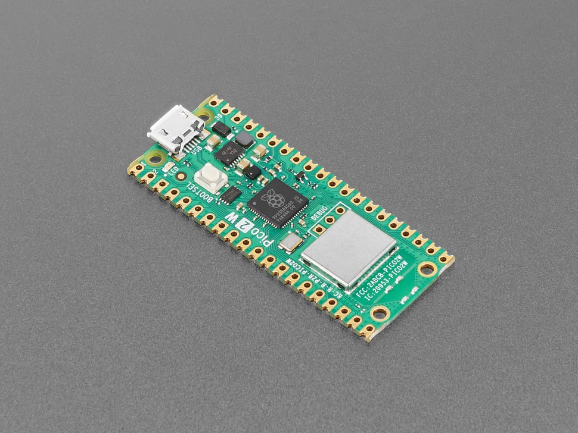

# Raspberry Pi Pico 2W

## Details

- **Location**: Cabinet-1, Bin 32
- **Category**: Microcontroller Boards
- **Type**: RP2350 Development Board with WiFi & Bluetooth (Pico Form Factor)
- **Microcontroller**: RP2350 (Dual ARM Cortex-M33 or RISC-V Hazard3 @ 150MHz)
- **Brand**: Raspberry Pi Foundation
- **Part Number**: 6087
- **Quantity**: 3
- **Product URL**: https://www.adafruit.com/product/6087

## Description

The Raspberry Pi Pico 2W is the Foundation's latest wireless microcontroller board, built on the new RP2350 chip. It features dual-architecture capability (ARM Cortex-M33 or RISC-V Hazard3), WiFi, Bluetooth LE/Classic, and significant performance improvements over the original Pico while maintaining full pin compatibility.

## Specifications

- **Microcontroller**: RP2350 dual-core @ 150MHz (ARM Cortex-M33 or RISC-V Hazard3)
- **Memory**: 520KB on-chip SRAM, 4MB on-board QSPI Flash
- **WiFi**: 802.11n single-band 2.4GHz with WPA3 support
- **Bluetooth**: Bluetooth LE and Bluetooth Classic via Infineon CYW43439
- **GPIO Pins**: 26 multi-purpose pins
- **ADC**: 4x 12-bit analog inputs
- **PWM**: 24 PWM channels
- **Peripherals**: 2x UART, 2x SPI, 2x I2C, USB 1.1 controller
- **PIO**: 3 blocks with 4 state machines each (12 total)
- **Power**: 1.8-5.5V DC input
- **Operating Temperature**: -20°C to +85°C

## Dimensions

- **Board Size**: 21mm x 51mm (0.83" x 2.0")
- **Weight**: ~3g
- **Form Factor**: Standard Pico compatible

## Image

## Features

- **Dual Architecture**: Choose between ARM Cortex-M33 or RISC-V Hazard3 cores
- **Enhanced Performance**: 2x faster than RP2040, with FPU on M33 cores
- **Expanded Memory**: 2x SRAM (520KB) and 2x Flash (4MB) vs original Pico
- **Wireless Connectivity**: WiFi 802.11n and Bluetooth LE/Classic
- **Security Features**: ARM TrustZone, signed boot, hardware TRNG, SHA-256 acceleration
- **Advanced Peripherals**: HSTX for high-speed transmission, additional PIO block
- **Pin Compatibility**: Fully compatible with original Pico and accessories
- **Soft Access Point**: Support up to 4 WiFi clients
- **Programming Options**: C/C++, CircuitPython, MicroPython, Arduino IDE

## Wireless Capabilities

- **WiFi**: 802.11n 2.4GHz with WPA3 security
- **Access Point Mode**: Support up to 4 connected clients
- **Bluetooth LE**: Low energy wireless communication
- **Bluetooth Classic**: Traditional Bluetooth connectivity
- **Antenna**: On-board antenna (licensed from ABRACON/ProAnt)

## Security Features

- ARM TrustZone for Cortex-M security architecture
- Signed boot capability
- 8KB antifuse OTP for secure key storage
- Hardware True Random Number Generator (TRNG)
- SHA-256 hardware acceleration
- Fast glitch detection

## Programming Support

- **CircuitPython/MicroPython**: Enhanced support with 4MB Flash
- **Arduino IDE**: Full Arduino compatibility
- **C/C++ SDK**: Official Raspberry Pi SDK
- **RISC-V Development**: Affordable entry into RISC-V programming

## Tags

microcontroller, rp2350, pico, raspberry-pi, wifi, bluetooth-le, bluetooth-classic, circuitpython, micropython, arduino, dual-architecture, wireless, iot

## Notes

**Important**: This board uses the A2 version of RP2350 affected by erratum E9, which impacts some GPIO and PIO uses including high-impedance inputs and internal pulldowns. Use 8.2K or smaller resistors for pulldowns if required. The Pico 2W represents a major upgrade from the original Pico with 2x performance, 2x memory, wireless connectivity, and security features while maintaining full compatibility.
