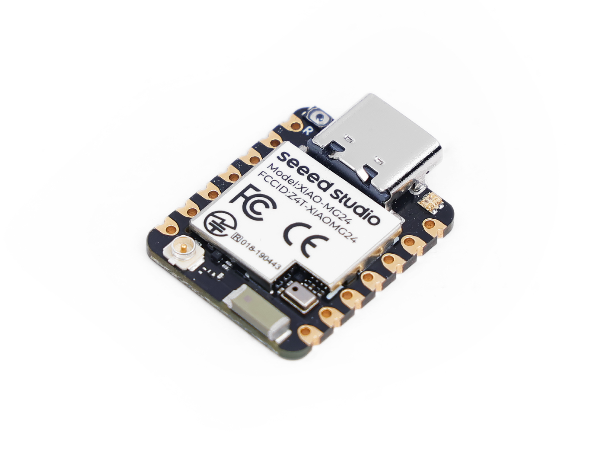

# Seeed Studio XIAO MG24 Sense

## Details

- **Location**: Cabinet-1, Bin 26
- **Category**: Microcontroller Boards
- **Type**: Matter-native Development Board with Sensors
- **Microcontroller**: Silicon Labs EFR32MG24
- **Brand**: Seeed Studio
- **Part Number**: 102010610
- **Quantity**: 1
- **Product URL**: https://www.seeedstudio.com/Seeed-XIAO-MG24-Sense-p-6248.html

## Description

Seeed Studio XIAO MG24 Sense is an ultra-low-power wireless development board based on Silicon Labs' EFR32MG24 SoC, featuring a high-performance 78MHz ARM Cortex-M33 core with built-in AI/ML hardware accelerator. It's Matter native over Thread and Bluetooth Low Energy 5.3, making it ideal for next-generation IoT applications. The Sense variant includes a 6-axis IMU and analog microphone for TinyML applications.

## Specifications

- **Part Number**: 102010610
- **Microcontroller**: Silicon Labs EFR32MG24
- **Architecture**: ARM Cortex-M33 32-bit RISC
- **Clock Speed**: 78MHz
- **Operating Voltage**: 3.3V
- **Flash Memory**: 1536KB + 4MB external
- **RAM**: 256KB
- **Dimensions**: 21.0mm x 17.8mm x 3.5mm
- **Weight**: ~2.5g

## Image

## Features

- **ARM Cortex-M33**: High-performance 78MHz processor with DSP and FPU
- **AI/ML Accelerator**: Built-in MVP (Matrix Vector Processor) for AI workloads
- **Matter Native**: Native support for Matter over Thread and Bluetooth LE
- **Ultra-Low Power**: Deep sleep as low as 1.95μA
- **Rich Connectivity**: Thread, Zigbee, Bluetooth LE 5.3, Bluetooth Mesh
- **Built-in Sensors**: 6-axis IMU (LSM6DS3TR-C) and analog microphone (MSM381ACT001)
- **Excellent RF**: +19.5dBm TX power, -105.4dBm RX sensitivity
- **Security**: Secure Vault with secure boot, encryption, tamper protection

## Pin Configuration

- **Digital I/O**: 18 GPIO pins
- **Analog Inputs**: 18 pins (12-bit 1Msps ADC)
- **PWM**: All GPIO pins support PWM
- **I2C**: 1 port
- **SPI**: 2 ports
- **UART**: 2 ports + 2 low-power UART
- **Special**: Temperature sensor, analog comparator

## Power Specifications

- **Operating Voltage**: 3.3V
- **Input Voltage**: 5V (USB-C) or 3.7V (battery)
- **Current Consumption**:
  - Normal: 6.71mA @ 3.7V
  - Sleep: 1.91mA @ 3.7V
  - Deep Sleep: 1.95μA @ 3.7V
- **Battery Charging**: 200mA charging current
- **Power Management**: Multiple ultra-low power modes

## Wireless Capabilities

### Matter & Thread
- **Matter**: Native Matter support over Thread
- **Thread**: IPv6-based mesh networking
- **Range**: 100m+ line of sight
- **Mesh**: Self-healing mesh network

### Bluetooth
- **Version**: Bluetooth LE 5.3
- **Protocols**: BLE, Bluetooth Mesh
- **Range**: Up to 10m
- **Power**: Ultra-low power operation

### Other Protocols
- **Zigbee**: PRO/Green Power protocols
- **Proprietary**: 2.4GHz custom protocols

## Built-in Sensors

### 6-Axis IMU (LSM6DS3TR-C)
- **Accelerometer**: ±2/±4/±8/±16g
- **Gyroscope**: ±125/±250/±500/±1000/±2000dps
- **Interface**: I2C/SPI
- **Features**: Motion detection, step counting

### Analog Microphone (MSM381ACT001)
- **Type**: MEMS analog microphone
- **Sensitivity**: High-quality audio capture
- **Applications**: Voice recognition, sound detection

## AI/ML Capabilities

- **MVP Accelerator**: Matrix Vector Processor for AI workloads
- **TinyML**: Optimized for machine learning inference
- **Applications**: Gesture recognition, voice commands, sensor fusion
- **Frameworks**: TensorFlow Lite Micro support

## Applications

- Matter-enabled smart home devices
- Thread mesh sensor networks
- TinyML edge AI projects
- Gesture and voice recognition
- Ultra-low power IoT sensors
- Zigbee automation systems
- Bluetooth mesh networks
- Posture detection and monitoring

## Programming

- **Arduino IDE**: Full support with Silicon Labs board package
- **Matter SDK**: Native Matter development
- **Simplicity Studio**: Silicon Labs professional IDE
- **PlatformIO**: Cross-platform development
- **TinyML**: Machine learning frameworks

## XIAO Ecosystem

- **Form Factor**: Compatible with all XIAO accessories
- **Expansion Boards**: Grove Base, Expansion Board
- **Shields**: Various XIAO-compatible shields available
- **Community**: Large XIAO developer community

## Advantages

- **Matter Native**: Future-proof IoT connectivity
- **Ultra-Low Power**: Excellent for battery applications
- **AI Acceleration**: Built-in ML processing capabilities
- **Rich Sensors**: IMU and microphone for advanced applications
- **Excellent RF**: Superior wireless performance
- **Security**: Hardware-level security features
- **Compact Size**: Smallest Matter-enabled development board

## Hardware Features

- **USB-C**: Modern connector for programming and power
- **Battery Connector**: JST connector for lithium battery
- **Reset Button**: Convenient program restart
- **User LED**: Built-in status indicator
- **Charging LED**: Battery charging status indicator

## Comparison with Other XIAO Boards

- **vs ESP32S3**: Matter/Thread vs WiFi/Bluetooth, AI accelerator
- **vs ESP32C3**: ARM vs RISC-V, Matter native, built-in sensors
- **vs SAMD21**: Wireless connectivity vs USB native, AI capabilities

## Notes

- First XIAO board with native Matter support
- ARM Cortex-M33 with hardware AI acceleration
- Built-in sensors make it perfect for TinyML applications
- Ultra-low power consumption ideal for battery projects
- Matter over Thread enables interoperable smart home devices
- Compatible with XIAO ecosystem accessories
- Excellent for learning Matter and Thread protocols
- Perfect for next-generation IoT applications

## Tags

microcontroller, mg24, matter, thread, zigbee, bluetooth, xiao, seeed, ultra-low-power, tinyml, ai, imu, microphone
