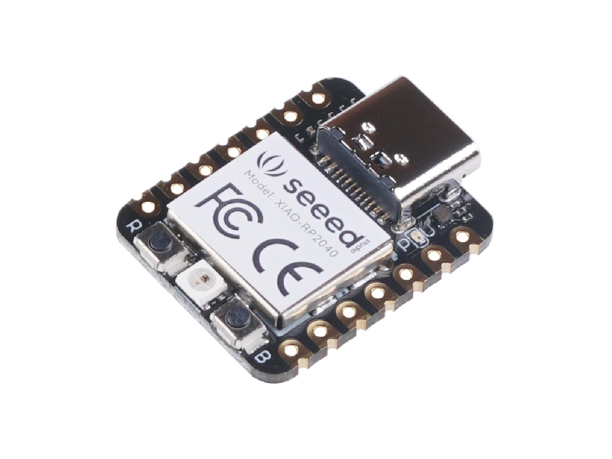

# Seeed Studio XIAO RP2040

## Details

- **Location**: Cabinet-1, Bin 32
- **Category**: Microcontroller Boards
- **Type**: RP2040 Development Board (XIAO Form Factor)
- **Microcontroller**: RP2040 (Dual ARM Cortex-M0+ @ 133MHz)
- **Brand**: Seeed Studio
- **Part Number**: 102010428
- **Quantity**: 1
- **Product URL**: https://wiki.seeedstudio.com/XIAO-RP2040/

## Description

The Seeed Studio XIAO RP2040 is as small as the Seeed Studio XIAO SAMD21 but more powerful. It carries the powerful dual-core RP2040 processor with flexible clock running up to 133 MHz. Despite its tiny thumb-sized form factor (21x17.8mm), it packs 264KB of SRAM and 2MB of on-board Flash memory, making it perfect for wearable devices and small projects.

## Specifications

- **Microcontroller**: Dual-core ARM Cortex M0+ processor up to 133MHz
- **Logic/Power**: 3.3V (5V tolerant via VIN pin)
- **Memory**: 264KB SRAM, 2MB Flash memory
- **GPIO Pins**: 14 total (11 digital, 4 analog)
- **ADC**: 4x 12-bit ADC channels
- **Peripherals**: 1x I2C, 1x SPI, 1x UART, 1x SWD
- **PWM**: 11 PWM pins
- **USB**: USB Type C connector with native USB support
- **Special Features**: Built-in RGB LED, Boot/Reset buttons

## Dimensions

- **Board Size**: 21mm x 17.8mm x 3.5mm (0.8" x 0.7" x 0.1")
- **Weight**: ~3g
- **Form Factor**: XIAO family compatible

## Image

## Features

- Powerful dual-core RP2040 processor up to 133MHz
- Rich on-chip resources with 264KB SRAM and 2MB Flash
- Flexible compatibility: Arduino, CircuitPython, MicroPython
- Breadboard-friendly & SMD design with no back components
- Thumb-sized form factor perfect for wearables
- Multiple interfaces: 11 digital pins, 4 analog pins, 11 PWM pins
- Compatible with XIAO expansion boards
- Built-in programmable RGB LED (reversed logic)
- UF2 bootloader support for easy programming

## Tags

microcontroller, rp2040, xiao, seeed, usb-c, circuitpython, micropython, arduino, compact, breadboard-friendly

## Notes

Perfect for wearable devices and small projects requiring powerful processing in a tiny form factor. Compatible with the entire XIAO ecosystem of expansion boards. The built-in RGB LED uses reversed logic (pull low to enable). Supports multiple programming environments including Arduino IDE, CircuitPython, and MicroPython. Easy bootloader mode access by holding B button while connecting USB.
