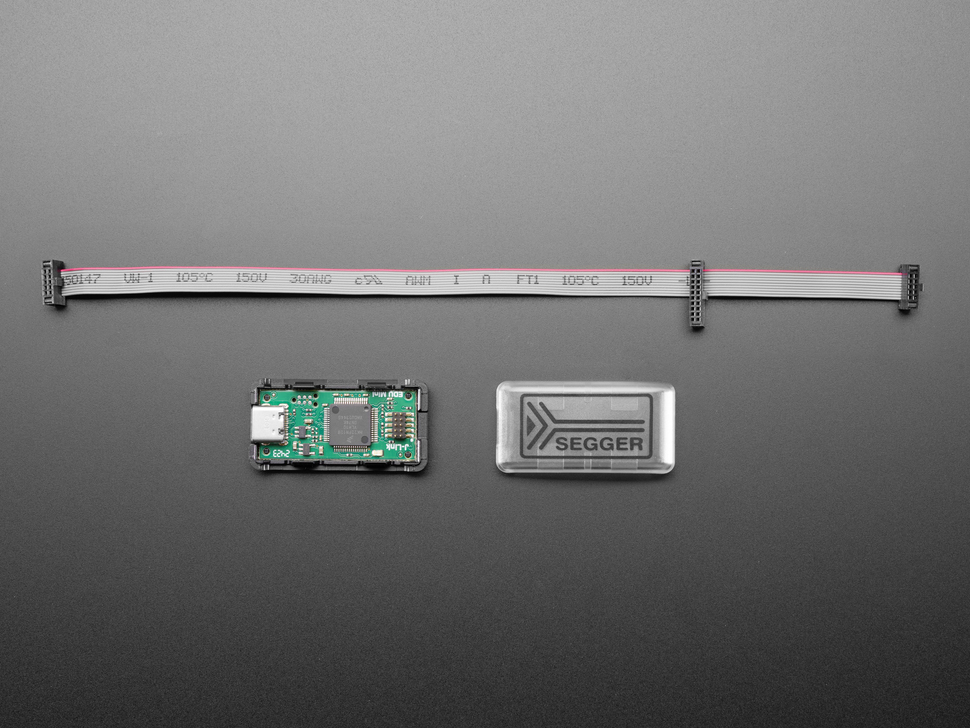

# SEGGER J-Link EDU Mini

## Details

- **Location**: Cabinet-1, Bin 5
- **Category**: Programming / Debugging Tools
- **Product URL**: https://www.adafruit.com/product/3571

## Description

SEGGER J-Link EDU Mini - JTAG/SWD Debugger for educational use. Compact debugging probe for ARM Cortex microcontrollers.

## Image

## Tags

#segger #jlink #jtag #swd #debugger #adafruit
