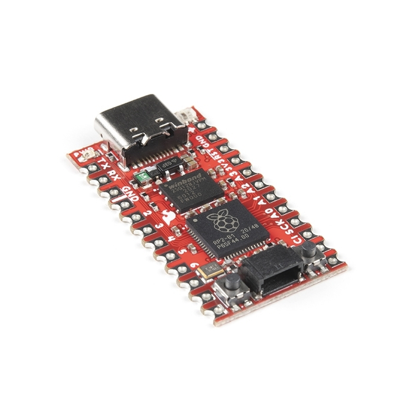

# SparkFun Pro Micro - RP2040

## Details

- **Location**: Cabinet-1, Bin 32
- **Category**: Microcontroller Boards
- **Type**: RP2040 Development Board (Pro Micro Compatible)
- **Microcontroller**: RP2040 (Dual ARM Cortex-M0+ @ 133MHz)
- **Brand**: SparkFun
- **Part Number**: DEV-18288
- **Quantity**: 3
- **Product URL**: https://www.sparkfun.com/sparkfun-pro-micro-rp2040.html

## Description

The SparkFun Pro Micro RP2040 is a low-cost, high performance board with flexible digital interfaces featuring the Raspberry Pi Foundation's RP2040 microcontroller. Besides the good 'ol Pro Micro footprint, the board also includes a WS2812B addressable LED, boot button, reset button, Qwiic connector, USB-C, resettable PTC fuse, and castellated pads.

## Specifications

- **Microcontroller**: RP2040 dual ARM Cortex-M0+ @ up to 133MHz
- **Logic/Power**: 3.3V
- **Memory**: 264kB embedded SRAM in six banks, 16MB external QSPI flash
- **GPIO Pins**: 20 multifunctional GPIO pins
- **ADC**: 4x 12-bit ADC channels with internal temperature sensor
- **PWM**: 10 PWM channels
- **Peripherals**: 2x UARTs, 1x I2C (Qwiic enabled), 1x SPI
- **USB**: USB-C connector with USB 1.1 Host/Device functionality
- **Regulator**: AP2112 3.3V voltage regulator
- **Special Features**: WS2812B addressable LED, Boot/Reset buttons

## Dimensions

- **Board Size**: 33mm x 18mm (1.3" x 0.7")
- **Weight**: ~4.5g
- **Form Factor**: Pro Micro compatible

## Image

## Features

- Pro Micro footprint compatibility
- Qwiic connector for easy I2C device connection
- WS2812B addressable LED for status indication
- Boot and Reset buttons for easy programming
- USB-C connector for modern connectivity
- Resettable PTC fuse for protection
- Castellated pads for direct PCB mounting
- 16MB external flash for program storage
- UF2 boot support for easy programming
- Supports MicroPython and C/C++ development

## Tags

microcontroller, rp2040, pro-micro, qwiic, usb-c, sparkfun, circuitpython, micropython, ws2812

## Notes

Perfect for projects requiring Pro Micro form factor with modern RP2040 performance. The Qwiic connector makes it easy to add sensors and displays without soldering. Supports both MicroPython and C/C++ development environments with UF2 bootloader for easy programming.
