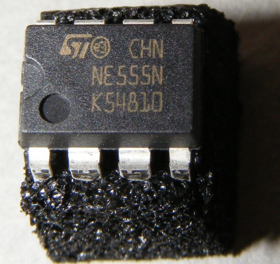

# 555 Timer IC - Precision Timing Circuit

## Details

- **Location**: Cabinet-3, Bin 36, Section A
- **Category**: Analog ICs
- **Brand**: Various (TI, STMicroelectronics, etc.)
- **Part Number**: NE555 / LM555
- **Package**: 8-DIP
- **Quantity**: 70
- **Status**: Available
- **Price Range**: $0.25-0.75
- **Datasheet**: [NE555 Datasheet](https://www.ti.com/lit/ds/symlink/ne555.pdf)
- **Product URL**: https://www.ti.com/product/NE555

## Description

The 555 timer is one of the most popular and versatile integrated circuits ever created. This precision timing circuit can be configured as an astable multivibrator (oscillator), monostable multivibrator (one-shot), or bistable multivibrator (flip-flop). It's widely used in timing applications, pulse generation, and sequential timing circuits.

## Specifications

### Electrical Characteristics
- **Operating Voltage**: 4.5V ~ 16V
- **Supply Current**: 3mA (typical)
- **Output Current**: 200mA (source/sink)
- **Frequency Range**: 0.1Hz to 500kHz
- **Temperature Stability**: 50ppm/°C
- **Timing Accuracy**: ±1% (with proper components)

### Physical Characteristics  
- **Package**: 8-DIP (0.300", 7.62mm)
- **Dimensions**: Standard 8-pin DIP package
- **Operating Temperature**: 0°C ~ 70°C (commercial), -55°C ~ 125°C (military)
- **Mounting Type**: Through Hole

### Key Features
- Astable and monostable operation modes
- High output current capability (200mA)
- Wide supply voltage range (4.5V-16V)
- Temperature stable operation
- TTL and CMOS compatible outputs
- Adjustable duty cycle in astable mode
- Single supply operation

## Image



*Image: NE555 Timer IC in 8-pin DIP package (Creative Commons, Wikimedia Commons)*

## Pinout Diagram

### Pin Descriptions (8-DIP Package)

| Pin | Name | Function |
|-----|------|----------|
| 1 | GND | Ground |
| 2 | TRIGGER | Trigger input (active low) |
| 3 | OUTPUT | Timer output |
| 4 | RESET | Reset input (active low) |
| 5 | CONTROL | Control voltage input |
| 6 | THRESHOLD | Threshold input |
| 7 | DISCHARGE | Open collector discharge output |
| 8 | VCC | Positive power supply |

## Applications

Common use cases and applications for this component:
- LED flashers and blinkers
- Pulse width modulation (PWM) circuits
- Tone generators and buzzers
- Delay circuits and timers
- Clock generators for digital circuits
- Voltage controlled oscillators (VCO)
- Missing pulse detectors
- Sequential timing circuits

## Circuit Examples

### Astable Multivibrator (Oscillator)
```
VCC (Pin 8) ---- +5V to +15V
GND (Pin 1) ---- Ground
RESET (Pin 4) -- VCC (or control input)
CONTROL (Pin 5) - 0.01µF capacitor to ground
TRIGGER (Pin 2) - Connected to THRESHOLD (Pin 6)
THRESHOLD (Pin 6) - R1+R2 to VCC, timing capacitor to ground
DISCHARGE (Pin 7) - R2 to THRESHOLD
OUTPUT (Pin 3) -- Output signal

Frequency = 1.44 / ((R1 + 2*R2) * C)
```

### Monostable Multivibrator (One-Shot)
```
VCC (Pin 8) ---- +5V to +15V
GND (Pin 1) ---- Ground
RESET (Pin 4) -- VCC
CONTROL (Pin 5) - 0.01µF capacitor to ground
TRIGGER (Pin 2) - Input trigger (active low)
THRESHOLD (Pin 6) - R1 to VCC, timing capacitor to ground
DISCHARGE (Pin 7) - Connected to THRESHOLD
OUTPUT (Pin 3) -- Output pulse

Pulse Width = 1.1 * R1 * C
```

## Technical Notes

Important technical considerations and features:
- Use 0.01µF bypass capacitor on CONTROL pin (Pin 5) for noise immunity
- RESET pin (Pin 4) should be tied to VCC if not used for control
- Output can source or sink up to 200mA, suitable for driving LEDs directly
- For precise timing, use 1% tolerance resistors and capacitors
- Timing components should be stable over temperature
- Maximum frequency limited by propagation delays (~500kHz)
- DISCHARGE pin provides path to discharge timing capacitor
- TRIGGER and THRESHOLD inputs have hysteresis for noise immunity

## Tags

timer-ic, analog-ic, precision-timer, astable, monostable, 555 #cabinet-3 #bin-36 #status-available

## Notes

The 555 timer is arguably the most famous IC in electronics history, designed by Hans Camenzind in 1971. It's an essential component for any electronics hobbyist or engineer. The IC is incredibly versatile and can be found in countless applications from simple LED flashers to complex timing circuits. Its robust design and wide operating range make it suitable for both hobby projects and professional applications. Having 70 of these ICs provides excellent flexibility for various timing and oscillator projects.
