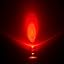

# 5mm LED Red

## Details

- **Location**: Cabinet-1, Bin 9
- **Category**: LEDs
- **Color**: Red
- **Size**: 5mm

## Description

Standard 5mm red LED for general purpose lighting and indicators.

## Image



## Specifications

- **Forward Voltage**: 1.8V - 2.2V (typical 2.0V)
- **Forward Current**: 20mA (maximum)
- **Luminous Intensity**: 20-50 mcd (typical)
- **Viewing Angle**: 30° - 60°
- **Wavelength**: 620-630nm (red)
- **Package**: 5mm through-hole
- **Lens**: Clear or diffused

## Wiring Examples

### Basic LED Circuit (Arduino/5V)

```
Arduino 5V → 220Ω Resistor → LED Anode (long leg)
LED Cathode (short leg) → Arduino GND

Resistor calculation: R = (5V - 2V) / 0.02A = 150Ω
Use 220Ω for safety margin
```

### Basic LED Circuit (3.3V Systems)

```
3.3V → 100Ω Resistor → LED Anode (long leg)
LED Cathode (short leg) → GND

Resistor calculation: R = (3.3V - 2V) / 0.02A = 65Ω
Use 100Ω for safety margin
```

### Digital Control Circuit

```
Arduino Pin 13 → 220Ω Resistor → LED Anode
LED Cathode → Arduino GND

Code: digitalWrite(13, HIGH) turns LED on
```

### PWM Brightness Control

```
Arduino PWM Pin (3,5,6,9,10,11) → 220Ω Resistor → LED Anode
LED Cathode → Arduino GND

Code: analogWrite(pin, 0-255) controls brightness
```

## LED Identification

### Physical Identification

- **Anode (Positive)**: Longer leg, larger internal element
- **Cathode (Negative)**: Shorter leg, flat side of LED body
- **Polarity**: LEDs only work in one direction

### Testing

- Use multimeter diode test function
- Apply 3V with 1kΩ resistor to test
- LED should light when connected correctly

## Current Limiting

### Why Resistors Are Required

- LEDs have very low internal resistance
- Without current limiting, LED will draw excessive current
- Excessive current causes overheating and LED failure
- Always use appropriate current limiting resistor

### Resistor Value Calculation

```
R = (Supply Voltage - LED Forward Voltage) / Desired Current

For 5V supply with red LED:
R = (5V - 2V) / 0.02A = 150Ω (use 220Ω for safety)

For 3.3V supply with red LED:
R = (3.3V - 2V) / 0.02A = 65Ω (use 100Ω for safety)
```

## Programming Examples

### Arduino Blink Code

```cpp
void setup() {
  pinMode(13, OUTPUT);
}

void loop() {
  digitalWrite(13, HIGH);  // Turn LED on
  delay(1000);             // Wait 1 second
  digitalWrite(13, LOW);   // Turn LED off
  delay(1000);             // Wait 1 second
}
```

### Arduino Fade Code

```cpp
int ledPin = 9;    // PWM pin

void setup() {
  // No setup needed for PWM
}

void loop() {
  // Fade in
  for (int brightness = 0; brightness <= 255; brightness++) {
    analogWrite(ledPin, brightness);
    delay(5);
  }

  // Fade out
  for (int brightness = 255; brightness >= 0; brightness--) {
    analogWrite(ledPin, brightness);
    delay(5);
  }
}
```

## Applications

- Status indicators
- Power-on indicators
- Error/warning lights
- Decorative lighting
- Prototyping and testing
- Educational projects
- Simple displays

## Safety Notes

- Never connect LED directly to power without current limiting
- Check polarity before connecting
- Use appropriate resistor values
- Avoid exceeding maximum current rating
- Handle with care to avoid damage to leads

## Tags

#led #red #5mm #standard
