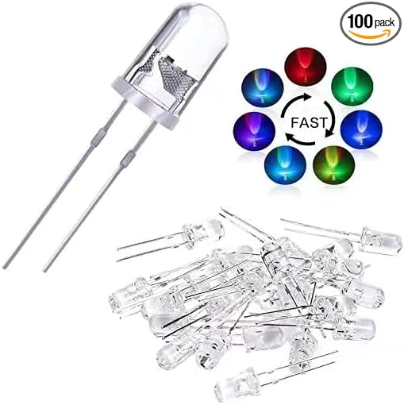

# 5mm RGB Multicolor Fast Blinking LED (2‑Pin)

## Details

- **Location**: Cabinet-1, Bin 10, Section A
- **Category**: Special Effect LEDs
- **Subcategory**: Blinking LED (Auto color-cycling)
- **Package**: 5mm Through-hole (THT)
- **Quantity**: 30+
- **Product URL**: https://www.amazon.com/dp/B09TQDFQGM

## Description

100-piece pack of 5mm RGB multicolor fast-blinking LEDs. These 2-pin LEDs automatically cycle through colors when powered, making them ideal for visual indicators and decorative lighting without needing microcontroller timing. Clear/diffused round lens, super-bright effect.

## Specifications

- LED Size: 5mm THT (2-pin)
- Effect: Fast blinking, auto color changing (internal controller)
- Typical Use: 3–5V with appropriate current limiting resistor

## Image

## Applications

- Visual and status indicators
- Decorative lighting and props
- Quick demos without programming

## Notes

- Requires a current-limiting resistor (e.g., 220Ω at 5V as a safe starting point)
- Not addressable (unlike NeoPixel/WS2812); color pattern is internal and automatic

