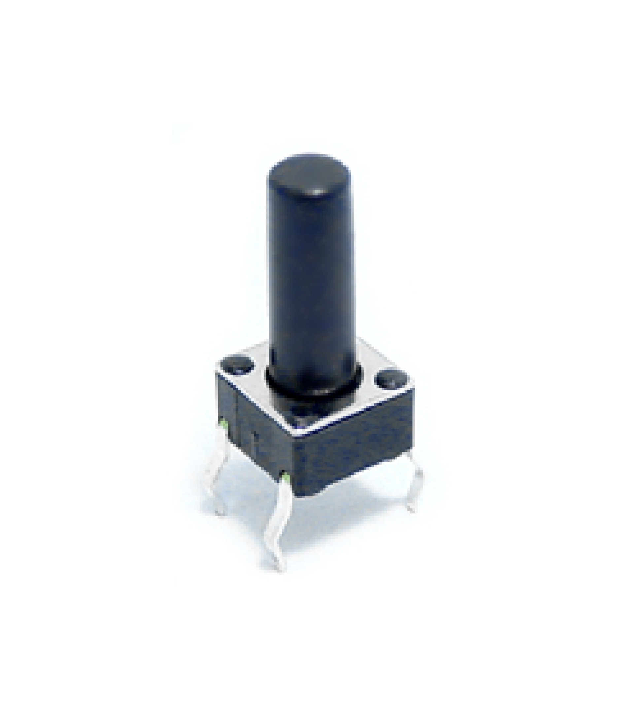

# 6x6mm Tact Switch 13mm Through Hole SPST-NO

## Overview

Standard 6x6mm tactile push button switches with 13mm actuator height. These are commonly used momentary switches that provide tactile feedback when pressed. The SPST (Single Pole Single Throw) normally open configuration makes them ideal for user input applications in electronic projects.

## Location

**Cabinet-5, Bin 15, Section A** - Tactile Switches

## Images



## Specifications

### Physical Specifications
- **Body Size**: 6x6mm square
- **Actuator Height**: 13mm total height
- **Button Cap**: Round plastic actuator
- **Mounting**: Through-hole PCB mount
- **Pin Configuration**: 4 pins (2 pairs)
- **Pin Spacing**: 2.54mm (0.1") compatible
- **Color**: Black body with white/gray actuator

### Electrical Specifications
- **Contact Type**: SPST-NO (Single Pole Single Throw - Normally Open)
- **Voltage Rating**: 12V DC (typical)
- **Current Rating**: 50mA (typical)
- **Power Rating**: 0.6W maximum
- **Contact Resistance**: <100mΩ
- **Insulation Resistance**: >100MΩ
- **Operating Temperature**: -20°C to +70°C

### Mechanical Specifications
- **Operating Force**: 160gf ±50gf (typical)
- **Travel Distance**: 0.25mm ±0.1mm
- **Tactile Feedback**: Distinct click feel
- **Life Expectancy**: 100,000+ operations
- **Bounce Time**: <5ms (typical)

## Pin Configuration

### 4-Pin Layout
The switch has 4 pins arranged in a 2x2 configuration:

```
Pin 1 ---- Pin 2
  |          |
  |   BODY   |
  |          |
Pin 4 ---- Pin 3
```

### Electrical Connections
- **Pins 1 & 2**: Connected together (one side of switch)
- **Pins 3 & 4**: Connected together (other side of switch)
- **When pressed**: Pins 1&2 connect to Pins 3&4
- **When released**: No connection between sides

### Common Wiring
- **Simple Switch**: Use any pin from one side and any pin from the other side
- **Redundant Connection**: Use both pins from each side for better reliability
- **Pull-up/Pull-down**: Connect one side to signal, other side to VCC or GND

## Applications

### User Interface
- **Reset Buttons**: System reset and boot mode selection
- **Menu Navigation**: Up/down/select buttons in interfaces
- **Mode Selection**: Function switching in devices
- **Emergency Stops**: Safety shutdown buttons

### Development Boards
- **Arduino Projects**: Digital input buttons
- **Raspberry Pi**: GPIO input switches
- **ESP32/ESP8266**: Boot and reset buttons
- **Microcontroller Projects**: General purpose input

### Consumer Electronics
- **Remote Controls**: Function buttons
- **Gaming Controllers**: Action buttons
- **Appliances**: Control panel buttons
- **Audio Equipment**: Function selection

### Prototyping
- **Breadboard Projects**: Temporary input switches
- **PCB Prototypes**: User input testing
- **Development Kits**: Interactive controls
- **Educational Projects**: Basic switch circuits

## Circuit Examples

### Basic Digital Input (Arduino)
```cpp
const int buttonPin = 2;
const int ledPin = 13;

void setup() {
  pinMode(buttonPin, INPUT_PULLUP);
  pinMode(ledPin, OUTPUT);
}

void loop() {
  if (digitalRead(buttonPin) == LOW) {
    digitalWrite(ledPin, HIGH);
  } else {
    digitalWrite(ledPin, LOW);
  }
}
```

### Debounced Button Reading
```cpp
const int buttonPin = 2;
unsigned long lastDebounceTime = 0;
unsigned long debounceDelay = 50;
int buttonState = HIGH;
int lastButtonState = HIGH;

void setup() {
  pinMode(buttonPin, INPUT_PULLUP);
  Serial.begin(9600);
}

void loop() {
  int reading = digitalRead(buttonPin);
  
  if (reading != lastButtonState) {
    lastDebounceTime = millis();
  }
  
  if ((millis() - lastDebounceTime) > debounceDelay) {
    if (reading != buttonState) {
      buttonState = reading;
      
      if (buttonState == LOW) {
        Serial.println("Button pressed!");
      }
    }
  }
  
  lastButtonState = reading;
}
```

### Interrupt-Based Button
```cpp
const int buttonPin = 2;
volatile bool buttonPressed = false;

void setup() {
  pinMode(buttonPin, INPUT_PULLUP);
  attachInterrupt(digitalPinToInterrupt(buttonPin), buttonISR, FALLING);
  Serial.begin(9600);
}

void loop() {
  if (buttonPressed) {
    Serial.println("Button interrupt triggered!");
    buttonPressed = false;
    delay(200); // Simple debounce
  }
}

void buttonISR() {
  buttonPressed = true;
}
```

## PCB Design Considerations

### Footprint
- **Hole Size**: 0.8mm (0.031") diameter
- **Pad Size**: 1.5mm diameter (typical)
- **Pin Spacing**: 2.54mm (0.1") grid compatible
- **Body Clearance**: 6x6mm keep-out area

### Layout Guidelines
- **Pull-up Resistors**: 10kΩ typical value
- **Debounce Capacitors**: 100nF across switch contacts
- **ESD Protection**: Consider TVS diodes for exposed buttons
- **Mechanical Stress**: Avoid placing near board edges

### Schematic Symbol
```
    1 ----+     +---- 2
          |     |
          |  o  |  (Normally Open)
          |     |
    4 ----+     +---- 3
```

## Installation

### PCB Mounting
1. **Drill Holes**: 0.8mm diameter holes on 2.54mm grid
2. **Insert Switch**: Place from component side
3. **Solder**: Solder all 4 pins from solder side
4. **Test**: Verify continuity when pressed

### Breadboard Use
1. **Pin Spacing**: Fits standard breadboard holes
2. **Straddle**: Place across center channel for isolation
3. **Connections**: Use jumper wires to connect
4. **Stability**: Press firmly for good contact

### Panel Mounting
1. **Hole Size**: 6mm square or 6.5mm round hole
2. **Actuator Access**: Ensure 13mm clearance above PCB
3. **Mechanical Support**: Consider switch mounting clips
4. **Labeling**: Mark function clearly on panel

## Troubleshooting

### Common Issues
- **No Response**: Check solder joints and connections
- **Multiple Triggers**: Add debounce circuit or software debouncing
- **Intermittent Operation**: Clean contacts or replace switch
- **Mechanical Failure**: Check for physical damage to actuator

### Testing
- **Continuity**: Use multimeter to verify switching action
- **Bounce**: Use oscilloscope to check contact bounce
- **Force**: Verify operating force within specification
- **Life Test**: Cycle switch to verify durability

## Sourcing Information

### Supplier
- **Tayda Electronics**: Primary supplier
- **Part Number**: A0302
- **Price**: $0.07 per piece
- **URL**: https://www.taydaelectronics.com/tact-switch-6-6mm-13mm-through-hole-spst-no.html

### Alternative Sources
- **DigiKey**: Various manufacturers (Omron, Alps, etc.)
- **Mouser**: Multiple options available
- **Amazon**: Bulk assortment packs
- **AliExpress**: Low-cost alternatives

### Specifications to Match
- **6x6mm body size**
- **Through-hole mounting**
- **SPST-NO contact configuration**
- **Actuator height as needed (4.3mm, 7mm, 9.5mm, 13mm available)**

## Storage and Handling

### Storage Recommendations
- **Dry Environment**: Avoid moisture to prevent corrosion
- **Anti-Static**: Use anti-static bags for sensitive applications
- **Organization**: Sort by actuator height if multiple types
- **Temperature**: Room temperature storage

### Handling Tips
- **Gentle Insertion**: Don't force into PCB holes
- **Soldering**: Use appropriate temperature (350°C max)
- **Testing**: Test before final installation
- **Replacement**: Keep spares for critical applications

## Variants Available

### Actuator Heights
- **4.3mm**: Low profile applications
- **7mm**: Standard height
- **9.5mm**: Medium height
- **13mm**: High profile (this variant)
- **17mm**: Extra tall applications

### Contact Configurations
- **SPST-NO**: Normally open (this type)
- **SPST-NC**: Normally closed
- **SPDT**: Single pole double throw

## Tags

switches, buttons, tactile, tact-switch, 6x6mm, 13mm, spst-no, through-hole, momentary, user-input #cabinet-5 #status-available

## Notes

These 6x6mm tact switches with 13mm actuator height are versatile input devices suitable for a wide range of electronic projects. The 13mm height provides good tactile feedback and easy access for user interaction. Store in Cabinet-5, Bin 15, Section A for easy access during prototyping and development work. The through-hole mounting and standard pin spacing make them compatible with breadboards and most PCB designs. Consider the actuator height when designing enclosures to ensure proper clearance and user accessibility.
