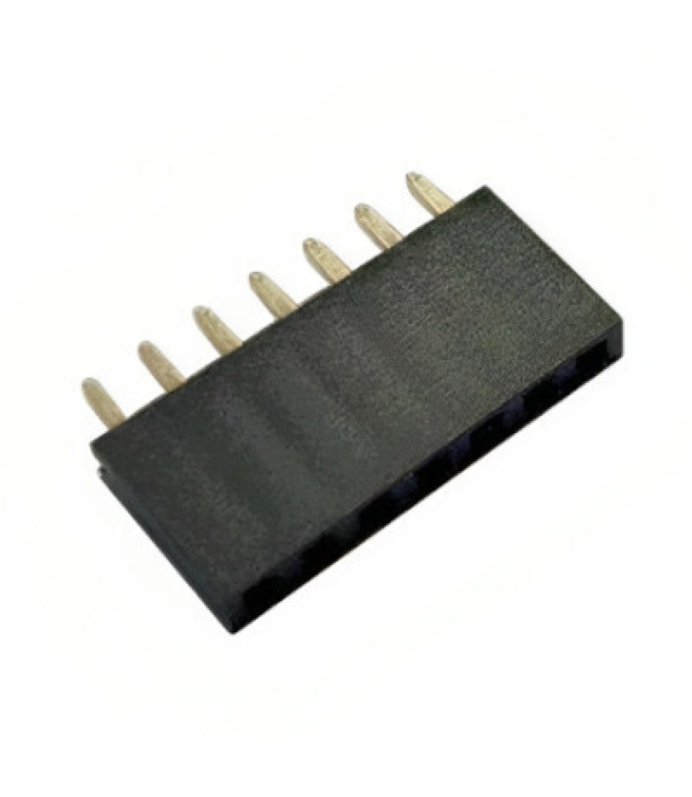

# 7-Pin Single Row Female Headers

## Overview

Standard 0.1" (2.54mm) pitch single row female pin headers with 7 pins. These headers are commonly used for connecting sensors, modules, and other electronic components to development boards and PCBs. The 7-pin configuration is particularly useful for sensor breakout boards and custom interfaces that require power, ground, and 5 signal connections.

## Location

**Cabinet-3, Bin 61** - Header Connectors

## Images

## Specifications

### Physical Specifications
- **Pin Count**: 7 pins
- **Configuration**: Single row
- **Pitch**: 0.1" (2.54mm) standard spacing
- **Pin Length**: Standard through-hole length
- **Housing Material**: Black plastic (nylon/PBT)
- **Contact Material**: Brass with gold plating
- **Mounting**: Through-hole PCB mount

### Electrical Specifications
- **Voltage Rating**: 250V AC/DC (typical)
- **Current Rating**: 3A per pin (typical)
- **Contact Resistance**: <20mΩ
- **Insulation Resistance**: >1000MΩ
- **Operating Temperature**: -40°C to +85°C
- **Dielectric Strength**: 1000V AC (1 minute)

### Mechanical Specifications
- **Insertion Force**: 0.5-1.5N per pin
- **Withdrawal Force**: 0.3-1.0N per pin
- **Durability**: 100+ mating cycles
- **Pin Retention**: Secure contact retention

## Pin Configuration

### Standard 7-Pin Layout
1. **Pin 1**: Signal/Power (often VCC or first signal)
2. **Pin 2**: Signal/Ground (often GND or second signal)
3. **Pin 3**: Signal line (data/control)
4. **Pin 4**: Signal line (data/control)
5. **Pin 5**: Signal line (data/control)
6. **Pin 6**: Signal line (data/control)
7. **Pin 7**: Signal/Power (often additional signal or power)

### Common Applications by Pin Assignment
- **Power + 5 Signals**: VCC, GND, D1, D2, D3, D4, D5
- **I2C + Extras**: VCC, GND, SDA, SCL, INT, RST, EN
- **SPI + Control**: VCC, GND, MISO, MOSI, SCK, CS, RST
- **UART + Control**: VCC, GND, TX, RX, RTS, CTS, DTR

## Applications

### Sensor Connections
- **Environmental Sensors**: Temperature, humidity, pressure sensors
- **Motion Sensors**: Accelerometers, gyroscopes, magnetometers
- **Light Sensors**: Photodiodes, ambient light sensors
- **Gas Sensors**: Air quality, CO2, VOC sensors

### Module Interfaces
- **Display Modules**: Small OLED, LCD displays
- **Communication Modules**: WiFi, Bluetooth, LoRa modules
- **Storage Modules**: SD card readers, EEPROM modules
- **Audio Modules**: Amplifiers, DACs, microphone modules

### Development Board Connections
- **Arduino Projects**: Sensor shields, custom interfaces
- **Raspberry Pi**: HAT connections, GPIO breakouts
- **ESP32/ESP8266**: Development board extensions
- **STM32**: Nucleo and Discovery board connections

### Custom PCB Design
- **Modular Systems**: Removable sensor modules
- **Test Points**: Debug and programming interfaces
- **Expansion Connectors**: Add-on board connections
- **Interface Adapters**: Level shifters, protocol converters

## Compatibility

### Male Header Compatibility
- **Standard 0.1" Male Headers**: Perfect fit with all standard male headers
- **Breakaway Headers**: Compatible with broken-off sections
- **Stacking Headers**: Works with male stacking headers
- **Right-Angle Headers**: Compatible with 90-degree male headers

### Wire Connections
- **Dupont Wires**: Standard female-to-male jumper wires
- **Ribbon Cables**: 7-conductor ribbon cable assemblies
- **Custom Harnesses**: Wire-to-board connections
- **Test Leads**: Probe and measurement connections

### PCB Integration
- **Through-Hole Mounting**: Standard PCB through-hole footprint
- **Breadboard Compatible**: Fits standard breadboard spacing
- **Perfboard**: Compatible with prototype perfboards
- **Custom PCBs**: Standard KiCad/Eagle footprints available

## Installation

### PCB Mounting
1. **Drill Holes**: 0.8mm (0.031") diameter holes on 2.54mm centers
2. **Insert Header**: Place header from component side
3. **Solder**: Solder all pins from solder side
4. **Trim Leads**: Cut excess pin length if needed

### Breadboard Use
1. **Insert**: Press header into breadboard holes
2. **Connect**: Use male-to-male jumpers to connect
3. **Secure**: Ensure good contact with breadboard springs

### Wire Connections
1. **Strip Wires**: 3-5mm of insulation
2. **Tin Wires**: Pre-tin with solder for better connection
3. **Insert**: Insert tinned wire into header socket
4. **Secure**: Ensure good mechanical and electrical contact

## Design Considerations

### PCB Layout
- **Spacing**: Maintain 2.54mm grid spacing
- **Orientation**: Consider connector access direction
- **Clearance**: Allow space for mating connector
- **Silkscreen**: Label pin functions clearly

### Signal Integrity
- **Ground Planes**: Use ground pins for return paths
- **Power Distribution**: Dedicate pins for power and ground
- **Signal Routing**: Keep high-speed signals short
- **EMI**: Consider shielding for sensitive signals

### Mechanical Design
- **Strain Relief**: Provide cable strain relief
- **Keying**: Consider polarization for critical connections
- **Access**: Ensure easy connector access
- **Retention**: Consider locking mechanisms if needed

## Common Configurations

### Power + I2C (4-wire + extras)
- Pin 1: VCC (3.3V or 5V)
- Pin 2: GND
- Pin 3: SDA (I2C Data)
- Pin 4: SCL (I2C Clock)
- Pin 5: INT (Interrupt)
- Pin 6: RST (Reset)
- Pin 7: EN (Enable)

### SPI Interface
- Pin 1: VCC
- Pin 2: GND
- Pin 3: MISO (Master In, Slave Out)
- Pin 4: MOSI (Master Out, Slave In)
- Pin 5: SCK (Serial Clock)
- Pin 6: CS (Chip Select)
- Pin 7: RST (Reset)

### UART + Control
- Pin 1: VCC
- Pin 2: GND
- Pin 3: TX (Transmit)
- Pin 4: RX (Receive)
- Pin 5: RTS (Request to Send)
- Pin 6: CTS (Clear to Send)
- Pin 7: DTR (Data Terminal Ready)

## Sourcing Information

### Supplier
- **Tayda Electronics**: Primary supplier
- **Part Number**: 2212S-07G-85
- **Price**: $0.12 per piece
- **URL**: https://www.taydaelectronics.com/7-pin-2-54-mm-single-row-female-pin-header.html

### Alternative Sources
- **DigiKey**: Various manufacturers available
- **Mouser**: Multiple part options
- **Amazon**: Bulk packs available
- **AliExpress**: Low-cost alternatives

## Storage and Handling

### Storage Recommendations
- **Anti-Static**: Store in anti-static bags if handling sensitive circuits
- **Organization**: Keep in labeled compartments
- **Temperature**: Room temperature storage
- **Humidity**: Avoid high humidity environments

### Handling Tips
- **Insertion Force**: Apply even pressure when inserting
- **Alignment**: Ensure proper pin alignment before insertion
- **Removal**: Use gentle rocking motion to remove
- **Inspection**: Check for bent or damaged pins

## Tags

headers, connectors, female, single-row, 7-pin, 0.1-spacing, prototyping, sensors, modules #cabinet-3 #status-available

## Notes

These 7-pin single row female headers are versatile connectors suitable for a wide range of electronic projects. The 7-pin configuration provides a good balance between functionality and space efficiency, making them ideal for sensor modules and small interface boards. Store in Cabinet-3, Bin 61 for easy access during prototyping and development work. The standard 0.1" pitch ensures compatibility with most development boards and prototyping systems. Consider stocking multiple quantities as they are frequently used in sensor and module connections.
