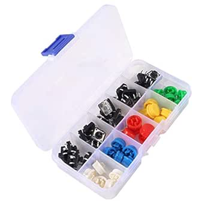

# ACEIRMC 12x12x7.3mm Tactile Push Button Switches

## Details

- **Location**: Cabinet-5, Bin 12, Section A
- **Category**: Switches & Controls
- **Brand**: ACEIRMC
- **Part Number**: B091HL5YBD
- **Model**: 12x12x7.3mm Tactile Switch
- **Package**: Through-hole/SMD PCB Mount
- **Quantity**: 20 switches (from 25-piece pack)
- **Status**: Available
- **Price Range**: $6.89 (pack of 25)
- **Product URL**: https://a.co/d/f2uPsdL

## Description

ACEIRMC 12x12x7.3mm tactile push button switches are momentary contact switches designed for PCB mounting in electronics projects. These switches feature a compact square form factor with 4-pin configuration and come with colored caps for easy identification and professional appearance. The switches provide tactile feedback with a satisfying click feel, making them ideal for user interface applications in Arduino projects, control panels, and electronic devices.

## Specifications

### Electrical Characteristics

- **Operating Voltage**: 12V DC (maximum)
- **Contact Current**: 50mA (maximum)
- **Power Rating**: 0.6W (maximum)
- **Contact Resistance**: <100 milliohms
- **Insulation Resistance**: >100 MΩ
- **Dielectric Strength**: 250V AC (1 minute)
- **Contact Type**: Momentary (normally open)

### Physical Characteristics

- **Body Size**: 12mm x 12mm x 7.3mm (L×W×H)
- **Actuator Height**: 3.5mm above body
- **Pin Configuration**: 4-pin through-hole
- **Pin Spacing**: 2.54mm (0.1 inch) standard
- **Mounting Type**: PCB through-hole or surface mount
- **Operating Temperature**: -25°C to +85°C
- **Mechanical Life**: >100,000 cycles

### Switch Operation

- **Actuation Force**: 160gf ± 50gf
- **Travel Distance**: 0.25mm ± 0.1mm
- **Contact Bounce**: <5ms
- **Operating Speed**: 0.005 to 10 operations per second
- **Switch Type**: Momentary (spring return)

## Image



## Applications

Common use cases and applications for these tactile switches:

- **Arduino Projects**: User input buttons for microcontroller projects
- **Control Panels**: Manual control interfaces for equipment
- **Prototyping**: Breadboard and PCB prototyping applications
- **User Interfaces**: Menu navigation and selection buttons
- **Gaming Controllers**: Custom controller builds and modifications
- **Test Equipment**: Manual trigger and control switches
- **Educational Projects**: Electronics learning and demonstration
- **Robotics**: Manual control and programming buttons
- **Audio Equipment**: Function selection and control switches
- **Industrial Controls**: Operator interface panels

## Colored Caps

The switches come with colored caps for easy identification:

- **Red Caps**: Emergency stops, power controls, critical functions
- **White Caps**: General purpose, neutral functions
- **Yellow Caps**: Caution functions, warning controls
- **Black Caps**: Standard functions, general controls
- **Blue Caps**: Information functions, status controls

### Cap Benefits

- Easy visual identification of switch functions
- Professional appearance in finished projects
- Color coding for different operational modes
- Protection of switch actuator from dust and debris
- Enhanced tactile feel and user experience

## Technical Notes

Important technical considerations and usage tips:

- Designed for low-voltage, low-current applications
- Momentary contact means switch only closes while pressed
- 4-pin configuration provides redundant contacts for reliability
- Standard 2.54mm pin spacing fits breadboards and perfboard
- Caps can be removed and swapped for different color coding
- Suitable for both through-hole and surface mount applications
- Debouncing may be required in digital applications

## PCB Design Considerations

### Footprint Requirements
- **Hole Size**: 0.8mm diameter for through-hole pins
- **Pad Size**: 1.6mm diameter minimum
- **Pin Spacing**: 2.54mm x 2.54mm grid
- **Keep-out Area**: 13mm x 13mm minimum around switch body

### Mounting Recommendations
- Use appropriate hole size for secure mechanical fit
- Consider switch height when designing enclosures
- Provide adequate clearance for cap removal/replacement
- Use pull-up resistors for digital input applications

## Arduino Integration

### Basic Wiring
```cpp
const int buttonPin = 2;
const int ledPin = 13;

void setup() {
  pinMode(buttonPin, INPUT_PULLUP);
  pinMode(ledPin, OUTPUT);
}

void loop() {
  if (digitalRead(buttonPin) == LOW) {
    digitalWrite(ledPin, HIGH);
  } else {
    digitalWrite(ledPin, LOW);
  }
}
```

### Debouncing
Consider using software or hardware debouncing for reliable digital input detection.

## Installation

- Insert switch into PCB holes or breadboard
- Ensure proper orientation and pin alignment
- Solder connections for permanent installation
- Install colored caps as needed for identification
- Test switch operation before final assembly

## Safety Considerations

- **Voltage Limits**: Do not exceed 12V DC rating
- **Current Limits**: Keep current below 50mA maximum
- **Environmental**: Protect from moisture and excessive dust
- **Mechanical**: Avoid excessive force that could damage actuator
- **ESD Protection**: Use proper ESD precautions during handling

## Tags

aceirmc, tactile-switch, pushbutton, momentary, 12mm, colored-caps, pcb-mount, arduino #cabinet-5 #bin-12 #status-available

## Notes

These ACEIRMC tactile switches are excellent for general-purpose electronics projects requiring user input. The 12x12mm form factor provides a good balance between compact size and ease of use. The colored caps add both functionality and professional appearance to projects. The 4-pin configuration ensures reliable contact, and the standard pin spacing makes them compatible with breadboards and standard PCB layouts. Quality construction and reasonable price make them ideal for both prototyping and production applications.
