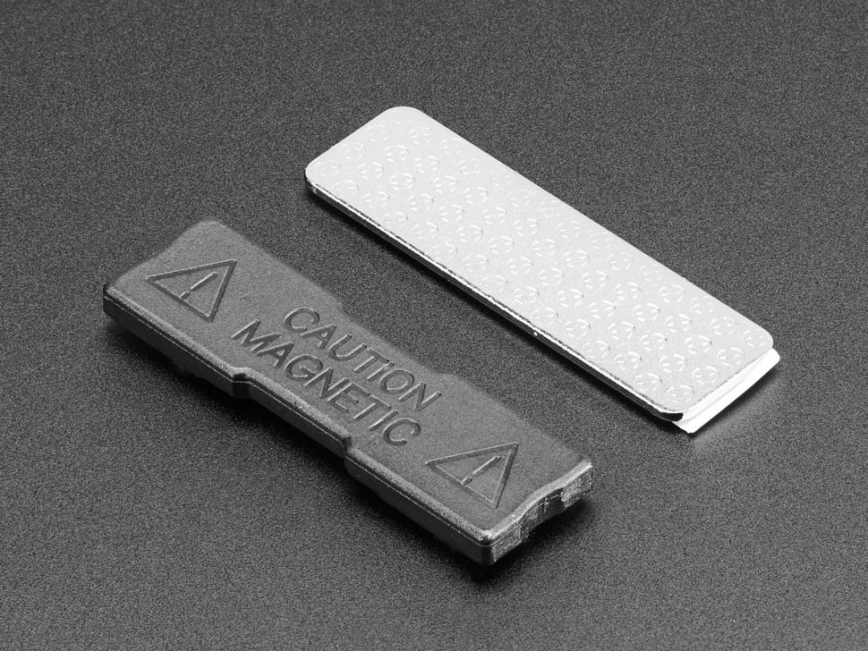

# Adafruit 1170 Magnetic Pin Back

## Details

- **Location**: Cabinet-5, Bin 31
- **Category**: Wearables & Accessories
- **Brand**: Adafruit Industries
- **Part Number**: 1170
- **Package**: Individual Unit
- **Quantity**: 1
- **Status**: Available
- **Price Range**: $1-2
- **Product URL**: https://www.adafruit.com/product/1170

## Description

This magnetic pin back is a two-piece mounting solution designed specifically for wearable electronics projects, particularly FLORA boards. The system consists of a galvanized steel metal bar with an adhesive strip and a plastic piece containing two strong rare-earth neodymium magnets. This design allows you to attach wearable electronics to clothing without poking holes in the fabric, making it perfect for temporary or removable wearable projects.

## Specifications

### Physical Characteristics

- **Dimensions**: 45.3mm x 13.3mm x 5.1mm (1.8" x 0.5" x 0.2")
- **Weight**: 10.0g (0.4oz)
- **Material**: Galvanized steel plate with plastic magnet housing
- **Magnet Type**: Rare-earth neodymium magnets (2 pieces)
- **Adhesive**: Strong adhesive strip on metal bar
- **Color**: Silver metal bar, black plastic magnet housing

### Key Features

- Two-piece magnetic attachment system
- Strong rare-earth neodymium magnets
- Galvanized steel metal bar with adhesive
- Perfect size for FLORA projects
- No holes required in clothing
- Strong enough to hold hefty circuits
- Removable and reusable attachment
- Professional appearance for wearables

## Image

**Visual Description**: The magnetic pin back consists of two components: a silver galvanized steel bar with adhesive backing and a black plastic housing containing two powerful rare-earth magnets. The metal bar is designed to be attached to the back of wearable electronics, while the magnetic piece attaches through fabric to hold the project in place.

## Applications

Common use cases and applications for this component:

- FLORA wearable electronics projects
- Circuit Playground wearable badges
- LED matrix clothing attachments
- Temporary electronic jewelry
- Cosplay electronics mounting
- Interactive clothing projects
- Wearable sensor attachments
- Electronic art installations on fabric
- Removable electronic accessories
- Educational wearable electronics demos

## Technical Notes

Important technical considerations and usage tips:

- **Heat Sensitivity**: Do not solder, braze, or weld to the magnetic pin back
- **Zinc Fumes**: Galvanized steel releases harmful zinc fumes when heated
- **Magnet Demagnetization**: Heat can demagnetize neodymium magnets
- **Adhesive Application**: Clean surface before applying adhesive strip
- **Magnet Strength**: Strong magnets - keep away from magnetic storage devices
- **Size Compatibility**: Designed specifically for FLORA board dimensions
- **Fabric Thickness**: Works best with thin to medium-weight fabrics
- **Washing**: Remove before washing garments
- **Storage**: Store magnets away from electronic devices and credit cards
- **Safety**: Keep small magnets away from children and pacemaker users

## Installation Instructions

### Basic Installation:

1. **Prepare Surface**: Clean the back of your wearable electronics project
2. **Apply Metal Bar**: Remove adhesive backing and firmly attach metal bar
3. **Position Project**: Place project on desired location on garment
4. **Attach Magnets**: Position magnetic piece on inside of garment, aligning with metal bar
5. **Secure**: Allow magnets to snap together through fabric

### Best Practices:

- Test fit before removing adhesive backing
- Ensure even pressure when applying adhesive
- Allow adhesive to cure for best bond strength
- Check magnetic alignment before final attachment

## Tags

magnetic-pin-back, wearable, flora, mounting, rare-earth-magnets, adhesive, adafruit #cabinet-5 #bin-31 #status-available

## Notes

This Adafruit magnetic pin back is an essential accessory for wearable electronics projects, providing a professional and damage-free way to attach circuits to clothing. The two-piece design with strong rare-earth magnets ensures secure attachment while allowing easy removal. Perfect for FLORA projects, the metal bar is sized appropriately for the circular FLORA board. The magnetic attachment is strong enough to support even heavy circuits with multiple components. Important safety note: never apply heat to this component as it can release toxic zinc fumes and demagnetize the rare-earth magnets. Ideal for makers working on interactive clothing, cosplay electronics, or educational wearable projects.
