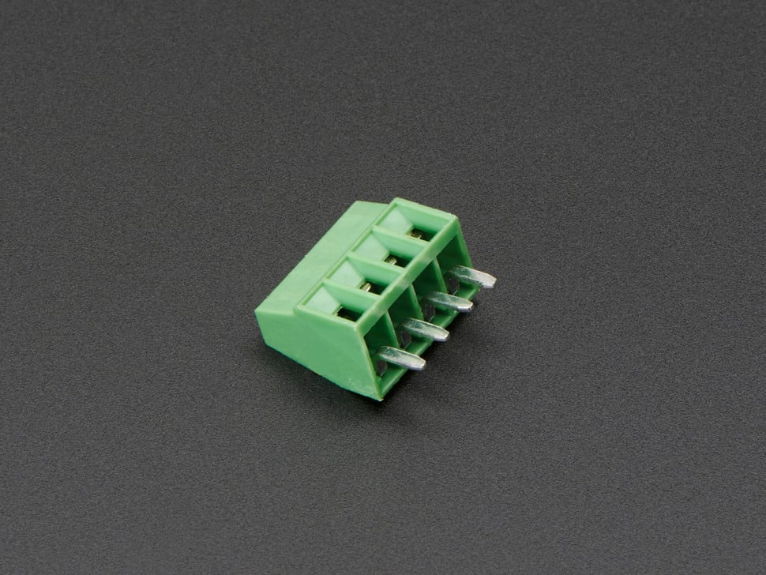

# Adafruit 2.54mm/0.1" Pitch Terminal Block - 4-pin



## Details

- **Location**: Cabinet-3, Bin 57, Section A
- **Category**: Connectors & Cables - Terminal Blocks
- **Brand**: Adafruit Industries
- **Part Number**: 2137
- **Type**: 4-pin Terminal Block
- **Package**: Through-hole
- **Quantity**: 20+
- **Status**: Available
- **Pitch**: 2.54mm (0.1") standard spacing

## Description

These compact and reliable 4-pin terminal blocks from Adafruit are perfect for making secure PCB-to-wire connections in electronics projects. With standard 2.54mm (0.1") spacing, they fit perfectly into perfboards and protoboards, making them ideal for prototyping and permanent installations. Each terminal can accommodate wire gauges from 26-20AWG and provides a secure screw connection that won't come loose over time.

## Specifications

### Electrical Characteristics
- **Voltage Rating**: 250V (typical)
- **Current Rating**: 3A per terminal (typical)
- **Wire Gauge**: 26-20AWG
- **Contact Material**: Brass with tin plating (typical)
- **Insulation Resistance**: >100MΩ

### Physical Characteristics
- **Dimensions (w/o pins)**: 11mm x 9mm x 6mm / 0.4" x 0.4" x 0.2"
- **Pin Length**: 3mm / 0.1"
- **Weight**: 1.0g
- **Pitch**: 2.54mm (0.1") standard spacing
- **Distance between terminals**: 2.5mm
- **Insulator Material**: Green plastic housing
- **Mounting**: Through-hole

### Key Features
- Standard 0.1" (2.54mm) pitch spacing
- Secure screw terminals for reliable connections
- Compact design saves PCB space
- Compatible with perfboard and protoboard
- Easy wire insertion and removal
- RoHS compliant
- Available in multiple pin counts (2-10 pins)

## Applications

Common use cases and applications for this component:
- **Power Distribution**: Connecting power supplies to PCBs
- **Sensor Interfaces**: Secure connections for sensor wiring
- **Motor Control**: Connecting motors and drivers
- **LED Projects**: Power and control connections for LED strips
- **Audio Projects**: Speaker and amplifier connections
- **Prototyping**: Temporary and permanent wire connections
- **Industrial Control**: Reliable field wiring connections
- **Home Automation**: Secure connections for control systems

## Pin Configuration

### 4-Pin Terminal Block Layout
```
Terminal 1  Terminal 2  Terminal 3  Terminal 4
    |           |           |           |
   Pin 1       Pin 2       Pin 3       Pin 4
```

### Common Wiring Examples
- **Power Distribution**: VCC, GND, Signal 1, Signal 2
- **Motor Control**: Motor+, Motor-, Enable, Direction
- **Sensor Interface**: VCC, GND, Data, Clock
- **LED Control**: VCC, GND, Data, Clock (for addressable LEDs)

## Installation Guidelines

### PCB Design Considerations
```cpp
// Standard footprint specifications:
// Hole diameter: 1.0mm (0.040")
// Pad diameter: 1.8mm (0.070")
// Pitch: 2.54mm (0.1")
// Keep-out area: 3mm around terminals for screw access

// Recommended PCB layout:
// - Place away from tall components
// - Provide clear access for screwdriver
// - Consider wire routing and strain relief
// - Label terminals on silkscreen
```

### Assembly Best Practices
- **Orientation**: Mark pin 1 clearly on PCB silkscreen
- **Soldering**: Use standard through-hole soldering techniques
- **Wire Preparation**: Strip 5-7mm of insulation from wire ends
- **Screw Torque**: Tighten screws firmly but don't over-torque
- **Testing**: Verify connections with multimeter before power-up

## Wiring Guidelines

### Wire Preparation
1. **Strip Length**: Remove 5-7mm of insulation
2. **Tinning**: Optional - tin wire ends for better connection
3. **Insertion**: Insert wire fully into terminal
4. **Tightening**: Secure with screwdriver (don't over-tighten)
5. **Testing**: Gently tug wire to verify secure connection

### Wire Gauge Compatibility
- **26AWG**: Light signals, low current applications
- **24AWG**: Standard signal wiring, moderate current
- **22AWG**: Power connections, higher current applications
- **20AWG**: Maximum recommended gauge for these terminals

## Circuit Examples

### Power Distribution Example
```
Power Supply
├── Terminal 1: +12V
├── Terminal 2: GND
├── Terminal 3: +5V
└── Terminal 4: GND
```

### Motor Control Interface
```
Motor Driver PCB
├── Terminal 1: Motor A+
├── Terminal 2: Motor A-
├── Terminal 3: Motor B+
└── Terminal 4: Motor B-
```

### Sensor Interface
```
Sensor Connection
├── Terminal 1: VCC (3.3V or 5V)
├── Terminal 2: GND
├── Terminal 3: SDA (I2C Data)
└── Terminal 4: SCL (I2C Clock)
```

## Technical Notes

Important technical considerations and limitations:
- **Screw Access**: Ensure adequate clearance for screwdriver access
- **Wire Strain Relief**: Provide strain relief to prevent wire fatigue
- **Current Capacity**: Derate current for high ambient temperatures
- **Vibration**: Consider thread-locking compound for high-vibration environments
- **Corrosion**: Use appropriate wire types for environmental conditions
- **Spacing**: Don't snap together - each block is independent

## Comparison with Other Sizes

### Adafruit Terminal Block Family
- **2-pin (2138)**: $0.95 - Basic power connections
- **3-pin (2136)**: $1.25 - Power + signal applications
- **4-pin (2137)**: $1.55 - Balanced pin count for most projects
- **5-pin (2139)**: $1.85 - Extended interfaces
- **6-pin (2135)**: $2.15 - Complex sensor interfaces
- **7-pin (2140)**: $2.45 - Multi-signal applications
- **8-pin (2141)**: $2.75 - High pin count interfaces
- **9-pin (2134)**: $3.05 - Maximum density applications
- **10-pin (2142)**: $3.35 - Highest pin count available

## Advantages Over Other Connection Methods

### vs. Dupont Connectors
- **Security**: Screw terminals won't accidentally disconnect
- **Current Capacity**: Higher current handling capability
- **Durability**: More robust for permanent installations
- **Wire Compatibility**: Works with solid and stranded wire

### vs. Soldered Connections
- **Serviceability**: Easy to disconnect and reconnect
- **Flexibility**: Change wiring without desoldering
- **Reliability**: No risk of cold solder joints
- **Field Installation**: Can be wired without soldering tools

## Quality Considerations

Factors affecting terminal block reliability:
- **Screw Torque**: Proper tightening prevents loose connections
- **Wire Preparation**: Clean, properly stripped wires essential
- **Environmental**: Consider temperature and humidity effects
- **Vibration**: May require additional securing in mobile applications
- **Corrosion**: Use appropriate wire types for environment

## Inventory Management

Tips for managing terminal block inventory:
- **Standardization**: 4-pin blocks handle most common applications
- **Bulk Purchasing**: Better pricing at 10+ and 100+ quantities
- **Mixed Sizes**: Keep 2, 3, 4, and 6-pin blocks in stock
- **Compatibility**: All sizes use same footprint and spacing
- **Documentation**: Track usage patterns for restocking

## Troubleshooting

Common issues and solutions:
- **Loose Connection**: Check screw tightness and wire preparation
- **High Resistance**: Ensure clean wire ends and proper insertion
- **Mechanical Failure**: Don't over-torque screws
- **Poor Contact**: Verify wire gauge compatibility
- **Corrosion**: Use appropriate wire types for environment

## Tags

terminal-blocks, connectors, screw-terminals, 4-pin, 0.1-pitch, wire-connections, pcb, adafruit #cabinet-3 #bin-57 #status-available

## Notes

These 4-pin terminal blocks are excellent for projects requiring secure, removable wire connections. The 2.54mm pitch makes them compatible with standard perfboard and protoboard layouts. While they don't snap together like some terminal blocks, this independence can be advantageous for custom spacing requirements. The compact size and reliable screw terminals make them ideal for both prototyping and production use. Consider purchasing in quantities of 10+ for better pricing, and keep multiple pin counts in stock for different project requirements.
