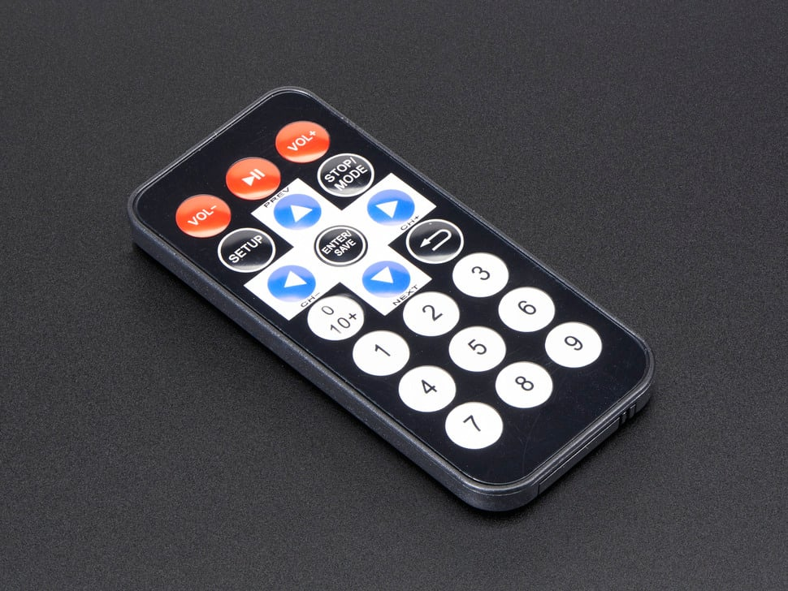

# Adafruit 389 Mini Remote Control

## Details

- **Location**: Cabinet-5, Bin 32
- **Category**: Sensors & Transducers
- **Brand**: Adafruit Industries
- **Part Number**: 389
- **Package**: Individual Unit
- **Quantity**: 3
- **Status**: Available
- **Price Range**: $4-5
- **Product URL**: https://www.adafruit.com/product/389

## Description

This little remote control is perfect for controlling robots or other projects from across the room. It features 21 buttons with a handy layout including directional buttons and number entry buttons. The remote uses NEC encoding and sends data codes 0 through 26 (skipping codes 3, 7, 11, 15, 19, and 23) to address #0. It can be used to control devices expecting NEC codes or paired with IR remote receiver sensors for custom applications.

## Specifications

### Physical Characteristics

- **Dimensions**: 40mm x 86mm x 7mm (1.6" x 3.4" x 0.3")
- **Weight**: Lightweight plastic construction
- **Color**: Black with white button labels
- **Button Count**: 21 buttons total
- **Layout**: Directional pad + numeric keypad + function buttons
- **Battery**: CR2032 included (just remove plastic pull-tab)

### Electrical Characteristics

- **IR Frequency**: 38KHz carrier frequency
- **IR Wavelength**: 940nm
- **Protocol**: NEC encoding type
- **Address**: #0 (default)
- **Data Codes**: 0-26 (skips 3, 7, 11, 15, 19, 23)
- **Power Source**: CR2032 lithium coin cell battery
- **Battery Life**: Long life with typical usage

### Key Features

- 21-button layout with directional and numeric controls
- NEC protocol encoding for wide compatibility
- 38KHz IR transmission at 940nm wavelength
- Includes CR2032 battery (remove pull-tab to activate)
- Compact size perfect for handheld operation
- Compatible with standard IR receiver modules
- Ready to use out of the box

## Image



**Visual Description**: This compact black remote control features 21 clearly labeled white buttons arranged in a logical layout. The top section has directional arrow buttons (up, down, left, right) with an OK button in the center. Below that are numeric buttons 0-9, and additional function buttons including power, menu, and other controls. The remote is slim and lightweight, perfect for handheld operation.

## Applications

Common use cases and applications for this component:

- Robot remote control systems
- Arduino and CircuitPython IR projects
- Home automation control interfaces
- Interactive art installations
- Educational electronics demonstrations
- Custom appliance control
- Prototype remote control development
- IoT device control interfaces
- Wireless project control
- Distance-controlled LED displays

## Circuit Examples

### Basic IR Receiver Setup

```
IR Receiver (TSOP38238) connections:
- VCC → 3.3V or 5V
- GND → Ground  
- OUT → Digital Pin (e.g., Pin 2)
```

### Arduino Code Example

```cpp
#include <IRremote.h>

const int RECV_PIN = 2;
IRrecv irrecv(RECV_PIN);
decode_results results;

void setup() {
  Serial.begin(9600);
  irrecv.enableIRIn();
  Serial.println("IR Receiver Ready");
}

void loop() {
  if (irrecv.decode(&results)) {
    Serial.print("Code: ");
    Serial.println(results.value, HEX);
    irrecv.resume();
  }
}
```

## Programming Examples

### CircuitPython Example

```python
import pulseio
import board
import adafruit_irremote

pulsein = pulseio.PulseIn(board.D2, maxlen=120, idle_state=True)
decoder = adafruit_irremote.GenericDecode()

while True:
    pulses = decoder.read_pulses(pulsein)
    if pulses:
        try:
            code = decoder.decode_bits(pulses)
            print("IR Code:", code)
        except adafruit_irremote.IRNECRepeatException:
            print("Repeat code")
        except adafruit_irremote.IRDecodeException:
            print("Decode error")
```

## Technical Notes

Important technical considerations and usage tips:

- **Button Mapping**: Codes 0-26 with gaps at 3, 7, 11, 15, 19, 23
- **Range**: Typical range 10-15 feet depending on ambient IR interference
- **Battery**: Remove plastic pull-tab from CR2032 to activate
- **Compatibility**: Works with most 38KHz IR receiver modules
- **Protocol**: Standard NEC encoding ensures wide compatibility
- **Interference**: Avoid direct sunlight and fluorescent lights
- **Pairing**: Use with TSOP38238 or similar IR receiver sensors
- **Code Learning**: Can be used with code learning IR receivers
- **Troubleshooting**: Check battery orientation and receiver wiring
- **Storage**: Store in dry location to prevent battery corrosion

## Tags

infrared, remote-control, ir-remote, nec-protocol, robotics, arduino, circuitpython, adafruit #cabinet-5 #bin-32 #status-available

## Notes

These Adafruit mini remote controls are excellent for adding wireless control to robotics and electronics projects. The 21-button layout provides plenty of control options while remaining compact and easy to use. The NEC protocol encoding ensures compatibility with most IR receiver modules and libraries. Having 3 units provides flexibility for multiple projects or backup remotes. The included CR2032 battery means they're ready to use immediately - just remove the plastic pull-tab. Perfect for Arduino and CircuitPython projects where wireless control is needed without the complexity of WiFi or Bluetooth. The 38KHz carrier frequency and 940nm wavelength are standard for consumer IR devices, ensuring reliable operation with common IR receiver sensors.
