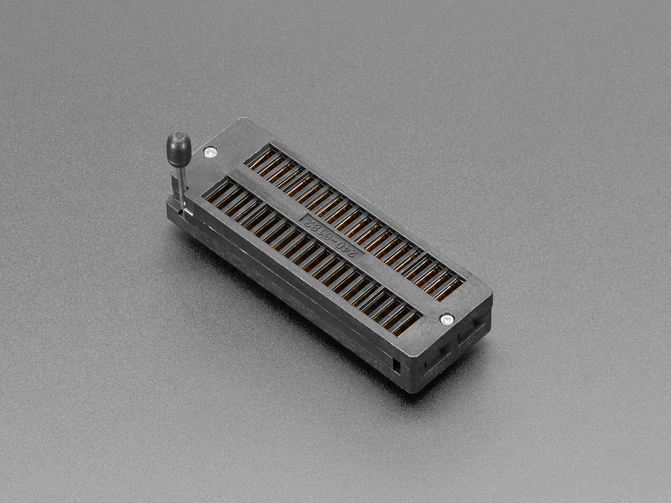

# Adafruit 40-PIN ZIF Socket

## Details

- **Location**: Cabinet-5, Bin 22
- **Category**: Connectors & Hardware
- **Brand**: Adafruit Industries LLC
- **Part Number**: 383
- **Model**: 40-PIN ZIF SOCKET
- **Package**: DIP Socket
- **Quantity**: 3 sockets
- **Status**: Available
- **Price Range**: $4.00 each
- **DigiKey**: 1528-2586-ND
- **Product URL**: https://www.digikey.com/en/products/detail/adafruit-industries-llc/383/8687218

## Description

The Adafruit 40-pin ZIF (Zero Insertion Force) socket is a high-quality IC socket designed for easy insertion and removal of 40-pin DIP (Dual In-line Package) integrated circuits. The ZIF mechanism allows ICs to be inserted without force and secured with a simple lever action, preventing damage to delicate IC pins during prototyping and development work. Gold-plated contacts ensure reliable electrical connections and long service life.

## Specifications

### Physical Characteristics

- **Pin Configuration**: 40 pins (2 x 20 arrangement)
- **Package Type**: DIP (Dual In-line Package)
- **Pin Spacing**: 0.6" (15.24mm) between rows
- **Pin Pitch**: 0.1" (2.54mm) standard spacing
- **Mounting Type**: Through-hole
- **Socket Type**: ZIF (Zero Insertion Force)

### Electrical Characteristics

- **Contact Material**: Gold-plated for corrosion resistance
- **Contact Resistance**: Low resistance for reliable connections
- **Insulation Resistance**: High insulation between pins
- **Operating Temperature**: Standard operating range
- **Voltage Rating**: Suitable for standard logic voltages

### Mechanical Features

- **ZIF Mechanism**: Lever-actuated clamping system
- **Insertion Force**: Zero force insertion when lever is open
- **Retention Force**: Secure clamping when lever is closed
- **Cycle Life**: High cycle count for repeated use
- **Pin Protection**: Prevents damage during insertion/removal

## Image

## Applications

Common use cases for 40-pin ZIF sockets:

- **Microcontroller Development**: Easy swapping of microcontroller chips during development
- **EPROM/EEPROM Programming**: Frequent insertion/removal for memory programming
- **IC Testing**: Testing multiple ICs without pin damage
- **Prototype Development**: Flexible IC placement during circuit development
- **Educational Projects**: Safe IC handling for learning environments
- **Production Testing**: Automated testing systems requiring frequent IC changes
- **Repair Work**: Temporary IC placement for troubleshooting
- **Legacy System Maintenance**: Replacement of failed ICs in older equipment

## Compatible IC Types

### Microcontrollers
- **8-bit Microcontrollers**: 8051, PIC, AVR in 40-pin DIP packages
- **Vintage Processors**: Z80, 6502, 8080 processors
- **Development Boards**: Microcontroller modules in DIP format

### Memory Devices
- **EPROM**: 27C256, 27C512 and similar erasable memory
- **EEPROM**: 28C256, 28C64 and similar electrically erasable memory
- **SRAM**: Static RAM devices in 40-pin packages
- **Flash Memory**: Flash memory devices in DIP format

### Logic Devices
- **Programmable Logic**: GAL, PAL devices in 40-pin packages
- **Custom Logic**: ASIC and custom logic devices
- **Interface Chips**: UART, parallel port, and communication ICs

## ZIF Socket Operation

### Insertion Procedure
1. **Open Lever**: Lift the ZIF lever to open position
2. **Insert IC**: Place IC into socket with no force required
3. **Align Pins**: Ensure all pins are properly aligned in socket
4. **Close Lever**: Lower lever to clamp IC securely in place
5. **Verify Connection**: Check that IC is fully seated and secure

### Removal Procedure
1. **Open Lever**: Lift the ZIF lever to release clamping force
2. **Remove IC**: Lift IC straight up from socket
3. **Inspect Pins**: Check IC pins for damage or bending
4. **Clean Socket**: Remove any debris from socket contacts
5. **Close Lever**: Lower lever to protect socket contacts

## Design Considerations

### PCB Layout
- **Footprint**: Standard 40-pin DIP footprint
- **Clearance**: Adequate clearance for lever operation
- **Height**: Consider socket height in enclosure design
- **Orientation**: Clear pin 1 marking for proper IC orientation

### Electrical Design
- **Signal Integrity**: Short traces to minimize signal degradation
- **Power Distribution**: Adequate power and ground connections
- **Decoupling**: Proper decoupling capacitor placement
- **EMI Considerations**: Shielding if required for sensitive applications

## Advantages of ZIF Sockets

### Protection Benefits
- **Pin Protection**: Prevents IC pin damage during insertion/removal
- **Reduced Stress**: No mechanical stress on IC package
- **Consistent Contact**: Reliable electrical connections
- **Long Life**: Extended IC and socket life through gentle handling

### Development Benefits
- **Rapid Prototyping**: Quick IC swapping during development
- **Testing Flexibility**: Easy testing of multiple IC variants
- **Programming Convenience**: Simplified EPROM/EEPROM programming
- **Debugging Aid**: Easy IC replacement during troubleshooting

## Maintenance and Care

### Socket Maintenance
- **Regular Cleaning**: Clean contacts with appropriate solvents
- **Lever Operation**: Exercise lever periodically to maintain smooth operation
- **Visual Inspection**: Check for bent or damaged contacts
- **Replacement**: Replace socket if contacts become worn or damaged

### IC Handling
- **ESD Protection**: Use proper ESD precautions when handling ICs
- **Pin Inspection**: Check IC pins before insertion
- **Proper Storage**: Store ICs in anti-static containers
- **Gentle Handling**: Avoid excessive force during insertion/removal

## Troubleshooting

### Common Issues
- **Poor Contact**: Clean socket contacts and IC pins
- **Lever Problems**: Check for debris in lever mechanism
- **Pin Misalignment**: Ensure proper IC orientation and alignment
- **Intermittent Connection**: Inspect for bent or damaged contacts

### Testing Procedures
- **Continuity Test**: Verify electrical continuity through socket
- **Resistance Check**: Measure contact resistance
- **Mechanical Test**: Verify smooth lever operation
- **Visual Inspection**: Check for physical damage or wear

## Safety Considerations

- **ESD Protection**: Use proper ESD precautions during handling
- **Mechanical Safety**: Avoid excessive force on lever mechanism
- **Electrical Safety**: Observe voltage and current ratings
- **Proper Orientation**: Ensure correct IC orientation to prevent damage

## Tags

adafruit, zif-socket, 40-pin, dip, zero-insertion-force, gold-contacts, prototyping #cabinet-5 #bin-22 #status-available

## Notes

This Adafruit 40-pin ZIF socket is an essential tool for electronics development and prototyping. The zero insertion force mechanism protects valuable ICs from pin damage while providing reliable electrical connections. The gold-plated contacts ensure long-term reliability and low contact resistance. Having 3 sockets provides flexibility for multiple projects and ensures availability for critical development work. The high-quality construction and reliable operation make these sockets suitable for both hobby and professional applications.
