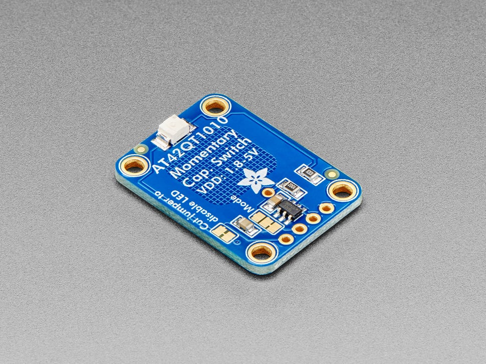

# Adafruit AT42QT1010 Capacitive Touch Sensors

## Details

- **Location**: Cabinet-5, Bin 12 (Section B: 3 units)
- **Category**: Sensors
- **Brand**: Adafruit Industries
- **Part Number**: 1374
- **Model**: AT42QT1010
- **Package**: Breakout Board
- **Quantity**: 3 total
- **Status**: Available
- **Price Range**: $5.95 each
- **Product URL**: https://www.adafruit.com/product/1374

## Description

The Adafruit AT42QT1010 is a standalone momentary capacitive touch sensor breakout that requires no microcontroller. Simply power it with 1.8V to 5.5V DC and touch the sensor pad to activate the output. When a capacitive load is detected, the red LED lights up and the output pin goes high. This makes it perfect for simple touch-activated projects where you need a reliable, low-power touch sensor.

## Specifications

### Electrical Characteristics

- **Supply Voltage**: 1.8V to 5.5V DC
- **Current Consumption**: 0.5mA (fast mode) / 50µA (low power mode)
- **Output Type**: Digital (high when touched, low when not touched)
- **Output Voltage**: Same as supply voltage
- **Touch Sensitivity**: Adjustable via built-in calibration
- **Response Time**: <100ms (fast mode) / <200ms (low power mode)

### Physical Characteristics

- **Board Dimensions**: 20mm x 28mm (0.8" x 1.1")
- **Weight**: 1.87g
- **Touch Pad**: Built-in capacitive sensing area
- **LED Indicator**: Red LED shows touch status
- **Mounting**: 0.1" header holes for breadboard use
- **Operating Temperature**: -40°C to +85°C

### Touch Sensor Features

- **Capacitive Sensing**: Detects human touch through dielectric changes
- **Built-in Calibration**: Automatically adjusts sensitivity
- **Noise Immunity**: Resistant to electrical noise and interference
- **No Mechanical Wear**: Solid-state operation with no moving parts
- **Custom Touch Pads**: Wire connection point for external touch surfaces

## Image



## Applications

Common use cases and applications for these touch sensors:

- **Interactive Projects**: Touch-activated lights, sounds, or displays
- **User Interfaces**: Simple touch buttons for control panels
- **Art Installations**: Touch-sensitive interactive art pieces
- **Educational Projects**: Demonstrating capacitive sensing principles
- **Accessibility Devices**: Large touch-sensitive activation areas
- **Security Systems**: Touch-activated alarms or access controls
- **Wearable Electronics**: Touch controls for clothing or accessories
- **Home Automation**: Touch switches for lights and appliances
- **Musical Instruments**: Touch-sensitive controllers and interfaces
- **Prototype Development**: Quick touch sensing for proof-of-concept projects

## Wiring and Connections

### Pin Configuration

- **VDD**: Power supply (1.8V to 5.5V)
- **GND**: Ground connection
- **OUT**: Digital output (high when touched)
- **PAD**: Connection point for external touch surface
- **LED**: Built-in indicator LED (can be disconnected)

### Basic Wiring

```
VDD  → Power supply positive
GND  → Power supply ground
OUT  → Input to microcontroller or load
PAD  → External touch surface (optional)
```

## Power Management

### Power Modes

- **Fast Mode**: 0.5mA consumption, faster response time
- **Low Power Mode**: 50µA consumption, slower response time
- **Mode Selection**: Jumper on board allows mode switching

### Power Optimization

- LED can be disconnected to save power
- Low power mode suitable for battery-powered applications
- Sleep mode available when not in use

## Custom Touch Surfaces

### External Touch Pads

- Solder wire to center PAD connection
- Use copper foil, conductive fabric, or metal objects
- Touch surface size affects sensitivity
- Larger surfaces = more sensitive detection

### Touch Surface Materials

- **Copper Foil**: Excellent conductivity and adhesion
- **Conductive Fabric**: Flexible and wearable applications
- **Metal Objects**: Everyday items as touch sensors
- **Conductive Paint**: Custom shapes and designs

## Technical Notes

Important considerations for touch sensor usage:

- Automatic calibration occurs on power-up
- Sensitivity adjusts to environmental conditions
- Works through thin non-conductive materials
- Avoid placing near strong electromagnetic fields
- Ground plane improves noise immunity
- Response time varies with power mode selection

## Integration Examples

### Arduino Integration

```cpp
int touchPin = 2;
int ledPin = 13;

void setup() {
  pinMode(touchPin, INPUT);
  pinMode(ledPin, OUTPUT);
}

void loop() {
  if (digitalRead(touchPin) == HIGH) {
    digitalWrite(ledPin, HIGH);
  } else {
    digitalWrite(ledPin, LOW);
  }
}
```

### Raspberry Pi Integration

- Connect OUT pin to GPIO input
- Use pull-down resistor for clean signals
- Monitor pin state changes for touch detection

## Troubleshooting

### Common Issues

- **No Response**: Check power supply voltage and connections
- **False Triggers**: Reduce sensitivity or improve grounding
- **Slow Response**: Switch to fast mode if using low power mode
- **Inconsistent Operation**: Ensure stable power supply

### Calibration

- Sensor auto-calibrates on power-up
- Avoid touching during initial power-on
- Recalibration occurs periodically during operation

## Tags

adafruit, at42qt1010, capacitive-touch, touch-sensor, breakout, momentary, standalone #cabinet-5 #bin-12 #status-available

## Notes

These Adafruit AT42QT1010 touch sensors are excellent for adding simple touch control to projects without requiring a microcontroller. The standalone operation makes them perfect for beginners and quick prototypes. The built-in LED provides immediate visual feedback, and the ability to connect external touch surfaces adds flexibility. Power management features make them suitable for both mains-powered and battery-operated applications. Quality Adafruit construction ensures reliable operation and good documentation support.
