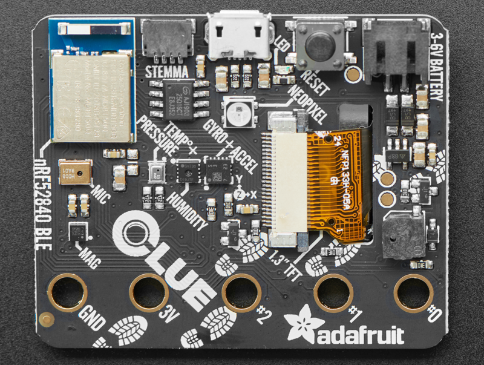

# Adafruit CLUE - nRF52840 Express with Bluetooth LE

## Overview

The Adafruit CLUE is a sensor-packed development board designed for projects that require extensive environmental monitoring and wireless connectivity. Built around the Nordic nRF52840 Bluetooth LE processor and featuring a comprehensive sensor suite, the CLUE is perfect for IoT projects, data logging, and interactive applications that need wireless communication.

## Specifications

- **Microcontroller**: Nordic nRF52840 Bluetooth LE processor
- **Performance**: 64 MHz Cortex M4 processor
- **Memory**: 1MB Flash + 256KB RAM
- **Storage**: 2MB internal flash for datalogging and code
- **Display**: 1.3" 240x240 Color IPS TFT
- **Connectivity**: Bluetooth LE 5.0
- **Form Factor**: BBC micro:bit compatible shape and size
- **Power**: 3-6V battery input with internal regulation

## Comprehensive Sensor Suite

### Motion Sensors

- **LSM6DS3TR**: 3-axis accelerometer and gyroscope
- **LIS3MDL**: 3-axis magnetometer
- **Combined 9-DoF**: Complete motion sensing capability

### Environmental Sensors

- **SHT Humidity Sensor**: Accurate humidity measurement
- **BMP280**: Temperature and barometric pressure/altitude sensor
- **APDS9960**: Proximity, light, color, and gesture sensor

### Audio & Light

- **PDM Microphone**: Digital sound sensor for audio projects
- **Two Bright White LEDs**: Front-facing illumination for color sensing
- **RGB NeoPixel**: Programmable indicator LED

## Display & Interface

- **1.3" IPS TFT**: 240x240 high-resolution color display
- **Two User Buttons**: A and B buttons for user interaction
- **Reset Button**: System reset functionality
- **Buzzer/Speaker**: Built-in audio output for tones and beeps

## Connectivity & Expansion

- **Bluetooth LE 5.0**: Wireless communication and data transmission
- **STEMMA QT/Qwiic Connector**: Easy sensor and peripheral expansion
- **Hardware Interfaces**: SPI, UART, I2C, and I2S on any pins
- **Grove Compatibility**: I2C Grove sensors via adapter cable
- **micro:bit Edge Connector**: 5 large pads for compatibility with existing kits

## Pinout Diagrams

### Official Adafruit Pinout Images




## Basic Wiring Examples

### External Sensor Connection (STEMMA QT)

```
STEMMA QT Sensor → CLUE STEMMA QT Connector
Simply plug in with STEMMA QT cable - no wiring needed!

Compatible sensors: BME280, LSM6DS33, VL53L0X, etc.
```

### Alligator Clip Connections

```
External LED:
CLUE Pad 0 → LED Anode (long leg)
LED Cathode (short leg) → 220Ω Resistor → CLUE GND Pad

External Button:
CLUE 3V Pad → 10kΩ Pull-up Resistor → CLUE Pad 1
CLUE Pad 1 → Button → CLUE GND Pad

External Sensor (Analog):
Sensor Output → CLUE Pad 2 (analog input)
Sensor VCC → CLUE 3V Pad
Sensor GND → CLUE GND Pad
```

### Battery Power Connection

```
Battery Pack (3V-6V) → CLUE JST PH Connector
Recommended: 3x AAA battery pack with JST connector
Note: No built-in charging - use external charger for LiPo
```

### Micro:bit Compatibility

```
CLUE Edge Connector → Micro:bit Expansion Board
Compatible with most micro:bit accessories
Pin mapping matches micro:bit standard
```

## Programming Setup Guide

### CircuitPython Setup (Recommended)

1. Download CircuitPython UF2 from circuitpython.org
2. Double-click reset button to enter bootloader mode
3. Drag UF2 file to CLUEBOOT drive
4. Board reboots as CIRCUITPY drive
5. Edit code.py to program

### Arduino IDE Setup

1. Install Arduino IDE
2. Add Adafruit nRF52 boards package URL in preferences
3. Install "Adafruit nRF52 by Adafruit" package
4. Select "Adafruit CLUE nRF52840 Express" from Tools → Board
5. Install required libraries (Adafruit_Arcada, sensor libraries)

## Programming Examples

### CircuitPython - Sensor Dashboard

```python
import board
import displayio
import terminalio
from adafruit_display_text import label
from adafruit_clue import clue
import time

# Set up display
display = board.DISPLAY
splash = displayio.Group()
display.root_group = splash

# Create text labels
temp_label = label.Label(terminalio.FONT, text="Temp: --°C", color=0xFFFFFF, x=10, y=30)
humidity_label = label.Label(terminalio.FONT, text="Humidity: --%", color=0xFFFFFF, x=10, y=50)
pressure_label = label.Label(terminalio.FONT, text="Pressure: -- hPa", color=0xFFFFFF, x=10, y=70)
accel_label = label.Label(terminalio.FONT, text="Accel: X=- Y=- Z=-", color=0xFFFFFF, x=10, y=90)

splash.append(temp_label)
splash.append(humidity_label)
splash.append(pressure_label)
splash.append(accel_label)

while True:
    # Read sensors
    temperature = clue.temperature
    humidity = clue.humidity
    pressure = clue.pressure
    accel_x, accel_y, accel_z = clue.acceleration

    # Update display
    temp_label.text = f"Temp: {temperature:.1f}°C"
    humidity_label.text = f"Humidity: {humidity:.1f}%"
    pressure_label.text = f"Pressure: {pressure:.1f} hPa"
    accel_label.text = f"Accel: X={accel_x:.1f} Y={accel_y:.1f} Z={accel_z:.1f}"

    # Change NeoPixel color based on temperature
    if temperature < 20:
        clue.pixel.fill((0, 0, 255))  # Blue for cold
    elif temperature > 25:
        clue.pixel.fill((255, 0, 0))  # Red for hot
    else:
        clue.pixel.fill((0, 255, 0))  # Green for comfortable

    time.sleep(0.5)
```

### CircuitPython - Gesture Control

```python
import board
from adafruit_clue import clue
import time

print("CLUE Gesture Control Demo")
print("Wave your hand over the sensor!")

while True:
    gesture = clue.gesture

    if gesture == 1:  # Up
        print("Gesture: UP")
        clue.pixel.fill((255, 0, 0))  # Red
        clue.start_tone(440)  # A note
        time.sleep(0.2)
        clue.stop_tone()

    elif gesture == 2:  # Down
        print("Gesture: DOWN")
        clue.pixel.fill((0, 0, 255))  # Blue
        clue.start_tone(220)  # Lower A note
        time.sleep(0.2)
        clue.stop_tone()

    elif gesture == 3:  # Left
        print("Gesture: LEFT")
        clue.pixel.fill((0, 255, 0))  # Green
        clue.start_tone(330)  # E note
        time.sleep(0.2)
        clue.stop_tone()

    elif gesture == 4:  # Right
        print("Gesture: RIGHT")
        clue.pixel.fill((255, 255, 0))  # Yellow
        clue.start_tone(523)  # C note
        time.sleep(0.2)
        clue.stop_tone()

    else:
        clue.pixel.fill((0, 0, 0))  # Off

    time.sleep(0.1)
```

### CircuitPython - Button and Sound

```python
import board
from adafruit_clue import clue
import time

print("CLUE Button and Sound Demo")

while True:
    if clue.button_a:
        print("Button A pressed!")
        clue.pixel.fill((255, 0, 0))  # Red
        clue.start_tone(523)  # C note
        clue.white_leds = True  # Turn on white LEDs

    elif clue.button_b:
        print("Button B pressed!")
        clue.pixel.fill((0, 0, 255))  # Blue
        clue.start_tone(659)  # E note
        clue.white_leds = True  # Turn on white LEDs

    else:
        clue.pixel.fill((0, 0, 0))  # Off
        clue.stop_tone()
        clue.white_leds = False  # Turn off white LEDs

    time.sleep(0.1)
```

### Arduino - Sensor Reading

```cpp
#include <Adafruit_Arcada.h>
#include <Adafruit_Sensor.h>
#include <Adafruit_LSM6DS33.h>
#include <Adafruit_LIS3MDL.h>
#include <Adafruit_SHT31.h>
#include <Adafruit_BMP280.h>
#include <Adafruit_APDS9960.h>

Adafruit_Arcada arcada;
Adafruit_LSM6DS33 lsm6ds33;
Adafruit_LIS3MDL lis3mdl;
Adafruit_SHT31 sht30;
Adafruit_BMP280 bmp280;
Adafruit_APDS9960 apds9960;

void setup() {
  Serial.begin(115200);
  while (!Serial);

  if (!arcada.arcadaBegin()) {
    Serial.println("Failed to initialize Arcada");
    while (1);
  }

  // Initialize sensors
  if (!lsm6ds33.begin_I2C()) {
    Serial.println("Failed to find LSM6DS33 chip");
  }

  if (!lis3mdl.begin_I2C()) {
    Serial.println("Failed to find LIS3MDL chip");
  }

  if (!sht30.begin()) {
    Serial.println("Failed to find SHT30 chip");
  }

  if (!bmp280.begin()) {
    Serial.println("Failed to find BMP280 chip");
  }

  if (!apds9960.begin()) {
    Serial.println("Failed to find APDS9960 chip");
  }

  Serial.println("CLUE Sensor Test");
}

void loop() {
  // Read accelerometer/gyroscope
  sensors_event_t accel;
  sensors_event_t gyro;
  sensors_event_t temp;
  lsm6ds33.getEvent(&accel, &gyro, &temp);

  // Read magnetometer
  sensors_event_t mag_event;
  lis3mdl.getEvent(&mag_event);

  // Read humidity/temperature
  float humidity = sht30.readHumidity();
  float temperature = sht30.readTemperature();

  // Read pressure
  float pressure = bmp280.readPressure() / 100.0F;  // Convert to hPa

  // Read proximity
  uint8_t proximity = apds9960.readProximity();

  // Print all sensor data
  Serial.println("=== CLUE Sensor Readings ===");
  Serial.print("Accelerometer (m/s²): X=");
  Serial.print(accel.acceleration.x, 2);
  Serial.print(", Y=");
  Serial.print(accel.acceleration.y, 2);
  Serial.print(", Z=");
  Serial.println(accel.acceleration.z, 2);

  Serial.print("Gyroscope (°/s): X=");
  Serial.print(gyro.gyro.x, 2);
  Serial.print(", Y=");
  Serial.print(gyro.gyro.y, 2);
  Serial.print(", Z=");
  Serial.println(gyro.gyro.z, 2);

  Serial.print("Magnetometer (µT): X=");
  Serial.print(mag_event.magnetic.x, 2);
  Serial.print(", Y=");
  Serial.print(mag_event.magnetic.y, 2);
  Serial.print(", Z=");
  Serial.println(mag_event.magnetic.z, 2);

  Serial.print("Temperature: ");
  Serial.print(temperature, 1);
  Serial.println("°C");

  Serial.print("Humidity: ");
  Serial.print(humidity, 1);
  Serial.println("%");

  Serial.print("Pressure: ");
  Serial.print(pressure, 1);
  Serial.println(" hPa");

  Serial.print("Proximity: ");
  Serial.println(proximity);

  Serial.println("---");
  delay(2000);
}
```

## Programming Support

### Arduino IDE

- Full Arduino IDE support with Nordic nRF52 core
- Extensive sensor libraries available
- Bluetooth LE library support
- Real-time development and debugging

### CircuitPython

- Native CircuitPython support
- Hardware abstraction for all sensors
- Bluetooth LE integration
- Rapid prototyping and development

## Applications

### IoT & Data Logging

- Environmental monitoring stations
- Wireless sensor networks
- Remote data collection
- Smart home sensors

### Interactive Projects

- Gesture-controlled devices
- Motion-activated displays
- Proximity-based interactions
- Voice-activated projects

### Educational & Research

- STEM education projects
- Sensor fusion experiments
- Bluetooth LE development learning
- Multi-sensor data analysis

### Wearable & Portable

- Activity trackers
- Environmental badges
- Portable weather stations
- Interactive art installations

## Bluetooth LE Capabilities

- **Data Transmission**: Send sensor data to computers or mobile devices
- **Remote Control**: Control the CLUE from smartphones or tablets
- **Mesh Networking**: Create networks of multiple CLUE devices
- **Beacon Functionality**: iBeacon and Eddystone support
- **Low Power**: Efficient wireless communication for battery projects

## Power Management

- **Battery Input**: 3-6V battery source compatibility
- **Internal Regulation**: Built-in voltage regulation and protection
- **Low Power Modes**: Sleep modes for extended battery life
- **USB Power**: Direct USB operation for development
- **Power Switch**: On/off switch for battery conservation

## micro:bit Compatibility

- **Same Form Factor**: Identical shape and size as BBC micro:bit
- **Edge Connector**: 5 large pads for existing robot kits and add-ons
- **Pin Compatibility**: Best effort to match edge-connector pins
- **Note**: Most micro:bit cases won't fit due to component placement

## Package Contents

- 1x CLUE development board (fully assembled)
- Documentation and tutorial links
- Getting started guides

## Important Notes

- **No MakeCode Support**: Currently only Arduino and CircuitPython supported
- **Case Compatibility**: Most micro:bit cases won't fit the CLUE
- **Code Adaptation**: micro:bit code may need adjustment for CLUE
- **Battery Not Included**: Requires separate battery for portable operation
- **Sensor Calibration**: Some sensors may require calibration for precision applications

## Getting Started

1. Install Arduino IDE or set up CircuitPython
2. Connect via USB and test basic functionality
3. Explore individual sensor readings
4. Experiment with Bluetooth LE communication
5. Build comprehensive sensor monitoring projects

## Recommended Accessories

- 3.7V LiPoly battery or 3xAAA battery pack
- STEMMA QT sensors for expanded functionality
- Grove I2C sensors with adapter cable
- Protective case or enclosure
- Bluetooth LE development tools

## Advanced Features

- **Sensor Fusion**: Combine multiple sensors for enhanced data
- **Machine Learning**: Edge AI applications with sensor data
- **Wireless Mesh**: Multi-device sensor networks
- **Data Visualization**: Real-time sensor data plotting
- **Remote Monitoring**: Cloud-connected sensor applications

## Community & Support

- Active community with extensive tutorials
- Regular firmware and library updates
- Comprehensive documentation and examples
- Integration with popular IoT platforms
- Educational curriculum and lesson plans
