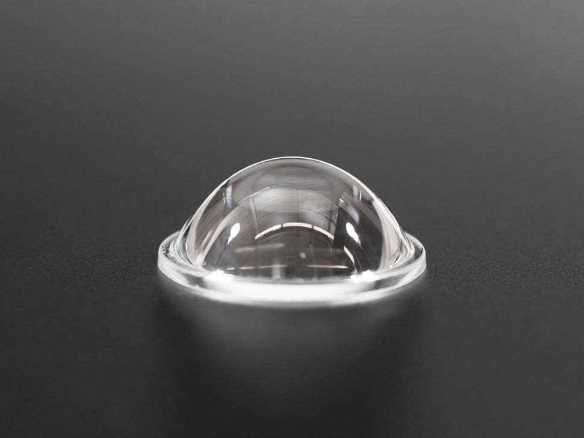

# Adafruit Convex Glass Lens with Edge - 40mm Diameter

## Details

- **Location**: Cabinet 4, Bin 9
- **Category**: Optical Components
- **Brand**: Adafruit
- **Part Number**: 3853
- **Package**: Single Glass Lens
- **Quantity**: 3
- **Status**: Available
- **Price Range**: $5.95
- **Product URL**: https://www.adafruit.com/product/3853

## Description

High-quality convex glass lens designed for electronic eyes projects, optical displays, and visual enhancement applications. These gorgeous glass lenses (not plastic/acrylic) provide brilliant clarity and excellent convexity for realistic eye effects. Features a convenient lip-edge for easy mounting with a 38mm cutout, making them perfect for animated eyes projects and optical demonstrations.

## Image

## Specifications

### Physical Characteristics
- **Material**: High-quality optical glass
- **Outer Diameter**: 40mm
- **Inner Diameter**: 37.5mm (mounting area)
- **Height**: 16mm
- **Focal Length**: 22mm
- **Weight**: Lightweight glass construction

### Optical Properties
- **Lens Type**: Convex (positive meniscus)
- **Clarity**: Brilliant optical clarity
- **Distortion**: Minimal optical distortion
- **Light Transmission**: High light transmission
- **Surface Quality**: Polished optical surfaces

### Key Features
- **Premium Glass**: Real glass construction, not plastic or acrylic
- **Mounting Edge**: Convenient lip-edge for secure mounting
- **Optical Quality**: Professional-grade clarity and precision
- **Versatile Use**: Suitable for multiple optical applications
- **Durable**: Scratch-resistant glass surface

## Pinout/Connection Information

### Mounting Specifications
- **Cutout Diameter**: 38mm for secure mounting
- **Mounting Method**: Lip-edge sits on mounting surface
- **Depth**: 16mm total height when mounted
- **Clearance**: Ensure adequate clearance behind lens

### Installation Guidelines
- **Support**: Provide adequate support around mounting edge
- **Alignment**: Center lens carefully in 38mm cutout
- **Securing**: Use appropriate retaining method for application
- **Protection**: Handle with care to avoid fingerprints and scratches

## Circuit Integration Notes

### Electronic Eyes Applications
- **Display Enhancement**: Magnifies and focuses TFT display output
- **Realistic Effect**: Creates convincing 3D eye appearance
- **Raspberry Pi Integration**: Perfect for Pi-based animated eyes
- **Microcontroller Projects**: Compatible with various eye animation systems

### Optical Considerations
- **Focal Distance**: 22mm focal length for optimal display viewing
- **Magnification**: Provides slight magnification of underlying display
- **Viewing Angle**: Wide viewing angle for realistic eye movement
- **Light Gathering**: Concentrates and directs display light effectively

## Technical Specifications

### Optical Parameters
- **Focal Length**: 22mm (positive lens)
- **Diameter**: 40mm outer, 37.5mm effective aperture
- **Thickness**: 16mm at center
- **Curvature**: Optimized for display enhancement
- **Refractive Index**: Standard optical glass (~1.5)

### Material Properties
- **Glass Type**: Optical quality glass
- **Surface Finish**: Polished optical surfaces
- **Durability**: Scratch and impact resistant
- **Temperature Stability**: Stable across normal operating temperatures
- **Chemical Resistance**: Resistant to common cleaning agents

### Mounting Specifications
- **Mounting Diameter**: 38mm cutout required
- **Edge Design**: Lip prevents lens from falling through
- **Thickness**: Consider 16mm depth requirement
- **Weight**: Minimal weight for most mounting applications

## Applications

### Electronic Eyes Projects
- **Animated Eyes**: Raspberry Pi Snake Eyes Bonnet projects
- **Spooky Eyes**: Halloween and costume applications
- **Robot Eyes**: Humanoid and character robot applications
- **Interactive Displays**: Motion-responsive eye systems

### Educational Projects
- **Optics Demonstrations**: Teaching focal length and magnification
- **STEM Learning**: Hands-on optics and physics education
- **Science Fair**: Optical science project components
- **Maker Education**: Integration into maker space projects

### Display Enhancement
- **TFT Magnification**: Enhances small TFT display visibility
- **Projection Systems**: Component in simple projection setups
- **Optical Instruments**: Building simple magnifiers and viewers
- **Art Installations**: Creative optical art projects

## Troubleshooting

### Common Issues
1. **Fingerprints**: Clean with optical cleaning cloth and solution
2. **Mounting Problems**: Ensure 38mm cutout is accurate and smooth
3. **Optical Distortion**: Verify proper focal distance from display
4. **Scratches**: Handle carefully and store in protective material

### Best Practices
- **Cleaning**: Use optical cleaning solutions and lint-free cloths
- **Handling**: Hold by edges to avoid fingerprints on optical surfaces
- **Storage**: Store in protective packaging when not in use
- **Mounting**: Ensure secure but gentle mounting to avoid stress

## Compatibility Notes

### Project Compatibility
- **Raspberry Pi Eyes**: Direct compatibility with Pi-based eye projects
- **Arduino Eyes**: Works with Arduino-based animated eye systems
- **TFT Displays**: Enhances 1.44" and similar small TFT screens
- **OLED Displays**: Compatible with small OLED displays

### Mounting Compatibility
- **Standard Cutout**: 38mm mounting hole standard
- **3D Printed Mounts**: Easy to design custom 3D printed holders
- **Acrylic Mounting**: Compatible with laser-cut acrylic mounts
- **Metal Mounting**: Works with machined metal mounting systems

## Notes

These high-quality glass lenses provide a significant upgrade over plastic alternatives, offering superior optical clarity and a more realistic appearance for electronic eyes projects. The 22mm focal length is optimized for small TFT displays commonly used in animated eyes applications.

The convenient mounting edge makes installation straightforward while ensuring the lens stays securely in place. The glass construction provides durability and professional appearance that plastic lenses cannot match.

Perfect for Halloween projects, robotics applications, interactive art installations, and educational demonstrations of optical principles.

## Related Components

- [[raspberry-pi-animated-eyes-bonnet]] - Complete animated eyes system
- [[tft-displays]] - Small TFT displays for use behind lens
- [[optical-components]] - Other lenses and optical elements
- [[electronic-eyes-components]] - Complete eye animation systems
