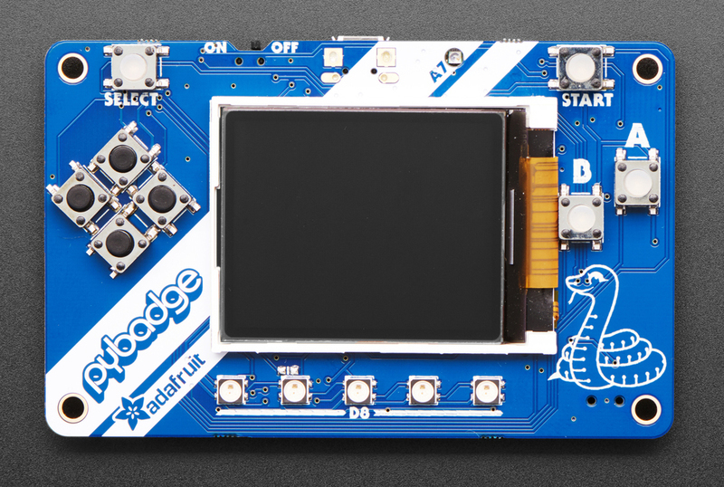
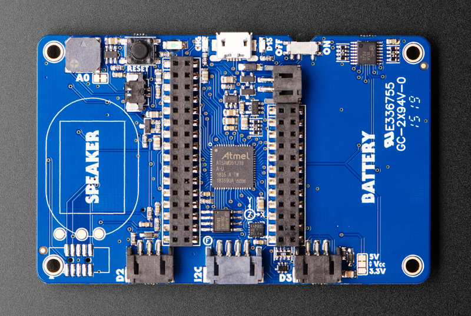

# Adafruit EdgeBadge - TensorFlow Lite for Microcontrollers

## Overview

The Adafruit EdgeBadge brings machine learning to the edge with TensorFlow Lite for Microcontrollers support. Based on the popular PyBadge design but enhanced with a PDM microphone, this board enables micro speech recognition and other ML applications on a compact, credit card-sized development platform.

## Specifications

- **Microcontroller**: ATSAMD51J19 @ 120MHz
- **Memory**: 512KB Flash + 192KB RAM
- **Storage**: 2MB QSPI Flash for TensorFlow models and assets
- **Display**: 1.8" 160x128 Color TFT with dimmable backlight
- **Audio Input**: PDM microphone for speech recognition
- **Controls**: 8 game/control buttons with silicone tops
- **Audio Output**: Built-in buzzer + Class-D amplifier
- **Connectivity**: Micro USB port
- **Power**: LiPoly battery connector with charging circuit

## Machine Learning Features

- **TensorFlow Lite for Microcontrollers**: Optimized ML inference engine
- **PDM Microphone**: High-quality digital microphone for audio ML
- **Pre-trained Models**: Voice recognition models (yes/no, up/down, cat/dog)
- **Edge Computing**: Local ML inference without cloud connectivity
- **Real-time Processing**: Fast inference suitable for interactive applications
- **Model Storage**: 2MB flash storage for TensorFlow Lite models

## Built-in Hardware

### Audio Processing

- PDM (Pulse Density Modulation) microphone on front panel
- High signal-to-noise ratio for clear audio capture
- Optimized for speech recognition applications
- Built-in buzzer for audio feedback
- Class-D amplifier for external speakers (up to 2W)

### Display & Interface

- 1.8" TFT LCD with 160x128 resolution
- 16-bit color depth for rich visual feedback
- Connected to dedicated SPI port for fast updates
- 8 responsive control buttons with silicone tops
- 5x NeoPixel RGB LEDs for visual indicators

### Sensors & Peripherals

- Triple-axis accelerometer for motion detection
- Light sensor for ambient light measurement
- Reset button and on/off switch
- Feather-compatible header layout for expansion

## Pinout Diagrams

### EdgeBadge Pinout (Same as PyBadge)





## Basic Wiring Examples

### External Microphone Connection

```
MAX4466 Microphone VCC → EdgeBadge 3V
MAX4466 Microphone GND → EdgeBadge GND
MAX4466 Microphone OUT → EdgeBadge Pin A1 (D2 connector)

Note: EdgeBadge has built-in PDM microphone, external mic for comparison
```

### I2C Sensor Connection (STEMMA)

```
I2C Sensor VCC → EdgeBadge STEMMA 3V/5V
I2C Sensor GND → EdgeBadge STEMMA GND
I2C Sensor SDA → EdgeBadge STEMMA SDA
I2C Sensor SCL → EdgeBadge STEMMA SCL

Note: STEMMA connector is Grove-compatible
```

### External Speaker Connection

```
8Ω Speaker + → EdgeBadge Speaker Connector +
8Ω Speaker - → EdgeBadge Speaker Connector -

Note: Cut solder jumper to disable built-in buzzer when using external speaker
```

### NeoPixel Strip Connection

```
NeoPixel Strip VCC → EdgeBadge 3V (D2/D3 connector)
NeoPixel Strip GND → EdgeBadge GND (D2/D3 connector)
NeoPixel Strip DIN → EdgeBadge Pin D2 or D3

Code: Use Adafruit_NeoPixel library with pin D2 or D3
```

### Battery Power Connection

```
3.7V LiPo Battery + → EdgeBadge JST Battery Connector +
3.7V LiPo Battery - → EdgeBadge JST Battery Connector -

Note: Built-in charging circuit, monitor voltage on A6
```

## Programming Setup Guide

### Arduino IDE Setup

1. Install Arduino IDE 1.8.19 or later
2. Add Adafruit board package URL in preferences
3. Install "Adafruit SAMD Boards" package
4. Install required libraries:
   - Adafruit Arcada Library
   - Arduino_TensorFlowLite
   - Adafruit GFX Library
   - Adafruit ST7735 and ST7789 Library
5. Select "Adafruit PyBadge M4" from Tools → Board

### TensorFlow Lite Library Installation

1. Open Arduino IDE Library Manager
2. Search for "Arduino_TensorFlowLite"
3. Install latest version
4. Install "Adafruit Arcada" library
5. Download TensorFlow Lite examples from GitHub

### CircuitPython Setup

1. Download CircuitPython UF2 for PyBadge from circuitpython.org
2. Hold RESET while connecting USB to enter bootloader
3. Drag UF2 file to PYBADGEBOOT drive
4. Board reboots as CIRCUITPY drive
5. Install required libraries in lib folder

## Programming Examples

### TensorFlow Lite - Micro Speech Recognition

```cpp
#include <Adafruit_Arcada.h>
#include <TensorFlowLite.h>
#include <tensorflow/lite/micro/all_ops_resolver.h>
#include <tensorflow/lite/micro/micro_error_reporter.h>
#include <tensorflow/lite/micro/micro_interpreter.h>
#include <tensorflow/lite/schema/schema_generated.h>

// Include the model data
#include "micro_speech_model_data.h"

Adafruit_Arcada arcada;

// TensorFlow Lite globals
tflite::MicroErrorReporter micro_error_reporter;
tflite::AllOpsResolver resolver;
const tflite::Model* model = nullptr;
tflite::MicroInterpreter* interpreter = nullptr;
TfLiteTensor* input = nullptr;
TfLiteTensor* output = nullptr;

// Memory allocation for TensorFlow Lite
constexpr int kTensorArenaSize = 10 * 1024;
uint8_t tensor_arena[kTensorArenaSize];

void setup() {
  Serial.begin(115200);

  // Initialize Arcada
  if (!arcada.arcadaBegin()) {
    Serial.println("Failed to initialize Arcada!");
    while(1);
  }

  arcada.displayBegin();
  arcada.display->fillScreen(ARCADA_BLACK);
  arcada.display->setTextColor(ARCADA_WHITE);
  arcada.display->setTextSize(2);
  arcada.display->setCursor(10, 50);
  arcada.display->println("TensorFlow");
  arcada.display->setCursor(10, 70);
  arcada.display->println("Micro Speech");

  // Initialize TensorFlow Lite
  model = tflite::GetModel(micro_speech_model_data);
  if (model->version() != TFLITE_SCHEMA_VERSION) {
    Serial.println("Model schema version mismatch!");
    return;
  }

  interpreter = new tflite::MicroInterpreter(
    model, resolver, tensor_arena, kTensorArenaSize, &micro_error_reporter);

  interpreter->AllocateTensors();

  input = interpreter->input(0);
  output = interpreter->output(0);

  Serial.println("TensorFlow Lite Micro Speech initialized");
}

void loop() {
  uint32_t buttons = arcada.readButtons();

  if (buttons & ARCADA_BUTTONMASK_A) {
    // Record and process audio
    arcada.display->fillScreen(ARCADA_BLACK);
    arcada.display->setCursor(10, 50);
    arcada.display->println("Listening...");

    // Capture audio data (simplified)
    // In real implementation, capture PDM microphone data
    // and preprocess for model input

    // Run inference
    TfLiteStatus invoke_status = interpreter->Invoke();
    if (invoke_status != kTfLiteOk) {
      Serial.println("Invoke failed!");
      return;
    }

    // Process results
    float yes_score = output->data.f[0];
    float no_score = output->data.f[1];

    arcada.display->fillScreen(ARCADA_BLACK);
    arcada.display->setCursor(10, 30);

    if (yes_score > no_score && yes_score > 0.7) {
      arcada.display->println("Heard: YES");
      arcada.display->setTextColor(ARCADA_GREEN);
    } else if (no_score > yes_score && no_score > 0.7) {
      arcada.display->println("Heard: NO");
      arcada.display->setTextColor(ARCADA_RED);
    } else {
      arcada.display->println("Uncertain");
      arcada.display->setTextColor(ARCADA_YELLOW);
    }

    delay(2000);
    arcada.display->setTextColor(ARCADA_WHITE);
  }

  delay(100);
}
```

### TensorFlow Lite - Gesture Recognition

```cpp
#include <Adafruit_Arcada.h>
#include <Adafruit_LIS3DH.h>
#include <TensorFlowLite.h>

// Include gesture model
#include "gesture_model_data.h"

Adafruit_Arcada arcada;
Adafruit_LIS3DH lis3dh;

// TensorFlow Lite setup (similar to above)
// ... TensorFlow Lite globals ...

// Gesture data collection
const int GESTURE_SAMPLES = 119;
const int GESTURE_FEATURES = 3; // x, y, z accelerometer
float gesture_data[GESTURE_SAMPLES * GESTURE_FEATURES];
int sample_count = 0;

void setup() {
  Serial.begin(115200);

  if (!arcada.arcadaBegin()) {
    Serial.println("Failed to initialize Arcada!");
    while(1);
  }

  // Initialize accelerometer
  if (!lis3dh.begin(0x19)) {
    Serial.println("Failed to initialize accelerometer!");
    while(1);
  }

  arcada.displayBegin();
  arcada.display->fillScreen(ARCADA_BLACK);
  arcada.display->setTextColor(ARCADA_WHITE);
  arcada.display->setTextSize(2);

  // Initialize TensorFlow Lite (similar to speech example)
  // ... TensorFlow Lite initialization ...

  Serial.println("Gesture recognition ready");
}

void loop() {
  uint32_t buttons = arcada.readButtons();

  if (buttons & ARCADA_BUTTONMASK_A) {
    // Start gesture recording
    arcada.display->fillScreen(ARCADA_BLACK);
    arcada.display->setCursor(10, 50);
    arcada.display->println("Recording");
    arcada.display->setCursor(10, 70);
    arcada.display->println("Gesture...");

    sample_count = 0;

    // Collect accelerometer data
    while (sample_count < GESTURE_SAMPLES) {
      lis3dh.read();

      // Normalize accelerometer data
      float x = lis3dh.x / 16384.0;
      float y = lis3dh.y / 16384.0;
      float z = lis3dh.z / 16384.0;

      gesture_data[sample_count * 3 + 0] = x;
      gesture_data[sample_count * 3 + 1] = y;
      gesture_data[sample_count * 3 + 2] = z;

      sample_count++;
      delay(20); // 50Hz sampling
    }

    // Copy data to model input
    for (int i = 0; i < GESTURE_SAMPLES * GESTURE_FEATURES; i++) {
      input->data.f[i] = gesture_data[i];
    }

    // Run inference
    TfLiteStatus invoke_status = interpreter->Invoke();
    if (invoke_status != kTfLiteOk) {
      Serial.println("Invoke failed!");
      return;
    }

    // Process results
    float punch_score = output->data.f[0];
    float flex_score = output->data.f[1];

    arcada.display->fillScreen(ARCADA_BLACK);
    arcada.display->setCursor(10, 30);

    if (punch_score > flex_score && punch_score > 0.8) {
      arcada.display->println("PUNCH!");
      arcada.display->setTextColor(ARCADA_RED);
      // Light up NeoPixels red
      for (int i = 0; i < 5; i++) {
        arcada.pixels.setPixelColor(i, 255, 0, 0);
      }
      arcada.pixels.show();
    } else if (flex_score > punch_score && flex_score > 0.8) {
      arcada.display->println("FLEX!");
      arcada.display->setTextColor(ARCADA_BLUE);
      // Light up NeoPixels blue
      for (int i = 0; i < 5; i++) {
        arcada.pixels.setPixelColor(i, 0, 0, 255);
      }
      arcada.pixels.show();
    } else {
      arcada.display->println("Unknown");
      arcada.display->setTextColor(ARCADA_YELLOW);
    }

    delay(2000);
    arcada.pixels.clear();
    arcada.pixels.show();
    arcada.display->setTextColor(ARCADA_WHITE);
  }

  delay(100);
}
```

### CircuitPython - Simple ML Dashboard

```python
import board
import displayio
import terminalio
import adafruit_lis3dh
import adafruit_arcada
from adafruit_display_text import label
import time

# Initialize Arcada
arcada = adafruit_arcada.Arcada(board.DISPLAY, debug=False)
arcada.display.brightness = 1.0

# Initialize accelerometer
i2c = board.I2C()
lis3dh = adafruit_lis3dh.LIS3DH_I2C(i2c, address=0x19)

# Create display group
splash = displayio.Group()

# Title
title_label = label.Label(
    terminalio.FONT, text="ML Dashboard", color=0xFFFFFF, x=10, y=15
)
splash.append(title_label)

# Sensor data labels
accel_label = label.Label(
    terminalio.FONT, text="Accel: ", color=0x00FF00, x=10, y=40
)
splash.append(accel_label)

light_label = label.Label(
    terminalio.FONT, text="Light: ", color=0xFFFF00, x=10, y=60
)
splash.append(light_label)

battery_label = label.Label(
    terminalio.FONT, text="Battery: ", color=0xFF0000, x=10, y=80
)
splash.append(battery_label)

status_label = label.Label(
    terminalio.FONT, text="Status: Ready", color=0x00FFFF, x=10, y=100
)
splash.append(status_label)

board.DISPLAY.show(splash)

# Main loop
while True:
    # Read sensors
    x, y, z = lis3dh.acceleration
    light_level = arcada.light
    battery_voltage = arcada.battery

    # Update display
    accel_label.text = f"Accel: {x:.1f},{y:.1f},{z:.1f}"
    light_label.text = f"Light: {light_level}"
    battery_label.text = f"Battery: {battery_voltage:.2f}V"

    # Simple motion detection
    motion_magnitude = (x**2 + y**2 + z**2)**0.5
    if motion_magnitude > 12:
        status_label.text = "Status: Motion!"
        status_label.color = 0xFF0000
        # Flash NeoPixels
        arcada.pixels.fill((255, 0, 0))
        arcada.pixels.show()
    else:
        status_label.text = "Status: Still"
        status_label.color = 0x00FF00
        arcada.pixels.fill((0, 0, 0))
        arcada.pixels.show()

    # Check buttons
    buttons = arcada.get_pressed_buttons()
    if buttons:
        status_label.text = f"Button: {buttons}"
        status_label.color = 0x0000FF

    time.sleep(0.1)
```

## Programming Support

### TensorFlow Lite for Microcontrollers

- Optimized inference engine for embedded systems
- Support for quantized models (8-bit, 16-bit)
- Arduino library integration
- Pre-built voice recognition examples
- Model conversion tools and documentation

### Arduino IDE

- Adafruit Arcada library for hardware abstraction
- TensorFlow Lite Arduino library
- Extensive ML examples and tutorials
- Integration with Arduino ecosystem

### CircuitPython

- Python-based development environment
- TensorFlow Lite integration (experimental)
- Rapid prototyping and development
- Hardware abstraction libraries

### MakeCode Arcade

- Visual programming environment
- Game development capabilities
- Educational ML projects
- Block-based programming interface

## Machine Learning Applications

### Voice Recognition

- Wake word detection
- Simple command recognition (yes/no, up/down)
- Voice-controlled interfaces
- Audio classification projects

### Sensor Fusion

- Accelerometer-based gesture recognition
- Multi-modal input processing
- Environmental monitoring with ML
- Predictive maintenance applications

### Educational Projects

- Introduction to machine learning concepts
- Edge AI development learning
- STEM education applications
- Interactive ML demonstrations

## Development Workflow

1. **Model Training**: Use TensorFlow to train models on desktop/cloud
2. **Model Conversion**: Convert to TensorFlow Lite format
3. **Quantization**: Optimize for microcontroller constraints
4. **Deployment**: Upload to EdgeBadge via Arduino IDE
5. **Testing**: Real-time inference and validation

## Power Management

- **Battery Support**: 3.7V LiPoly battery compatibility
- **USB Charging**: Built-in charging circuit
- **Power Optimization**: Low-power modes for battery operation
- **USB Power**: Direct USB operation for development

## Expansion & Connectivity

- **Feather Compatibility**: Two female headers for FeatherWings
- **JST Connectors**: NeoPixel, sensor, and I2C connections
- **Grove Compatibility**: I2C Grove connector support
- **STEMMA QT**: Compatible with sensor ecosystem

## Package Contents

- 1x EdgeBadge PCB (fully assembled)
- 1x Set of female headers
- Documentation and ML tutorial links

## Important Notes

- **Cutting-Edge Technology**: TensorFlow Lite for microcontrollers is rapidly evolving
- **Model Limitations**: Limited by microcontroller memory and processing power
- **Development Environment**: Requires familiarity with ML concepts and tools
- **Battery Not Included**: Requires separate LiPoly battery purchase
- **Community Support**: Active community developing ML examples and tutorials

## Getting Started

1. Install Arduino IDE and required libraries
2. Download pre-trained voice recognition examples
3. Upload and test basic speech recognition
4. Experiment with custom model training
5. Explore advanced ML applications

## Recommended Accessories

- 3.7V LiPoly battery (350mAh or 500mAh)
- External 4-8 ohm speaker for better audio
- STEMMA QT sensors for multi-modal ML
- Protective case for portable deployment
- MicroSD card for additional model storage

## Important Notes

### TensorFlow Lite Considerations

- **Memory Constraints**: 192KB RAM limits model complexity
- **Processing Power**: 120MHz ARM Cortex-M4 for real-time inference
- **Model Size**: 2MB QSPI Flash for model storage
- **Quantization**: 8-bit quantized models recommended for best performance
- **Inference Speed**: Typical inference time 10-100ms depending on model

### Audio Processing

- **PDM Microphone**: Built-in digital microphone for speech recognition
- **Sample Rate**: Typically 16kHz for speech applications
- **Audio Buffer**: Limited by available RAM
- **Preprocessing**: FFT and feature extraction on-device
- **Noise Handling**: Consider environmental noise in model training

### Development Best Practices

- **Start Simple**: Begin with pre-trained models before custom training
- **Iterative Development**: Test frequently on actual hardware
- **Power Management**: Consider battery life in deployment scenarios
- **Model Validation**: Validate accuracy on target hardware
- **Version Control**: Track model versions and performance metrics

### Troubleshooting Common Issues

- **Model Loading Errors**: Check model format and size constraints
- **Memory Allocation**: Reduce tensor arena size if needed
- **Inference Failures**: Verify input data preprocessing
- **Performance Issues**: Profile and optimize critical code paths
- **Audio Problems**: Check microphone connections and sample rates

## Applications & Use Cases

### Educational Projects

- **STEM Learning**: Hands-on machine learning education
- **Computer Science**: Embedded AI programming concepts
- **Engineering**: Real-world ML deployment challenges
- **Research**: Edge computing and TinyML research

### Prototyping Applications

- **Voice Interfaces**: Smart home device prototypes
- **Gesture Control**: Wearable and IoT applications
- **Sensor Fusion**: Multi-modal input processing
- **Edge Analytics**: Local data processing and decision making

### Commercial Development

- **Product Validation**: Proof-of-concept development
- **Cost Analysis**: Edge vs cloud processing trade-offs
- **Performance Testing**: Real-world deployment scenarios
- **User Experience**: Interactive ML interface design

## Learning Resources

- **TensorFlow Lite for Microcontrollers**: Official documentation and tutorials
- **Adafruit Learning System**: EdgeBadge-specific guides and examples
- **TinyML Community**: Forums, papers, and research resources
- **GitHub Repositories**: Open-source models and example code
- **Model Training Guides**: Custom model development workflows
- **Edge AI Courses**: Online learning platforms and university courses
