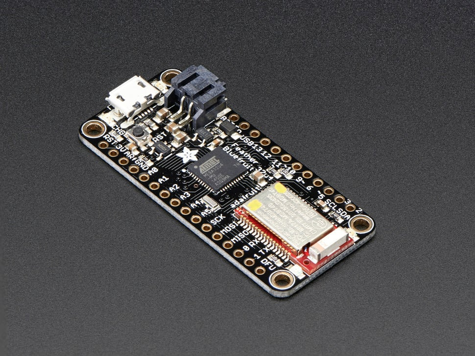

# Adafruit Feather 32u4 Bluefruit LE

## Details

- **Location**: Cabinet-1, Bin 29
- **Category**: Feather Boards
- **Type**: ATmega32u4 Development Board with Bluetooth LE (Feather Form Factor)
- **Microcontroller**: ATmega32u4 @ 8MHz with 3.3V logic
- **Brand**: Adafruit
- **Part Number**: 2829
- **Quantity**: 1
- **Product URL**: https://www.adafruit.com/product/2829

## Description

The Adafruit Feather 32u4 Bluefruit LE is an all-in-one Arduino-compatible board with Bluetooth Low Energy, built-in USB and battery charging. It combines an ATmega32u4 with an nRF51822 Bluetooth LE module, making it excellent for portable projects that communicate with iOS or Android devices.

## Specifications

- **Microcontroller**: ATmega32u4 @ 8MHz with 3.3V logic/power
- **Memory**: 32KB Flash, 2KB SRAM, 1KB EEPROM
- **Bluetooth**: nRF51822 Bluetooth Low Energy module
- **GPIO Pins**: 20 total
- **ADC**: 10x analog inputs
- **Peripherals**: Hardware Serial, I2C, SPI support
- **PWM**: 7x PWM pins
- **USB**: Native USB support with bootloader and serial debugging
- **Power**: 3.3V regulator with 500mA peak current output
- **Battery**: Built-in 100mA LiPoly charger with status LED

## Dimensions

- **Board Size**: 51mm x 23mm x 8mm (2.0" x 0.9" x 0.28")
- **Weight**: 5.7g (light as a large feather!)
- **Form Factor**: Standard Feather compatible

## Image

## Features

- Standard Feather form factor compatible with all FeatherWings
- Bluetooth Low Energy with Nordic UART profile support
- Built-in 100mA LiPoly charger with charging status indicator LED
- Native USB support - can act as keyboard, mouse, MIDI device
- Pin #13 red LED for general purpose blinking
- Two status LEDs for Bluetooth connection indication
- STEMMA QT connector for easy I2C device connection
- 4 mounting holes for secure installation
- Reset button and power/enable pin
- Battery voltage monitoring through analog pin
- Over-the-air firmware updates for BLE module

## Bluetooth LE Capabilities

- Nordic UART RX/TX connection profile
- AT command set for full control
- GATT Services and Characteristics support
- HID Keyboard functionality
- Heart Rate Monitor profile
- UriBeacon support (Google BLE beacon standard)
- Compatible with Adafruit Bluefruit iOS/Android apps
- Color picker, sensor data, and control pad interfaces

## Tags

microcontroller, atmega32u4, feather, bluefruit, bluetooth-le, battery-charging, adafruit, arduino, nrf51822, stemma-qt

## Notes

Perfect for portable projects requiring Bluetooth LE connectivity with smartphones and tablets. The ATmega32u4 provides Arduino compatibility while the nRF51822 handles BLE communication. Comes with loose headers requiring soldering. Excellent for IoT projects, wearables, and remote control applications. Compatible with both iOS and Android devices without special certification.
