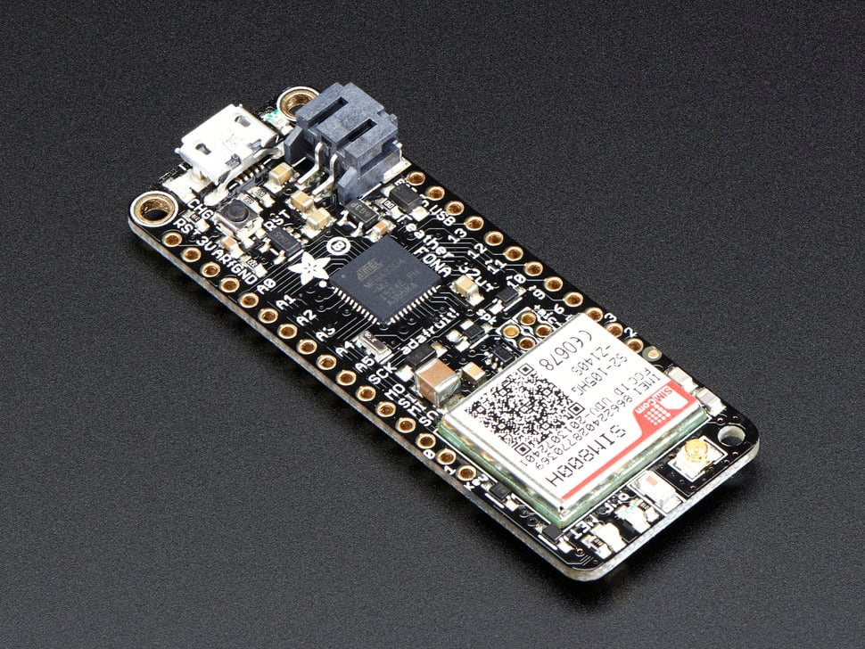

# Adafruit Feather 32u4 FONA

## Details

- **Location**: Cabinet-1, Bin 29
- **Category**: Feather Boards
- **Type**: ATmega32u4 Development Board with Cellular (Feather Form Factor)
- **Microcontroller**: ATmega32u4 @ 8MHz with 3.3V logic
- **Brand**: Adafruit
- **Part Number**: 3027
- **Quantity**: 2
- **Status**: Discontinued
- **Product URL**: https://www.adafruit.com/product/3027

## Description

The Adafruit Feather 32u4 FONA was an all-in-one Arduino-compatible board with cellular connectivity, built-in USB and battery charging. It combined an ATmega32u4 with a FONA800 cellular module (SIM800), making it perfect for IoT projects requiring cellular data, SMS, or voice calls.

## Specifications

- **Microcontroller**: ATmega32u4 @ 8MHz with 3.3V logic/power
- **Memory**: 32KB Flash, 2KB SRAM, 1KB EEPROM
- **Cellular**: SIM800 GSM module (Quad-band 850/900/1800/1900MHz)
- **GPIO Pins**: 20 total
- **ADC**: 10x analog inputs
- **Peripherals**: Hardware Serial, I2C, SPI support
- **PWM**: 7x PWM pins
- **USB**: Native USB support with bootloader and serial debugging
- **Power**: 3.3V regulator with 500mA peak current output
- **Battery**: Built-in 500mA LiPoly charger with status LED

## Dimensions

- **Board Size**: 61mm x 23mm x 7mm (2.4" x 0.9" x 0.28")
- **Weight**: 8.2g
- **Form Factor**: Standard Feather compatible

## Image

## Features

- Standard Feather form factor compatible with all FeatherWings
- Quad-band GSM cellular connectivity (2G networks)
- Make and receive voice calls with external speaker and microphone
- Send and receive SMS messages
- GPRS data connectivity (TCP/IP, HTTP)
- FM radio receiver capability
- Bluetooth client interface with SPP and audio
- AT command interface with auto-baud detection
- Built-in 500mA LiPoly charger with charging status LED
- Native USB support - can act as keyboard, mouse, MIDI device
- Pin #13 red LED for general purpose blinking
- STEMMA QT connector for easy I2C device connection
- 4 mounting holes and reset button

## Cellular Capabilities

- **Networks**: 2G GSM (T-Mobile recommended in USA)
- **Voice**: Make/receive calls with external audio components
- **SMS**: Send and receive text messages
- **Data**: GPRS TCP/IP and HTTP connectivity
- **Radio**: FM radio receiver
- **Bluetooth**: SPP and audio support
- **SIM**: Requires 2G Mini SIM card

## Required Accessories (Not Included)

- **2G Mini SIM Card** (T-Mobile or compatible network)
- **LiPoly Battery** (500mAh or larger required for cellular operation)
- **External Antenna** (uFL connector)
- **Microphone and Speaker** (for voice calls)
- **MicroUSB Cable** (for charging)

## Tags

microcontroller, atmega32u4, feather, fona, cellular, 2g, gsm, sim800, battery-charging, adafruit, arduino, discontinued

## Notes

**DISCONTINUED** - This board is no longer manufactured due to the shutdown of 2G networks in many countries. It was designed for cellular IoT projects requiring voice, SMS, and data connectivity. Required a 500mAh+ LiPoly battery for proper cellular operation due to high current spikes. The SIM800 module provided comprehensive cellular functionality but was limited to 2G networks which are being phased out globally.
