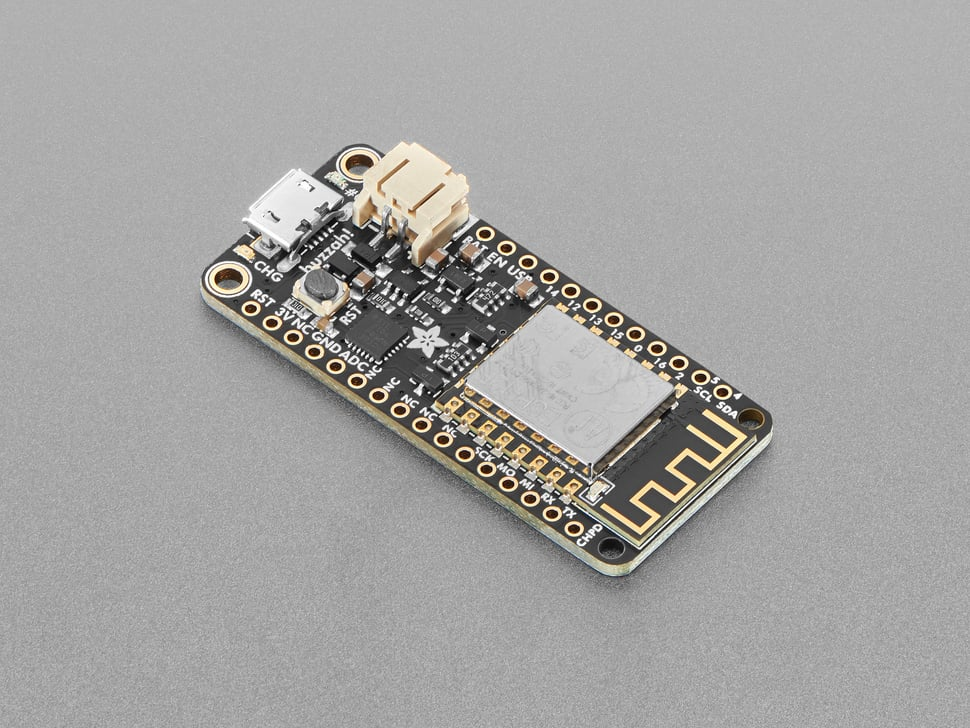

# Adafruit Feather HUZZAH ESP8266

## Details

- **Location**: Cabinet-1, Bin 30
- **Category**: Feather Boards
- **Type**: ESP8266 Development Board (Feather Form Factor)
- **Microcontroller**: ESP8266 (Xtensa LX106 @ 80MHz)
- **Brand**: Adafruit
- **Part Number**: 2821
- **Quantity**: 6
- **Product URL**: https://www.adafruit.com/product/2821

## Description

The Adafruit Feather HUZZAH ESP8266 is an all-in-one ESP8266 WiFi development board with built-in USB and battery charging. It's an ESP8266 WiFi module with all the extras you need, ready to rock! At the Feather HUZZAH's heart is an ESP8266 WiFi microcontroller clocked at 80 MHz with 3.3V logic, containing a Tensilica chip core and full WiFi stack.

## Specifications

- **Microcontroller**: ESP8266 @ 80MHz with 3.3V logic/power
- **Memory**: 80KB SRAM, 4MB Flash (32 MBit)
- **WiFi**: Built-in 802.11 b/g/n
- **GPIO Pins**: 9 total (can be used as I2C and SPI)
- **ADC**: 1x analog input (1.0V max)
- **USB**: CP2104 USB-Serial converter with 921600 max baudrate
- **Power**: 3.3V regulator with 500mA peak current output
- **Battery**: Built-in 100mA LiPoly charger with status LED
- **Special Features**: Auto-reset, Red LED (Pin #0), Blue LED (Pin #2)

## Dimensions

- **Board Size**: 51mm x 23mm x 8mm (2.0" x 0.9" x 0.28")
- **Weight**: 6.1g (light as a large feather!)
- **Form Factor**: Standard Feather compatible

## Image

## Features

- Standard Feather form factor compatible with all FeatherWings
- Built-in 100mA LiPoly charger with charging status indicator LED
- High-quality SiLabs CP2104 USB-Serial chip for fast uploads
- Auto-reset support for easy programming
- Power/enable pin and reset button
- 4 mounting holes for secure installation
- Automatic power switching between USB and battery
- Pin #0 red LED and Pin #2 blue LED for status indication
- Comes preprogrammed with NodeMCU Lua interpreter
- Arduino IDE compatible with ESP8266 core

## Tags

microcontroller, esp8266, feather, huzzah, wifi, battery-charging, adafruit, arduino, nodemcu, iot, usb-serial

## Notes

Perfect for portable IoT projects with built-in WiFi and battery charging. The Feather form factor makes it compatible with the entire ecosystem of FeatherWings. Comes with loose headers that require soldering. The CP2104 USB-Serial converter provides better driver support and higher speeds than CH340 alternatives. Great for Arduino IDE or NodeMCU Lua development.
