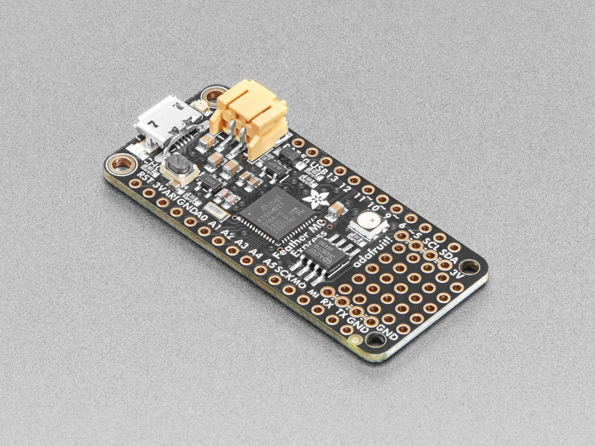
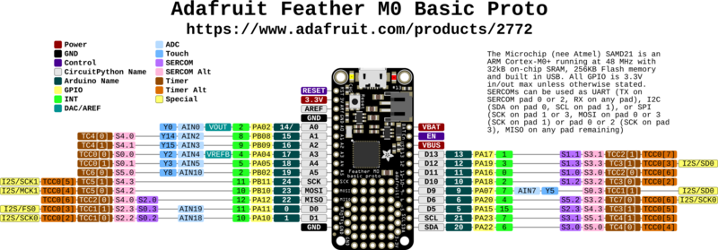

# Adafruit Feather M0 Express

## Details

- **Location**: Cabinet-1, Bin 29
- **Category**: Feather Boards
- **Type**: ATSAMD21 Development Board (Feather Form Factor)
- **Microcontroller**: ATSAMD21G18 ARM Cortex-M0+ @ 48MHz
- **Brand**: Adafruit
- **Part Number**: 3403
- **Quantity**: 3
- **Product URL**: https://www.adafruit.com/product/3403

## Description

The Adafruit Feather M0 Express features an ATSAMD21G18 ARM Cortex M0+ processor with built-in USB, making it perfect for CircuitPython and Arduino projects. It includes 2MB SPI Flash storage, a Mini NeoPixel, and prototyping space, making it an excellent choice for learning and development.

## Specifications

- **Microcontroller**: ATSAMD21G18 @ 48MHz with 3.3V logic/power
- **Memory**: 256KB Flash, 32KB SRAM (no EEPROM)
- **External Storage**: 2MB SPI Flash for CircuitPython files and data logging
- **GPIO Pins**: 20 total
- **ADC**: 6x 12-bit analog inputs
- **DAC**: 1x 10-bit analog output
- **PWM**: PWM outputs on all pins
- **Peripherals**: Hardware Serial, I2C, SPI support
- **USB**: Native USB support with UF2 bootloader
- **Power**: 3.3V regulator with 500mA peak current output
- **Clock**: 32.768 KHz crystal for clock generation & RTC

## Dimensions

- **Board Size**: 51mm x 23mm x 8mm (2.0" x 0.9" x 0.28")
- **Weight**: 5g (light as a large feather!)
- **Form Factor**: Standard Feather compatible

## Image



## Features

- Standard Feather form factor compatible with all FeatherWings
- Pre-loaded with UF2 bootloader for easy programming
- Drag-and-drop programming - appears as USB storage device
- CircuitPython support with 2MB Flash for file storage
- Arduino IDE compatible (bossa-compatible)
- Built-in 100mA LiPoly charger with charging status LED
- Pin #13 red LED for general purpose blinking
- Mini NeoPixel for colorful status indication
- Real Time Clock (RTC) with 32.768 KHz crystal
- 4 mounting holes and reset button
- Power/enable pin for low-power applications
- Small prototyping area for custom circuits

## Programming Options

- **CircuitPython**: Drag-and-drop Python programming with 2MB storage
- **Arduino IDE**: Full Arduino support with SAMD21 core
- **UF2 Bootloader**: Mass storage programming interface
- **PXT MakeCode**: Block-based programming support

## Pinout Diagram



## Basic Wiring Examples

### LED Blink Circuit

```
Feather Pin 13 → Built-in Red LED (no external wiring needed)
OR
Feather Pin 5 → LED Anode (long leg)
LED Cathode (short leg) → 220Ω Resistor → Feather GND

Note: Pin 13 has built-in red LED
```

### Button Input Circuit

```
Feather 3V → 10kΩ Pull-up Resistor → Feather Pin 5
Feather Pin 5 → Button → Feather GND

Code: digitalRead(5) returns HIGH when not pressed, LOW when pressed
```

### I2C Device Connection (STEMMA QT Compatible)

```
I2C Device VCC → Feather 3V
I2C Device GND → Feather GND
I2C Device SDA → Feather Pin 20 (SDA)
I2C Device SCL → Feather Pin 21 (SCL)

Note: Built-in pull-up resistors included
```

### SPI Device Connection

```
SPI Device VCC → Feather 3V
SPI Device GND → Feather GND
SPI Device SCK → Feather Pin SCK
SPI Device MOSI → Feather Pin MOSI
SPI Device MISO → Feather Pin MISO
SPI Device CS → Feather Pin 10 (or any digital pin)
```

### Analog Sensor Reading

```
Sensor Output → Feather Pin A0-A5 (6 analog inputs available)
Sensor VCC → Feather 3V
Sensor GND → Feather GND

Code: analogRead(A0) returns 0-1023 (10-bit ADC)
```

### DAC Output (True Analog)

```
Audio/Analog Output → Feather Pin A0 (DAC)
Connect to amplifier input or analog circuit
Output range: 0-3.3V analog

Note: True 10-bit DAC, not PWM
```

### Serial Communication

```
Device TX → Feather Pin 0 (RX)
Device RX → Feather Pin 1 (TX)
Device VCC → Feather 3V
Device GND → Feather GND

Code: Serial1.begin(9600) for hardware UART
```

### Battery Connection

```
LiPo Battery JST Connector → Feather BAT pin
Battery voltage monitoring → Feather Pin 9 (A7)

Note: Built-in charging circuit, automatic USB/battery switching
```

## Programming Setup Guide

### CircuitPython Setup (Recommended)

1. Download CircuitPython UF2 from circuitpython.org
2. Double-click reset button to enter bootloader mode
3. Drag UF2 file to FEATHERBOOT drive
4. Board reboots as CIRCUITPY drive
5. Edit code.py to program

### Arduino IDE Setup

1. Install Arduino IDE
2. Add Adafruit SAMD boards package URL in preferences
3. Install "Adafruit SAMD Boards" package
4. Select "Adafruit Feather M0 Express" from Tools → Board
5. Double-click reset for first upload

### UF2 Bootloader

1. Double-click reset button
2. Board appears as FEATHERBOOT drive
3. Drag UF2 files to program
4. Automatic reboot after programming

## Programming Examples

### CircuitPython Basic LED Blink

```python
import board
import digitalio
import time

led = digitalio.DigitalInOut(board.D13)
led.direction = digitalio.Direction.OUTPUT

while True:
    led.value = True
    time.sleep(0.5)
    led.value = False
    time.sleep(0.5)
```

### CircuitPython NeoPixel Control

```python
import board
import neopixel
import time

# Built-in NeoPixel
pixel = neopixel.NeoPixel(board.NEOPIXEL, 1, brightness=0.3)

colors = [(255, 0, 0), (0, 255, 0), (0, 0, 255), (255, 255, 0)]

while True:
    for color in colors:
        pixel[0] = color
        time.sleep(0.5)
```

### CircuitPython I2C Scanner

```python
import board
import busio

i2c = busio.I2C(board.SCL, board.SDA)

while not i2c.try_lock():
    pass

print("I2C addresses found:", [hex(device_address)
      for device_address in i2c.scan()])

i2c.unlock()
```

### Arduino Basic LED Blink

```cpp
void setup() {
  pinMode(13, OUTPUT);  // Built-in LED
}

void loop() {
  digitalWrite(13, HIGH);
  delay(1000);
  digitalWrite(13, LOW);
  delay(1000);
}
```

### Arduino DAC Output

```cpp
void setup() {
  analogWriteResolution(10);  // 10-bit DAC resolution
}

void loop() {
  // Generate sine wave on DAC output (pin A0)
  for (int i = 0; i < 360; i++) {
    float radians = i * (PI / 180.0);
    int dacValue = (sin(radians) + 1.0) * 511.5;  // 0-1023 range
    analogWrite(A0, dacValue);
    delayMicroseconds(100);  // ~10kHz sample rate
  }
}
```

### Arduino Battery Monitoring

```cpp
void setup() {
  Serial.begin(9600);
  while (!Serial);
  Serial.println("Feather M0 Express Battery Monitor");
}

void loop() {
  // Read battery voltage (connected through voltage divider)
  int batteryReading = analogRead(A7);
  float batteryVoltage = batteryReading * (3.3 / 1023.0) * 2.0;  // Voltage divider

  Serial.print("Battery voltage: ");
  Serial.print(batteryVoltage);
  Serial.println("V");

  if (batteryVoltage > 4.0) {
    Serial.println("Battery: Full");
  } else if (batteryVoltage > 3.7) {
    Serial.println("Battery: Good");
  } else if (batteryVoltage > 3.4) {
    Serial.println("Battery: Low");
  } else {
    Serial.println("Battery: Critical");
  }

  delay(5000);
}
```

## Important Notes

### Power Considerations

- **3.3V Logic**: All GPIO pins are 3.3V logic level
- **USB Power**: Powered via USB with automatic switching
- **Battery Power**: Built-in LiPo charging and management
- **Current Limit**: 500mA peak from 3.3V regulator
- **Power Monitoring**: Battery voltage available on pin A7

### Pin Capabilities

- **Digital I/O**: 20 pins total
- **Analog Input**: 6 pins (A0-A5) with 12-bit ADC
- **Analog Output**: 1 true DAC pin (A0) with 10-bit resolution
- **PWM**: All digital pins support PWM
- **Touch Sensing**: Not available on ATSAMD21

### Special Features

- **CircuitPython Optimized**: Designed specifically for CircuitPython
- **UF2 Bootloader**: Drag-and-drop programming
- **SPI Flash**: 2MB for CircuitPython files and data
- **Built-in NeoPixel**: RGB status indicator
- **Feather Ecosystem**: Compatible with all FeatherWings

### Programming Considerations

- **Double-click Reset**: Enter bootloader mode for programming
- **CircuitPython Priority**: Optimized for CircuitPython development
- **Arduino Compatible**: Full Arduino IDE support
- **Memory Management**: 32KB SRAM, 256KB Flash + 2MB SPI Flash

## Tags

microcontroller, atsamd21, feather, circuitpython, arduino, m0-express, battery-charging, adafruit, neopixel, spi-flash, uf2

## Notes

This was Adafruit's first board designed specifically for CircuitPython, though newer boards like the M4 series offer better performance. The 2MB SPI Flash acts as storage for CircuitPython scripts and libraries, or can be used as a tiny hard drive in Arduino projects. The UF2 bootloader makes programming incredibly easy - just drag firmware files to the board. Perfect for beginners learning CircuitPython or Arduino programming.
