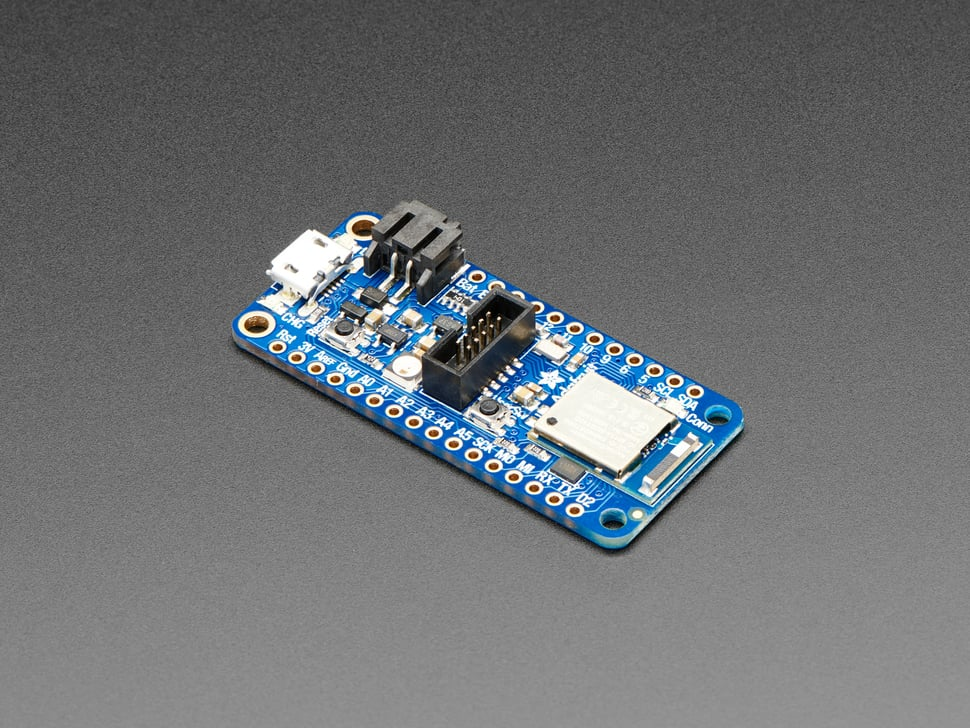

# Adafruit Feather nRF52840 Express

## Details

- **Location**: Cabinet-1, Bin 29
- **Category**: Feather Boards
- **Type**: nRF52840 Development Board with Bluetooth LE (Feather Form Factor)
- **Microcontroller**: nRF52840 ARM Cortex-M4F @ 64MHz
- **Brand**: Adafruit
- **Part Number**: 4062
- **Quantity**: 1
- **Product URL**: https://www.adafruit.com/product/4062

## Description

The Adafruit Feather nRF52840 Express is a powerful Feather board with Bluetooth Low Energy and native USB support. It features the nRF52840 chip with twice the flash and four times the SRAM of the nRF52832, making it perfect for CircuitPython and advanced Arduino projects requiring BLE connectivity.

## Specifications

- **Microcontroller**: nRF52840 ARM Cortex-M4F @ 64MHz with hardware floating point
- **Memory**: 1MB Flash, 256KB SRAM
- **External Storage**: 2MB QSPI Flash for CircuitPython files
- **Bluetooth**: Bluetooth Low Energy 2.4GHz radio (up to +8dBm output power)
- **GPIO Pins**: 21 total
- **ADC**: 6x 12-bit analog inputs
- **PWM**: Up to 12 PWM outputs (3 PWM modules with 4 outputs each)
- **Peripherals**: Hardware SPI, UART, I2C, I2S on any pins
- **USB**: Native USB stack with UF2 bootloader
- **Power**: 1.7V to 3.3V operation with internal regulators
- **Special Features**: NeoPixel LED, USER switch, SWD connector

## Dimensions

- **Board Size**: 51mm x 23mm x 7.2mm (2.0" x 0.9" x 0.28")
- **Weight**: 6g (light as a large feather!)
- **Form Factor**: Standard Feather compatible

## Image

## Features

- Standard Feather form factor compatible with all FeatherWings
- Native USB support - can act as keyboard, mouse, MIDI device, mass storage
- Pre-programmed with UF2 bootloader for easy firmware updates
- CircuitPython support with 2MB QSPI Flash for file storage
- Arduino IDE support with TinyUSB library
- Bluetooth Low Energy with Nordic SoftDevice stack
- Built-in battery charging and voltage monitoring
- Pin #3 red LED and addressable NeoPixel for status indication
- Extra USER switch for custom functions or OTA updates
- SWD connector for advanced debugging
- FCC/IC/TELEC certified module
- 4 mounting holes and reset button

## Bluetooth LE Capabilities

- Nordic UART RX/TX connection profile
- GATT Services and Characteristics support
- Compatible with Adafruit Bluefruit iOS/Android apps
- Color picker, sensor data, and control pad interfaces
- Custom BLE service development support
- iOS and Android compatible without special certification

## Programming Options

- **CircuitPython**: Drag-and-drop Python programming with 2MB storage
- **Arduino IDE**: Full Arduino support with TinyUSB library
- **UF2 Bootloader**: Mass storage programming interface
- **Command Line**: nrfutil for advanced development
- **SWD**: Hardware debugging with external programmer

## Tags

microcontroller, nrf52840, feather, bluetooth-le, circuitpython, arduino, native-usb, battery-charging, adafruit, neopixel, qspi-flash

## Notes

This is Adafruit's first BLE-friendly CircuitPython board, combining the power of the nRF52840 with native USB support. The massive 1MB Flash and 256KB SRAM make it ideal for running CircuitPython with BLE functionality. Perfect for portable projects requiring smartphone connectivity, wearables, and IoT applications. The native USB eliminates the need for separate USB-serial chips.
