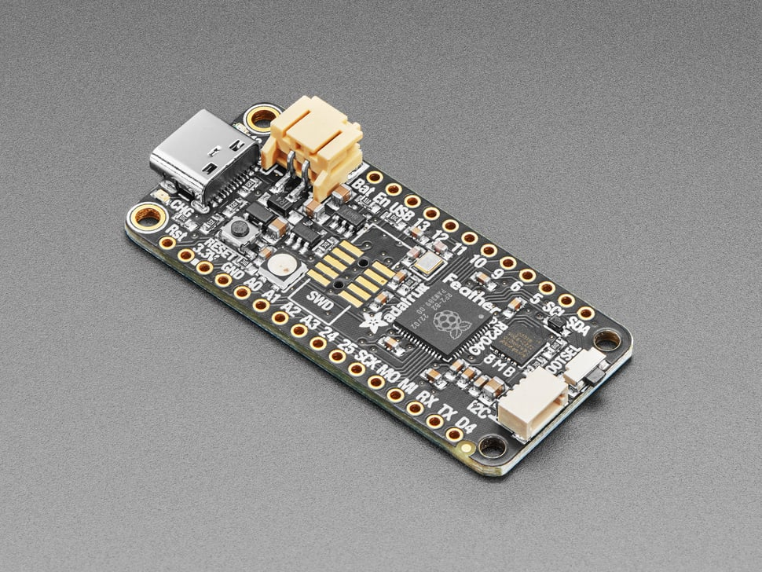
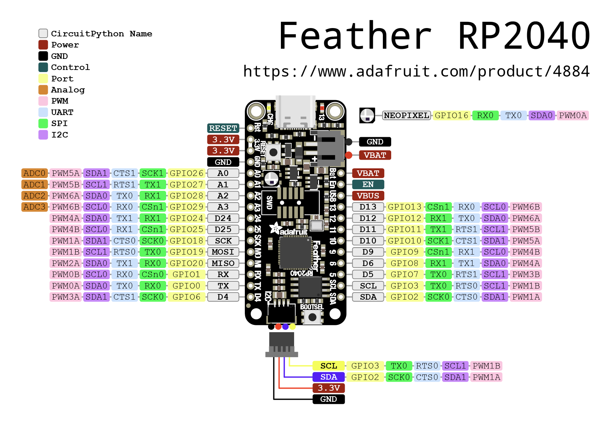

# Adafruit Feather RP2040

## Details

- **Location**: Cabinet-1, Bin 32
- **Category**: Feather Boards
- **Type**: RP2040 Development Board (Feather Form Factor)
- **Microcontroller**: RP2040 (Dual ARM Cortex-M0+ @ 125MHz)
- **Brand**: Adafruit
- **Part Number**: 4884
- **Quantity**: 1
- **Product URL**: https://www.adafruit.com/product/4884

## Description

A new chip means a new Feather, and the Raspberry Pi RP2040 is no exception. This Feather features the RP2040, and all niceties you know and love about Feather including built-in lipoly charging, tons of GPIO, and the standard Feather form factor that's compatible with all FeatherWings.

## Specifications

- **Microcontroller**: RP2040 32-bit Cortex M0+ dual core @ ~125 MHz
- **Logic/Power**: 3.3V
- **Memory**: 264 KB RAM, 8 MB SPI FLASH, No EEPROM
- **Crystal**: 12 MHz for perfect timing
- **GPIO Pins**: 21 total (4 ADC, 16 PWM capable)
- **ADC**: Four 12-bit ADCs (one more than Pico)
- **Peripherals**: Two I2C, Two SPI, Two UART
- **PWM**: 16 PWM outputs
- **USB**: USB Type C connector with built-in ROM bootloader
- **Regulator**: 3.3V with 500mA peak current output
- **Battery**: Built-in 200mA+ lipoly charger with status LED

## Dimensions

- **Board Size**: 51.0mm x 23.0mm x 7.5mm (2.0" x 0.9" x 0.3")
- **Weight**: 5g (light as a large feather!)
- **Form Factor**: Standard Feather compatible

## Image



## Features

- Standard Feather form factor compatible with all FeatherWings
- Built-in 200mA+ lipoly charger with charging status indicator LED
- Pin #13 red LED for general purpose blinking
- RGB NeoPixel for full-color indication
- On-board STEMMA QT connector for easy I2C device connection
- Both Reset button and Bootloader select button
- Optional SWD debug port can be soldered in
- 4 mounting holes for secure installation
- UF2 bootloader for easy programming
- Boot button connected to GPIO #4 for user input

## Pinout Diagram



## Basic Wiring Examples

### LED Blink Circuit

```
Feather Pin D13 → Built-in LED (no external wiring needed)
OR
Feather Pin D5 → LED Anode (long leg)
LED Cathode (short leg) → 220Ω Resistor → Feather GND
```

### Button Input Circuit

```
Feather 3V → 10kΩ Pull-up Resistor → Feather Pin D4
Feather Pin D4 → Button → Feather GND

Code: digitalRead(D4) returns HIGH when not pressed, LOW when pressed
```

### I2C Device Connection (STEMMA QT - Recommended)

```
Simply plug STEMMA QT cable between Feather and I2C device
No wiring required! STEMMA QT provides:
- 3.3V Power
- Ground
- SDA (Pin SDA)
- SCL (Pin SCL)
```

### Manual I2C Connection

```
I2C Device     Feather RP2040
----------     --------------
VCC       →    3V
GND       →    GND
SDA       →    SDA
SCL       →    SCL

Note: Built-in pull-up resistors included
```

### SPI Device Connection

```
SPI Device     Feather RP2040
----------     --------------
VCC       →    3V
GND       →    GND
SCK       →    SCK
MOSI      →    MO (MOSI)
MISO      →    MI (MISO)
CS        →    Any GPIO pin (e.g., D5)
```

### Analog Sensor Reading

```
Sensor Output → Feather Pin A0, A1, A2, or A3
Code: analogRead(A0) returns 0-65535 (0-3.3V)
```

### Battery Power

```
3.7V LiPo Battery → JST PH connector on Feather
Feather automatically manages charging when USB connected
Battery voltage available on BAT pin
```

## Programming Setup Guide

### CircuitPython Setup (Recommended)

1. Download CircuitPython UF2 from circuitpython.org
2. Hold BOOTSEL button while connecting USB-C
3. Drag UF2 file to RPI-RP2 drive
4. Board reboots as CIRCUITPY drive
5. Edit code.py to program

### Arduino IDE Setup

1. Install Arduino IDE 2.0+
2. Add RP2040 board package URL in preferences
3. Install "Raspberry Pi Pico/RP2040" boards
4. Select "Adafruit Feather RP2040" from Tools → Board
5. Hold BOOTSEL while connecting for first upload

## Programming Examples

### CircuitPython NeoPixel Example

```python
import board
import neopixel
import time

# Initialize NeoPixel
pixel = neopixel.NeoPixel(board.NEOPIXEL, 1)

while True:
    pixel[0] = (255, 0, 0)  # Red
    time.sleep(1)
    pixel[0] = (0, 255, 0)  # Green
    time.sleep(1)
    pixel[0] = (0, 0, 255)  # Blue
    time.sleep(1)
```

### Arduino NeoPixel Example

```cpp
#include <Adafruit_NeoPixel.h>

#define NEOPIXEL_PIN PIN_NEOPIXEL
#define NUM_PIXELS 1

Adafruit_NeoPixel pixels(NUM_PIXELS, NEOPIXEL_PIN, NEO_GRB + NEO_KHZ800);

void setup() {
  pixels.begin();
  pixels.setBrightness(50);
}

void loop() {
  pixels.setPixelColor(0, pixels.Color(255, 0, 0));  // Red
  pixels.show();
  delay(1000);

  pixels.setPixelColor(0, pixels.Color(0, 255, 0));  // Green
  pixels.show();
  delay(1000);

  pixels.setPixelColor(0, pixels.Color(0, 0, 255));  // Blue
  pixels.show();
  delay(1000);
}
```

### CircuitPython Battery Monitor

```python
import board
import analogio
import time

# Monitor battery voltage
vbat_voltage = analogio.AnalogIn(board.VOLTAGE_MONITOR)

def get_voltage(pin):
    return (pin.value * 3.3) / 65536 * 2  # Voltage divider

while True:
    battery_voltage = get_voltage(vbat_voltage)
    print(f"Battery voltage: {battery_voltage:.2f}V")

    if battery_voltage < 3.2:
        print("Low battery warning!")

    time.sleep(5)
```

### Arduino I2C Scanner

```cpp
#include <Wire.h>

void setup() {
  Wire.begin();
  Serial.begin(9600);
  while (!Serial);
  Serial.println("\nI2C Scanner");
}

void loop() {
  byte error, address;
  int nDevices;

  Serial.println("Scanning...");
  nDevices = 0;

  for(address = 1; address < 127; address++) {
    Wire.beginTransmission(address);
    error = Wire.endTransmission();

    if (error == 0) {
      Serial.print("I2C device found at address 0x");
      if (address < 16) Serial.print("0");
      Serial.print(address, HEX);
      Serial.println("  !");
      nDevices++;
    }
  }

  if (nDevices == 0)
    Serial.println("No I2C devices found\n");
  else
    Serial.println("done\n");

  delay(5000);
}
```

## Feather Ecosystem

The Feather RP2040's standard form factor makes it compatible with the entire Feather ecosystem:

### FeatherWings (Add-on Boards)

- OLED displays (128x32, 128x64)
- Motor controllers
- Sensor breakouts
- Audio amplifiers
- LoRa radio modules
- GPS modules
- And many more!

### Stacking and Expansion

- Stack multiple FeatherWings using stacking headers
- Breadboard-friendly with standard 0.1" spacing
- Prototyping area available on many FeatherWings
- Mix and match functionality as needed

## Important Notes

### Power Considerations

- **3.3V Logic**: All GPIO pins are 3.3V logic level
- **USB-C Power**: Can be powered via USB-C or battery
- **Battery Charging**: Built-in 200mA+ LiPo charger
- **Current Limit**: 500mA peak from onboard regulator

### Pin Limitations and Features

- **ADC Pins**: A0, A1, A2, A3 can be used for analog input
- **PWM**: 16 pins support PWM output
- **I2C**: Two I2C peripherals (I2C0 and I2C1)
- **SPI**: Two SPI peripherals (SPI0 and SPI1)
- **UART**: Two UART peripherals (UART0 and UART1)

### Special Features

- **BOOTSEL Button**: Connected to GPIO4 (Rev D+) for user input
- **NeoPixel**: Built-in RGB LED for status indication
- **STEMMA QT**: Plug-and-play I2C connectivity
- **Battery Monitor**: Built-in voltage divider for battery monitoring

## Tags

microcontroller, rp2040, feather, stemma-qt, usb-c, adafruit, circuitpython, neopixel, battery-charging

## Notes

Perfect for portable projects with the built-in battery charging capability. The Feather form factor makes it compatible with the entire ecosystem of FeatherWings. Supports CircuitPython, MicroPython, and C/C++ development. The 8 consecutive digital GPIO pins provide maximum PIO compatibility for advanced applications.
