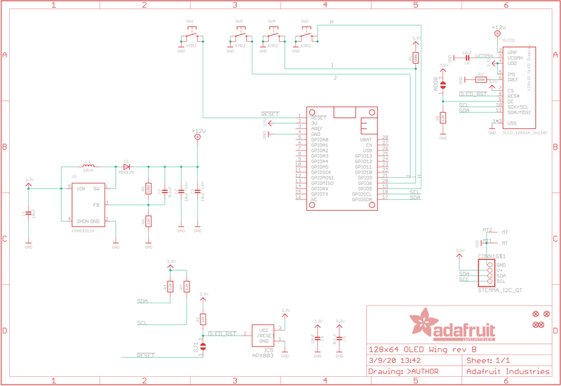
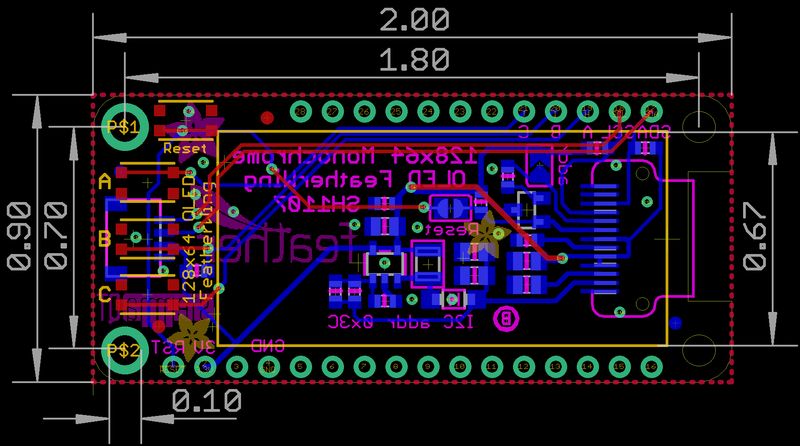

# Adafruit FeatherWing OLED 128x64 STEMMA QT

## Overview

The Adafruit FeatherWing OLED 128x64 is a gorgeous monochrome OLED display add-on that works with any Feather main board. This FeatherWing features a crisp 128x64 OLED display with high contrast and excellent readability, plus three user buttons (A, B, C) and a STEMMA QT connector for easy sensor integration.

## Specifications

- **Display Type**: OLED (Organic Light Emitting Diode)
- **Resolution**: 128x64 pixels
- **Colors**: Monochrome white on black
- **Screen Size**: ~1.3" diagonal
- **Display Area**: ~25.8mm / ~1.0"
- **Controller**: SH1107 (not SSD1306)
- **Interface**: I2C
- **Operating Voltage**: 3.3V/5V compatible
- **PCB Dimensions**: 22.9mm x 50.9mm / 0.9" x 2"

## Features

- **High Contrast Display**: Self-illuminating OLED pixels for excellent readability
- **No Backlight Required**: Each pixel generates its own light
- **3 User Buttons**: Tactile buttons labeled A, B, and C for user interface
- **STEMMA QT Connector**: Easy plug-and-play connection for sensors and peripherals
- **Reset Button**: Convenient reset functionality
- **I2C Interface**: Uses only 2 pins plus power and ground
- **Stackable Design**: Can be stacked with other FeatherWings
- **Pin Compatible**: Upgrade path from 128x32 OLED FeatherWing

## Pinout

- **Power**: 3.3V and Ground from Feather
- **I2C**: SDA and SCL pins
- **Reset**: Connected to Feather reset pin
- **Buttons**: A, B, C buttons accessible via I2C
- **STEMMA QT**: 4-pin JST SH connector (VCC, GND, SDA, SCL)

## Applications

- Status displays for IoT projects
- Menu systems and user interfaces
- Sensor data visualization
- Debug information display
- Portable device displays
- Weather stations
- Data logging displays

## Compatibility

- **All Feather Boards**: ESP8266, ESP32, M0, M4, RP2040, etc.
- **Arduino IDE**: Full library support
- **CircuitPython**: Native support
- **STEMMA QT/Qwiic**: Compatible with SparkFun Qwiic ecosystem
- **Grove**: Compatible with Grove I2C sensors via adapter cable

## Programming Support

### Arduino Libraries

- Adafruit SH1107 library
- Adafruit GFX library for graphics
- Button handling libraries

### CircuitPython

- displayio support
- Built-in graphics capabilities
- Easy button integration

## Pinout Diagrams

### Official Adafruit OLED FeatherWing Schematic



### OLED FeatherWing Fabrication Print



## Basic Wiring Examples

### Standard FeatherWing Connection

```
Feather Board → OLED FeatherWing (via stacking headers)
- 3V → 3V
- GND → GND
- SCL → SCL
- SDA → SDA
- RST → RST (auto-connected)

Note: Use Feather stacking headers for easy connection
```

### Non-Feather Board Connection (Minimal)

```
Microcontroller 3.3V → FeatherWing 3V
Microcontroller GND → FeatherWing GND
Microcontroller SCL → FeatherWing SCL
Microcontroller SDA → FeatherWing SDA
Microcontroller RST → FeatherWing RST

Note: Reset connection is required for proper operation
```

### STEMMA QT Sensor Chain

```
FeatherWing STEMMA QT → STEMMA QT Cable → I2C Sensor
- Automatic 3.3V, GND, SCL, SDA connection
- Supports multiple sensors in chain
- Compatible with SparkFun Qwiic ecosystem

Example: FeatherWing → BME280 → LIS3DH → TSL2591
```

### Button Connections (for non-Feather boards)

```
Button A → Microcontroller Pin 9 (or chosen GPIO)
Button B → Microcontroller Pin 6 (or chosen GPIO)
Button C → Microcontroller Pin 5 (or chosen GPIO)

Note: Buttons are active-low with internal pull-ups
```

## Programming Setup Guide

### Arduino IDE Setup

1. Install Arduino IDE 1.8.19 or later
2. Install required libraries via Library Manager:
   - Adafruit SH110X library
   - Adafruit GFX library
   - Adafruit BusIO library (auto-installed)
3. Select appropriate Feather board from Tools → Board
4. Connect FeatherWing to Feather with stacking headers

### CircuitPython Setup

1. Install CircuitPython on your Feather board
2. Install required libraries in lib folder:
   - adafruit_displayio_sh1107
   - adafruit_bus_device
   - adafruit_display_text
3. Create code.py file with your display code

## Programming Examples

### Arduino - Basic Display Test

```cpp
#include <SPI.h>
#include <Wire.h>
#include <Adafruit_GFX.h>
#include <Adafruit_SH110X.h>

Adafruit_SH1107 display = Adafruit_SH1107(64, 128, &Wire);

// Button pins for different Feather boards
#if defined(ESP8266)
  #define BUTTON_A  0
  #define BUTTON_B 16
  #define BUTTON_C  2
#elif defined(ESP32)
  #define BUTTON_A 15
  #define BUTTON_B 32
  #define BUTTON_C 14
#else // M0, M4, nRF52840, RP2040
  #define BUTTON_A  9
  #define BUTTON_B  6
  #define BUTTON_C  5
#endif

void setup() {
  Serial.begin(115200);

  // Initialize display
  delay(250); // Wait for OLED to power up
  display.begin(0x3C, true); // I2C address 0x3C

  // Show Adafruit splash screen
  display.display();
  delay(2000);

  // Clear display
  display.clearDisplay();
  display.setRotation(1); // Landscape orientation

  // Initialize buttons
  pinMode(BUTTON_A, INPUT_PULLUP);
  pinMode(BUTTON_B, INPUT_PULLUP);
  pinMode(BUTTON_C, INPUT_PULLUP);

  Serial.println("OLED FeatherWing initialized");
}

void loop() {
  display.clearDisplay();

  // Display title
  display.setTextSize(1);
  display.setTextColor(SH110X_WHITE);
  display.setCursor(0, 0);
  display.println("OLED FeatherWing Test");
  display.println();

  // Check buttons and display status
  display.print("Buttons: ");
  if (!digitalRead(BUTTON_A)) {
    display.print("A ");
  }
  if (!digitalRead(BUTTON_B)) {
    display.print("B ");
  }
  if (!digitalRead(BUTTON_C)) {
    display.print("C ");
  }
  display.println();

  // Display some graphics
  display.drawRect(0, 40, 128, 24, SH110X_WHITE);
  display.fillRect(2, 42, 124, 20, SH110X_WHITE);

  display.setTextColor(SH110X_BLACK);
  display.setCursor(10, 48);
  display.println("Graphics Test");

  display.display();
  delay(100);
}
```

## Important Notes

- **OLED Lifespan**: Pixels may dim after 1000+ hours of continuous use
- **Power Management**: Turn off display when not needed to preserve lifespan
- **Controller Difference**: Uses SH1107, not SSD1306 (requires specific library)
- **Pin Usage**: Uses I2C pins, can be stacked with other I2C devices
- **Assembly**: Comes with loose headers requiring soldering

## Package Contents

- 1x FeatherWing OLED 128x64 PCB
- 1x Set of 0.1" headers (unattached)
- Documentation and tutorial links

## Mounting

- **Feather Stacking Headers**: For permanent stacking installation
- **Feather Female Headers**: For removable connection
- **Direct Soldering**: Large square pads available for wire connections
- **Mounting Holes**: Available for secure enclosure mounting
