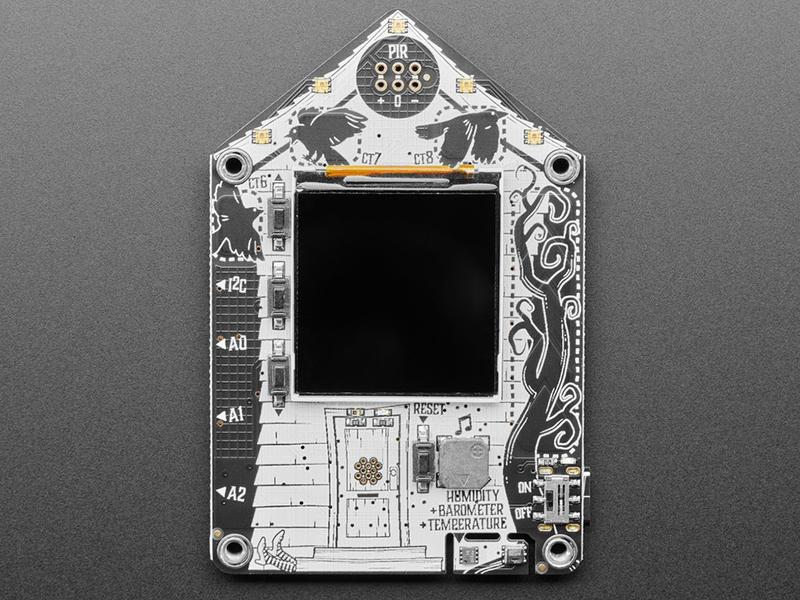
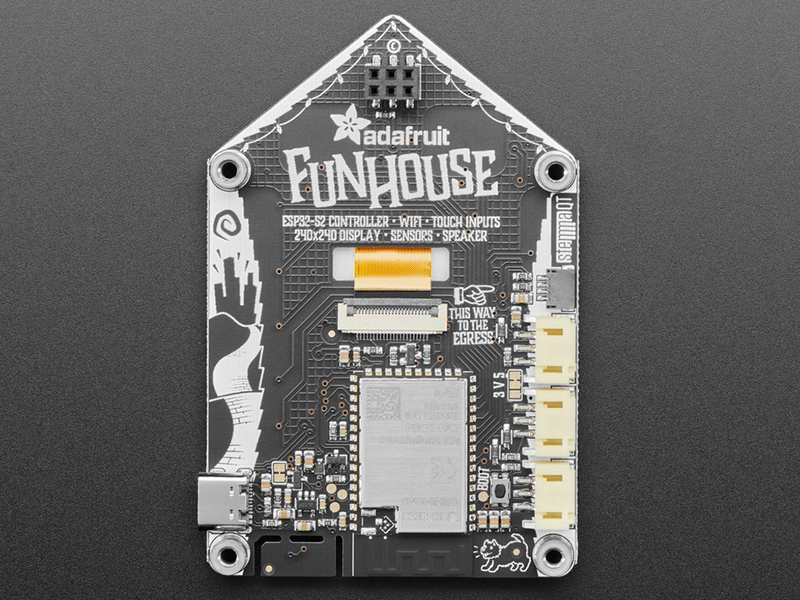
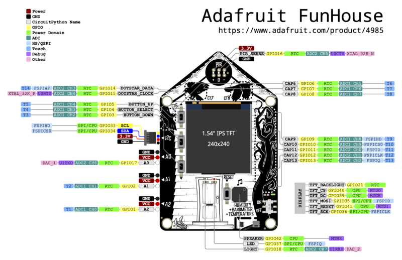

# Adafruit FunHouse - WiFi Home Automation Development Board

## Overview

The Adafruit FunHouse is a comprehensive WiFi-enabled home automation development board built around the ESP32-S2 microcontroller. Designed to make home automation projects easy and accessible, it features a color TFT display, multiple built-in sensors, extensive connectivity options, and support for both CircuitPython and Arduino development environments.

## Specifications

- **Processor**: ESP32-S2 240MHz Tensilica processor
- **Memory**: 4MB Flash, 2MB PSRAM (WROVER module)
- **Display**: 1.54" Color TFT (240x240 pixels)
- **Connectivity**: WiFi 802.11 b/g/n, USB-C
- **Power**: USB-C or external power input
- **Dimensions**: 85mm x 56mm x 10.8mm
- **Weight**: 26.6g

## Key Features

### ESP32-S2 Processor

- **240MHz Performance**: Fast processing for IoT applications
- **Native USB**: Acts as keyboard, mouse, MIDI device, or disk drive
- **WiFi Connectivity**: Built-in 802.11 b/g/n WiFi with antenna
- **FCC/CE Certified**: WROVER module with regulatory approval
- **Large Memory**: 4MB Flash and 2MB PSRAM for data buffers

### Built-in Sensors

- **DPS310**: Barometric pressure and temperature sensor
- **AHT20**: Relative humidity and temperature sensor
- **Light Sensor**: Front-facing ambient light detection
- **PIR Socket**: Plug-in socket for mini PIR motion sensor (sold separately)

### Display and Interface

- **1.54" TFT Display**: 240x240 pixel color display with SPI interface
- **Controllable Backlight**: Adjustable brightness
- **Five RGB LEDs**: Mini DotStar LEDs for status indication
- **Three Buttons**: User input and wake-from-sleep functionality
- **Capacitive Touch**: Three touch pads and one 5-element slider

### Connectivity Options

- **STEMMA QT**: I2C connector for sensors and devices
- **Three STEMMA 3-pin**: Digital/analog/PWM connections
- **USB-C**: Power and data with native USB support
- **Speaker/Buzzer**: Built-in audio output for notifications

## Hardware Components

### Environmental Sensors

- **DPS310 Pressure Sensor**: ±0.002 hPa precision, temperature compensation
- **AHT20 Humidity Sensor**: ±2% RH accuracy, -40°C to +85°C range
- **Light Sensor**: Ambient light detection for automatic display brightness
- **Temperature Monitoring**: Dual temperature sensors for accuracy

### User Interface

- **Color Display**: High-quality IPS TFT with wide viewing angles
- **Touch Interface**: Capacitive touch pads and slider
- **Physical Buttons**: Three tactile buttons for reliable input
- **LED Indicators**: Five programmable RGB LEDs
- **Audio Feedback**: Built-in buzzer for audible notifications

### Expansion Capabilities

- **STEMMA QT**: Connect I2C devices like additional sensors
- **STEMMA 3-pin**: Connect NeoPixels, servos, relays, or sensors
- **PIR Socket**: Easy connection for motion detection
- **GPIO Access**: Additional pins available for custom connections

## Software Support

### CircuitPython

- **Native Support**: Optimized CircuitPython support
- **Rapid Development**: Quick prototyping and testing
- **Extensive Libraries**: Access to CircuitPython ecosystem
- **Interactive Development**: REPL for real-time coding
- **File System**: Appears as USB drive for easy file management

### Arduino IDE

- **ESP32 Support**: Full Arduino IDE compatibility
- **Arduino Libraries**: Access to vast Arduino library ecosystem
- **Familiar Environment**: Standard Arduino development workflow
- **Community Support**: Large ESP32 Arduino community

### Development Tools

- **Adafruit Libraries**: Comprehensive sensor and display libraries
- **Example Projects**: Multiple ready-to-use examples
- **Documentation**: Extensive guides and tutorials
- **Web IDE**: Browser-based development options

## Applications

### Home Automation

- **Environmental Monitoring**: Temperature, humidity, pressure tracking
- **Smart Displays**: Weather stations, status displays
- **Motion Detection**: Security and automation triggers
- **Remote Control**: WiFi-controlled devices and systems

### IoT Projects

- **Sensor Networks**: Multi-sensor data collection
- **Cloud Integration**: Connect to IoT platforms and services
- **Data Logging**: Local and cloud data storage
- **Remote Monitoring**: Access data from anywhere

### Educational Use

- **STEM Education**: Teaching IoT and automation concepts
- **Programming Courses**: CircuitPython and Arduino learning
- **Science Projects**: Environmental data collection
- **Maker Education**: Hands-on technology learning

## Connectivity Features

### WiFi Capabilities

- **802.11 b/g/n**: Standard WiFi connectivity
- **WPA/WPA2**: Secure wireless connections
- **Access Point Mode**: Can create its own WiFi network
- **Station Mode**: Connect to existing WiFi networks
- **SSL/TLS**: Secure communications support

### Internet Integration

- **HTTP/HTTPS**: Web client and server capabilities
- **MQTT**: IoT messaging protocol support
- **REST APIs**: Easy integration with web services
- **Cloud Services**: Connect to AWS, Google Cloud, Azure
- **Adafruit IO**: Native support for Adafruit's IoT platform

## Power Management

### Power Options

- **USB-C**: Primary power and programming interface
- **External Power**: VIN pin for battery or adapter power
- **Low Power Modes**: Deep sleep for battery operation
- **Power Monitoring**: Built-in power management features

### Battery Operation

- **LiPoly Support**: Can be powered by lithium polymer batteries
- **Charging Circuit**: Built-in battery charging (with appropriate circuit)
- **Sleep Modes**: Extended battery life with deep sleep
- **Wake Sources**: Wake from buttons, sensors, or timers

## Environmental Monitoring

### Sensor Capabilities

- **Temperature**: Dual sensors for accuracy and redundancy
- **Humidity**: Precise relative humidity measurement
- **Pressure**: Barometric pressure for weather monitoring
- **Light**: Ambient light for automatic adjustments
- **Motion**: PIR sensor support for occupancy detection

### Data Collection

- **Real-time Monitoring**: Continuous sensor reading
- **Data Logging**: Store data locally or in cloud
- **Trend Analysis**: Track environmental changes over time
- **Alerts**: Trigger notifications based on sensor values

## Package Contents

- 1x FunHouse development board
- Documentation and getting started guide
- Example code and libraries
- Mounting hardware (varies by version)

## Important Notes

- **PIR Sensor**: Motion sensor sold separately
- **WiFi Range**: Performance depends on WiFi signal strength
- **Power Requirements**: Check power needs for connected devices
- **Development Environment**: CircuitPython recommended for beginners
- **Sensor Calibration**: Some sensors may need calibration

## Advantages

- **All-in-One**: Complete home automation platform
- **Easy Development**: CircuitPython makes programming simple
- **Extensive Sensors**: Multiple built-in environmental sensors
- **Expandable**: Multiple expansion options
- **WiFi Ready**: Built-in connectivity for IoT projects

## Getting Started

### Basic Setup

1. **Install CircuitPython**: Flash latest CircuitPython firmware
2. **Connect USB-C**: Use USB-C cable for power and programming
3. **Install Libraries**: Add required CircuitPython libraries
4. **Run Examples**: Start with built-in sensor examples
5. **Configure WiFi**: Set up wireless connectivity

### First Project

- **Sensor Display**: Show environmental data on screen
- **WiFi Connection**: Connect to home network
- **Data Logging**: Log sensor data to file
- **Web Interface**: Create simple web server
- **IoT Integration**: Connect to cloud service

## Pinout Diagrams

### Official Adafruit FunHouse Pinouts







## Basic Wiring Examples

### PIR Motion Sensor Connection

```
Mini PIR Sensor + → FunHouse PIR Socket + (3.3V)
Mini PIR Sensor - → FunHouse PIR Socket - (GND)
Mini PIR Sensor OUT → FunHouse PIR Socket Signal (GPIO16)

Note: Insert PIR sensor through front of board into back connector
```

### External NeoPixel Strip (A0 Port)

```
NeoPixel Strip VCC → FunHouse A0 Port + (5V/3.3V selectable)
NeoPixel Strip GND → FunHouse A0 Port - (GND)
NeoPixel Strip DIN → FunHouse A0 Port Signal (GPIO17)

Code: import neopixel; pixels = neopixel.NeoPixel(board.A0, 30)
```

### Servo Motor Connection (A1 Port)

```
Servo Red Wire → FunHouse A1 Port + (5V)
Servo Black Wire → FunHouse A1 Port - (GND)
Servo White Wire → FunHouse A1 Port Signal (GPIO2)

Code: import pwmio; servo = pwmio.PWMOut(board.A1, frequency=50)
```

### Relay Module Connection (A2 Port)

```
Relay Module VCC → FunHouse A2 Port + (5V)
Relay Module GND → FunHouse A2 Port - (GND)
Relay Module IN → FunHouse A2 Port Signal (GPIO1)

Code: import digitalio; relay = digitalio.DigitalInOut(board.A2)
```

### I2C Sensor via STEMMA QT

```
I2C Sensor VCC → FunHouse STEMMA QT 3.3V
I2C Sensor GND → FunHouse STEMMA QT GND
I2C Sensor SDA → FunHouse STEMMA QT SDA
I2C Sensor SCL → FunHouse STEMMA QT SCL

Note: Use STEMMA QT cable for plug-and-play connection
```

### External Speaker Connection

```
8Ω Speaker + → FunHouse Speaker Terminal +
8Ω Speaker - → FunHouse Speaker Terminal -

Note: Built-in amplifier on GPIO42 (DAC)
```

### Battery Power Connection

```
3.7V LiPo Battery + → FunHouse Battery JST Connector +
3.7V LiPo Battery - → FunHouse Battery JST Connector -

Note: Built-in charging circuit when USB connected
```

## Programming Setup Guide

### CircuitPython Setup (Recommended)

1. Download CircuitPython UF2 for FunHouse from circuitpython.org
2. Hold BOOT button while pressing RESET to enter bootloader
3. Drag UF2 file to FUNHOUSEBOOT drive
4. Board reboots as CIRCUITPY drive
5. Install required libraries in lib folder

### Arduino IDE Setup

1. Install Arduino IDE 1.8.19 or later
2. Add ESP32 board package URL in preferences
3. Install "ESP32" boards package
4. Install required libraries:
   - Adafruit GFX Library
   - Adafruit ST7789 Library
   - Adafruit DotStar Library
   - Adafruit DPS310 Library
   - Adafruit AHTX0 Library
5. Select "Adafruit FunHouse" from Tools → Board

### WiFi Configuration

1. Create secrets.py file with WiFi credentials
2. Add SSID and password for network connection
3. Configure time zone and location settings
4. Set up API keys for weather/IoT services

## Programming Examples

### CircuitPython - Home Automation Dashboard

```python
import board
import displayio
import terminalio
import wifi
import socketpool
import adafruit_requests
import adafruit_dps310
import adafruit_ahtx0
from adafruit_display_text import label
from adafruit_funhouse import FunHouse
import time

# Initialize FunHouse
funhouse = FunHouse(default_bg=0x0F0F00)

# Initialize sensors
i2c = board.STEMMA_I2C()
dps310 = adafruit_dps310.DPS310(i2c)
aht20 = adafruit_ahtx0.AHTx0(i2c)

# Connect to WiFi
try:
    from secrets import secrets
except ImportError:
    print("WiFi secrets are kept in secrets.py, please add them there!")
    raise

wifi.radio.connect(secrets["ssid"], secrets["password"])
pool = socketpool.SocketPool(wifi.radio)
requests = adafruit_requests.Session(pool)

# Create display labels
temp_label = label.Label(terminalio.FONT, text="Temp: --°F", color=0xFFFFFF)
temp_label.x = 10
temp_label.y = 30
funhouse.splash.append(temp_label)

humidity_label = label.Label(terminalio.FONT, text="Humidity: --%", color=0x00FFFF)
humidity_label.x = 10
humidity_label.y = 50
funhouse.splash.append(humidity_label)

pressure_label = label.Label(terminalio.FONT, text="Pressure: -- hPa", color=0x00FF00)
pressure_label.x = 10
pressure_label.y = 70
funhouse.splash.append(pressure_label)

light_label = label.Label(terminalio.FONT, text="Light: --", color=0xFFFF00)
light_label.x = 10
light_label.y = 90
funhouse.splash.append(light_label)

weather_label = label.Label(terminalio.FONT, text="Weather: Loading...", color=0xFF00FF)
weather_label.x = 10
weather_label.y = 110
funhouse.splash.append(weather_label)

status_label = label.Label(terminalio.FONT, text="Status: Ready", color=0xFF0000)
status_label.x = 10
status_label.y = 130
funhouse.splash.append(status_label)

# Main loop
last_weather_update = 0
weather_interval = 300  # 5 minutes

while True:
    # Read sensors
    temperature = aht20.temperature * 9/5 + 32  # Convert to Fahrenheit
    humidity = aht20.relative_humidity
    pressure = dps310.pressure
    light_level = funhouse.peripherals.light

    # Update sensor displays
    temp_label.text = f"Temp: {temperature:.1f}°F"
    humidity_label.text = f"Humidity: {humidity:.1f}%"
    pressure_label.text = f"Pressure: {pressure:.1f} hPa"
    light_label.text = f"Light: {light_level}"

    # Update weather periodically
    current_time = time.monotonic()
    if current_time - last_weather_update > weather_interval:
        try:
            # Replace with your weather API
            weather_url = f"http://api.openweathermap.org/data/2.5/weather?q={secrets['location']}&appid={secrets['weather_api_key']}&units=imperial"
            response = requests.get(weather_url)
            weather_data = response.json()
            weather_desc = weather_data['weather'][0]['description']
            weather_temp = weather_data['main']['temp']
            weather_label.text = f"Outside: {weather_temp:.0f}°F {weather_desc}"
            last_weather_update = current_time
        except Exception as e:
            weather_label.text = "Weather: Error"
            print(f"Weather error: {e}")

    # Check buttons
    if funhouse.peripherals.button_up:
        status_label.text = "Status: Button UP"
        funhouse.peripherals.dotstars.fill((0, 255, 0))
    elif funhouse.peripherals.button_down:
        status_label.text = "Status: Button DOWN"
        funhouse.peripherals.dotstars.fill((255, 0, 0))
    elif funhouse.peripherals.button_select:
        status_label.text = "Status: Button SELECT"
        funhouse.peripherals.dotstars.fill((0, 0, 255))
    else:
        status_label.text = "Status: Ready"
        funhouse.peripherals.dotstars.fill((0, 0, 0))

    # Check PIR motion sensor
    if funhouse.peripherals.pir_sensor:
        status_label.text = "Status: MOTION!"
        funhouse.peripherals.dotstars.fill((255, 255, 0))
        funhouse.peripherals.play_tone(1000, 0.1)

    # Auto-adjust display brightness
    if light_level < 100:
        funhouse.display.brightness = 0.3
    elif light_level < 500:
        funhouse.display.brightness = 0.7
    else:
        funhouse.display.brightness = 1.0

    time.sleep(1)
```

## Recommended Accessories

- Mini PIR motion sensor (Adafruit #4871)
- STEMMA QT sensors for additional monitoring
- LiPoly battery for portable operation
- Mounting plate and stand
- External speakers for audio projects
