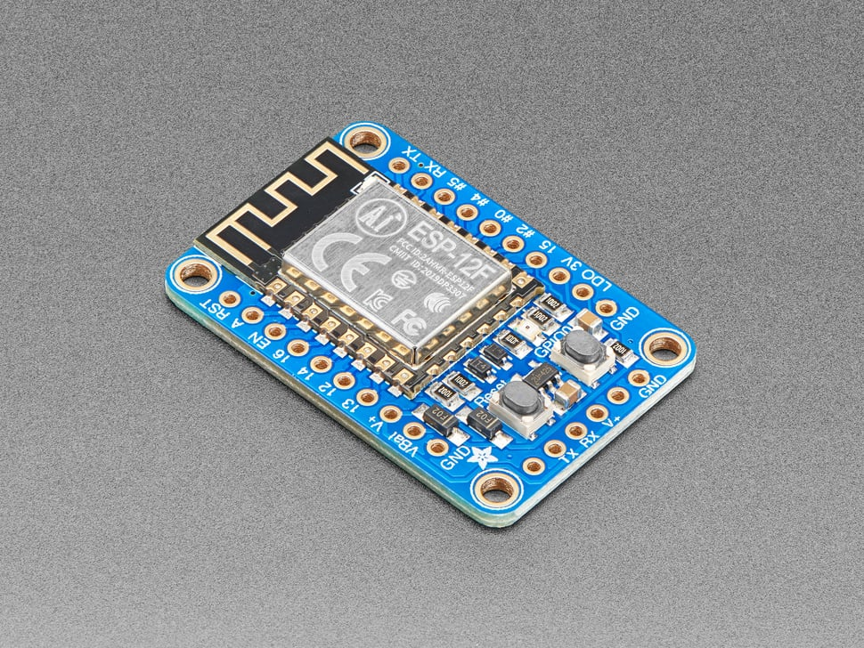

# Adafruit HUZZAH ESP8266 Breakout

## Details

- **Location**: Cabinet-1, Bin 30
- **Category**: Microcontroller Boards
- **Type**: ESP8266 Development Board (Breakout Board)
- **Microcontroller**: ESP8266 (Xtensa LX106 @ 80MHz)
- **Brand**: Adafruit
- **Part Number**: 2471
- **Quantity**: 4
- **Product URL**: https://www.adafruit.com/product/2471

## Description

Add Internet to your next project with an adorable, bite-sized WiFi microcontroller! The ESP8266 processor from Espressif is an 80 MHz microcontroller with a full WiFi front-end (both as client and access point) and TCP/IP stack with DNS support. The Adafruit HUZZAH ESP8266 breakout makes working with this chip super easy and fun.

## Specifications

- **Microcontroller**: ESP8266 80MHz Xtensa LX106 processor
- **Logic/Power**: 3.3V
- **Memory**: 80KB SRAM, 4MB Flash
- **WiFi**: 802.11 b/g/n with client and access point modes
- **GPIO Pins**: 9 total (3.3V logic)
- **ADC**: 1x analog input (1.0V max)
- **Peripherals**: I2C, SPI, 2x UART
- **PWM**: PWM outputs on GPIO pins
- **Power**: 3.3V out, 500mA regulator
- **Special Features**: Reset button, User button, Red LED

## Dimensions

- **Board Size**: 25.4mm x 50.8mm (1.0" x 2.0")
- **Weight**: ~8g
- **Form Factor**: Breadboard-friendly breakout

## Image

## Features

- Certified module with onboard antenna
- Reset and user buttons (user button for bootloading mode)
- Red LED for status indication
- Level shifting on UART and reset pin
- 3.3V regulator with 500mA output (ESP8266 can draw up to 250mA)
- Two diode-protected power inputs (USB cable and battery)
- Breadboard-friendly dual parallel breakouts
- FTDI pinout for easy programming with console cable
- Pre-loaded with NodeMCU Lua interpreter
- Arduino IDE compatible with ESP8266 core
- FCC and CE certified

## Tags

microcontroller, esp8266, huzzah, wifi, breakout, adafruit, arduino, nodemcu, lua, iot

## Notes

Perfect for IoT projects requiring WiFi connectivity. Comes pre-loaded with NodeMCU Lua interpreter but can be programmed with Arduino IDE. Requires USB-Serial cable for programming (FTDI Friend, FTDI cable, or USB console cable). Great for beginners getting started with ESP8266 development. The breakout design makes it easy to prototype on breadboards.
