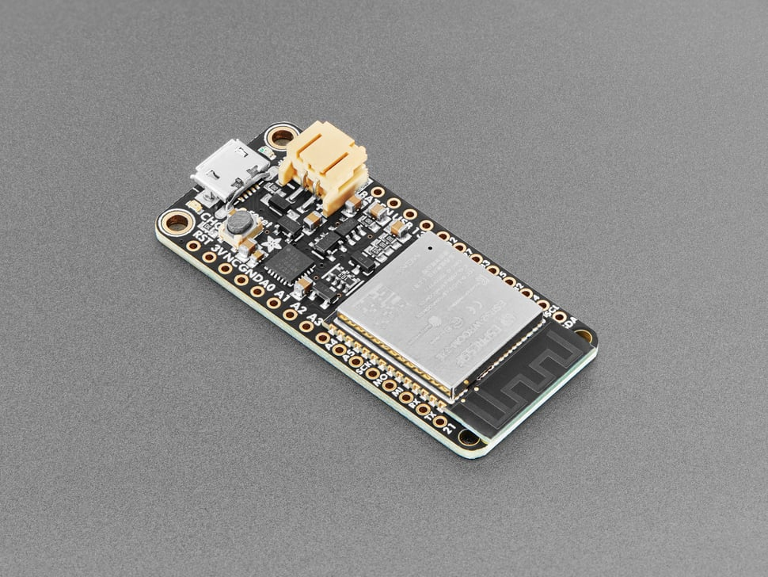

# Adafruit HUZZAH32 ESP32 Feather Board

## Details

- **Location**: Cabinet-1, Bin 31
- **Category**: Feather Boards
- **Type**: ESP32 Development Board (Feather Form Factor)
- **Microcontroller**: ESP32 (Dual Xtensa LX6 @ 240MHz)
- **Brand**: Adafruit
- **Part Number**: 3405
- **Quantity**: 3
- **Product URL**: https://www.adafruit.com/product/3405

## Description

The Adafruit HUZZAH32 is an ESP32-based Feather board made with the official WROOM32 module. It combines the powerful dual-core ESP32 processor with WiFi and Bluetooth connectivity in the popular Feather form factor, making it compatible with the entire ecosystem of FeatherWings.

## Specifications

- **Microcontroller**: ESP32 dual-core 240MHz Tensilica LX6 with 600 DMIPS
- **Memory**: 520KB integrated SRAM, 4MB SPI Flash (WROOM32 module)
- **WiFi**: 802.11b/g/n HT40 with integrated antenna
- **Bluetooth**: Dual mode (Classic and BLE)
- **GPIO Pins**: 21 total
- **ADC**: 12x analog input channels
- **DAC**: 2x digital-to-analog converters
- **Peripherals**: 3x UART, 3x SPI, 2x I2C, 2x I2S Audio
- **PWM**: Available on every GPIO pin
- **USB**: Built-in USB-to-Serial converter with auto-reset
- **Power**: 3.3V regulator, built-in LiPoly charging

## Dimensions

- **Board Size**: 51.0mm x 22.7mm x 7.3mm (2.0" x 0.9" x 0.3")
- **Weight**: 6.8g
- **Form Factor**: Standard Feather compatible

## Image

## Features

- Standard Feather form factor compatible with 50+ FeatherWings
- Dual-core ESP32 processor for multitasking
- Built-in WiFi and Bluetooth Classic/LE connectivity
- STEMMA QT connector for easy I2C device connection
- Built-in LiPoly battery charging and monitoring
- USB-to-Serial converter with automatic bootloader reset
- On-board PCB antenna for wireless connectivity
- Ultra-low noise analog amplifier
- Hall sensor and capacitive touch interfaces
- 32kHz crystal oscillator for accurate timing
- OpenOCD debug interface with 32kB TRAX buffer

## Advanced Features

- **Touch Interface**: 10x capacitive touch GPIO pins
- **Hall Sensor**: Built-in magnetic field sensor
- **Security**: Hardware encryption acceleration
- **Real-time**: Dedicated real-time operating system support
- **Audio**: I2S audio input/output capability
- **SD Card**: SDIO controller for SD card interface
- **Debug**: JTAG debugging support

## Connectivity

- **WiFi**: 802.11b/g/n with WPA/WPA2 security
- **Bluetooth Classic**: Traditional Bluetooth connectivity
- **Bluetooth LE**: Low energy wireless communication
- **Range**: Excellent RF performance with tuned antenna

## Programming Support

- **Arduino IDE**: Full Arduino support with ESP32 core
- **ESP-IDF**: Official Espressif development framework
- **CircuitPython**: Limited support (Arduino recommended)
- **MicroPython**: Community support available

## Power Management

- **Input Voltage**: 3.3-6V via USB or battery
- **Battery Charging**: Built-in LiPoly charger
- **Low Power**: Multiple sleep modes for battery operation
- **Current Draw**: ~80mA active, <10µA deep sleep

## Tags

microcontroller, esp32, feather, huzzah32, wifi, bluetooth-le, bluetooth-classic, battery-charging, adafruit, arduino, stemma-qt, dual-core, iot

## Notes

The HUZZAH32 is a significant upgrade from ESP8266-based boards, offering dual-core processing, more GPIO pins, analog outputs, and both WiFi and Bluetooth connectivity. Perfect for IoT projects requiring wireless communication and processing power. The Feather form factor provides access to a vast ecosystem of expansion boards. Recommended for makers with some microcontroller programming experience.
