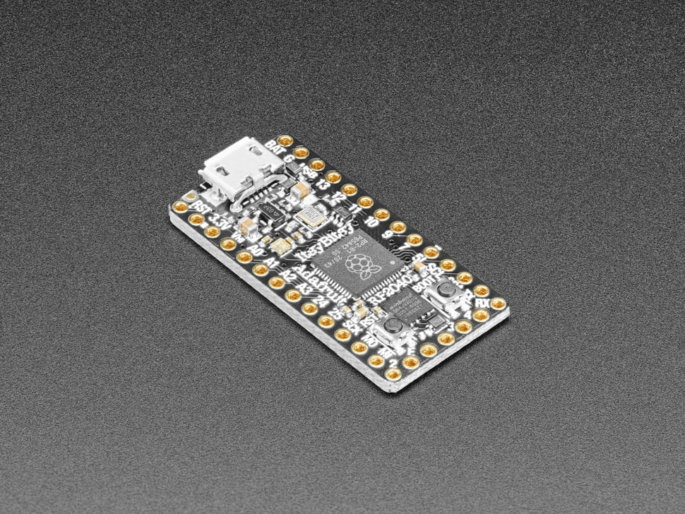

# Adafruit ItsyBitsy RP2040

## Details

- **Location**: Cabinet-1, Bin 32
- **Category**: Microcontroller Boards
- **Type**: RP2040 Development Board (ItsyBitsy Form Factor)
- **Microcontroller**: RP2040 (Dual ARM Cortex-M0+ @ 125MHz)
- **Brand**: Adafruit
- **Part Number**: 4888
- **Quantity**: 2
- **Product URL**: https://www.adafruit.com/product/4888

## Description

What's smaller than a Feather but larger than a Trinket? It's an Adafruit ItsyBitsy RP2040 featuring the Raspberry Pi RP2040! Small, powerful, with ultra fast dual Cortex M0+ processor running at 125 MHz - this microcontroller board is perfect when you want something very compact, with lots of horsepower and a bunch of pins. This Itsy has sports car speed, but SUV roominess with 8 MB of FLASH and 264KB of SRAM.

## Specifications

- **Microcontroller**: RP2040 32-bit Cortex M0+ dual core @ ~125 MHz
- **Logic/Power**: 3.3V
- **Memory**: 264 KB RAM, 8 MB SPI FLASH, No EEPROM
- **Crystal**: 12 MHz for perfect timing
- **GPIO Pins**: 23 total (4 ADC, 16 PWM capable)
- **ADC**: Four 12-bit ADCs (one more than Pico)
- **Peripherals**: Two I2C, Two SPI, Two UART
- **PWM**: 16 PWM outputs
- **USB**: USB Micro B connector with built-in ROM bootloader
- **Regulator**: 3.3V with 500mA peak current output
- **Special Features**: RGB NeoPixel, Red LED on pin 11, Boot/Reset buttons

## Dimensions

- **Board Size**: 36mm x 18mm x 4mm (1.4" x 0.7" x 0.2")
- **Weight**: ~3.2g
- **Form Factor**: ItsyBitsy family compatible

## Image

## Features

- Same size and form-factor as the rest of the ItsyBitsy family
- Pin #11 red LED for general purpose blinking
- RGB NeoPixel with power pin on GPIO for low power usage
- Both Reset button and Bootloader select button
- Power with either USB or external output (battery)
- Broken-out SWD pins for debug access
- Special Vhigh output pin for driving NeoPixels, servos, 5V devices
- Digital 5 level-shifted output for high-voltage logic
- 10 consecutive digital GPIO for maximum PIO compatibility
- Permanent ROM USB UF2 bootloader

## Tags

microcontroller, rp2040, itsybitsy, usb-micro, adafruit, circuitpython, neopixel, compact

## Notes

Perfect for projects where you need the power of RP2040 in a very compact form factor. Great for finished prototypes that need to be miniaturized. Comes with loose 0.1" headers for breadboard use. Supports CircuitPython, MicroPython, and C/C++ development.
