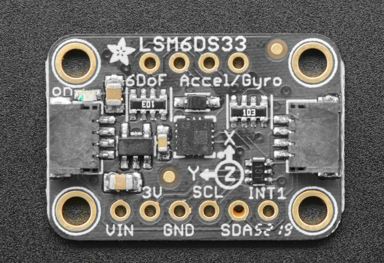
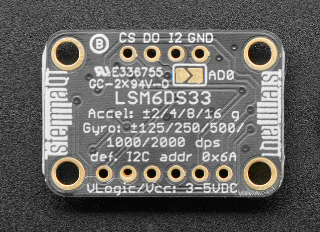

# Adafruit LSM6DS33 6-DoF IMU

6-axis inertial measurement unit combining 3-axis accelerometer and 3-axis gyroscope with STEMMA QT connectivity for easy plug-and-play integration.

## Overview

The Adafruit LSM6DS33 6-DoF IMU is a breakout board featuring ST's LSM6DS33 sensor that combines a 3-axis accelerometer and 3-axis gyroscope in a single package. The board includes voltage regulation, level shifting, and STEMMA QT connectors for easy integration with microcontroller projects.

**Note**: This product has been discontinued and replaced by the LSM6DS3TR-C.

## Key Features

### 6-Axis Motion Sensing

- **3-axis accelerometer** for linear acceleration measurement
- **3-axis gyroscope** for angular velocity measurement
- **Configurable ranges** for both sensors
- **High resolution** 16-bit output
- **Advanced features** including tap detection and free-fall detection

### Easy Integration

- **STEMMA QT connectors** for plug-and-play I²C connection
- **Voltage regulation** for 3V or 5V operation
- **Level shifting** for mixed voltage systems
- **Multiple interfaces** (I²C and SPI)
- **Compact design** with mounting holes

## Technical Specifications

### Electrical Characteristics

- **Operating Voltage**: 3.0V to 5.5V
- **Supply Current**: 0.9mA (accelerometer + gyroscope active)
- **Interface**: I²C (up to 400kHz) or SPI (up to 10MHz)
- **Logic Levels**: 3.3V with 5V tolerance
- **I²C Addresses**: 0x6A (default) or 0x6B (configurable)

### Accelerometer Specifications

- **Measurement Range**: ±2g, ±4g, ±8g, ±16g (selectable)
- **Resolution**: 16-bit
- **Sensitivity**: 0.061 mg/LSB (±2g), 0.122 mg/LSB (±4g), 0.244 mg/LSB (±8g), 0.488 mg/LSB (±16g)
- **Output Data Rate**: 12.5Hz to 1.6kHz
- **Zero-g level**: ±40mg
- **Noise density**: 90 μg/√Hz

### Gyroscope Specifications

- **Measurement Range**: ±125°/s, ±250°/s, ±500°/s, ±1000°/s, ±2000°/s (selectable)
- **Resolution**: 16-bit
- **Sensitivity**: 4.375 mdps/LSB (±125°/s), 8.75 mdps/LSB (±250°/s), 17.5 mdps/LSB (±500°/s), 35 mdps/LSB (±1000°/s), 70 mdps/LSB (±2000°/s)
- **Output Data Rate**: 12.5Hz to 1.6kHz
- **Zero-rate level**: ±10°/s
- **Angular rate noise density**: 0.004 °/s/√Hz

## Pinout Diagrams

### Official Adafruit Pinout Images





## Basic Wiring Examples

### I2C Connection (Recommended)

#### Arduino Uno Connection

```
LSM6DS33       Arduino Uno
--------       -----------
VIN       →    5V or 3.3V
GND       →    GND
SDA       →    A4 (SDA)
SCL       →    A5 (SCL)

Note: Built-in pull-up resistors included
```

#### Raspberry Pi Pico Connection

```
LSM6DS33       Pico
--------       ----
VIN       →    3V3
GND       →    GND
SDA       →    GP4 (I2C0 SDA)
SCL       →    GP5 (I2C0 SCL)

Note: Built-in pull-up resistors included
```

#### ESP32 Connection

```
LSM6DS33       ESP32
--------       -----
VIN       →    3.3V
GND       →    GND
SDA       →    GPIO21 (SDA)
SCL       →    GPIO22 (SCL)

Note: ESP32 has built-in I2C pull-up resistors
```

### STEMMA QT Plug-and-Play Connection

```
Simply connect STEMMA QT cable between:
- LSM6DS33 STEMMA QT connector
- Microcontroller STEMMA QT connector

No additional wiring required!
Compatible with: QT Py, Feather, Metro, etc.
```

### SPI Connection (Advanced)

```
LSM6DS33       Arduino Uno
--------       -----------
VIN       →    5V or 3.3V
GND       →    GND
SCK       →    Pin 13 (SCK)
MOSI      →    Pin 11 (MOSI)
MISO      →    Pin 12 (MISO)
CS        →    Pin 10 (or any digital pin)

Note: SPI mode for high-speed applications
```

### Interrupt Connections (Optional)

```
LSM6DS33       Arduino
--------       -------
INT1      →    Pin 2 (interrupt-capable pin)
INT2      →    Pin 3 (interrupt-capable pin)

Use for motion detection, tap detection, etc.
```

## Programming Examples

### Arduino - Basic Reading

```cpp
#include <Adafruit_LSM6DS33.h>

Adafruit_LSM6DS33 lsm6ds33;

void setup() {
  Serial.begin(115200);
  while (!Serial);

  if (!lsm6ds33.begin_I2C()) {
    Serial.println("Failed to find LSM6DS33 chip");
    while (1);
  }

  Serial.println("LSM6DS33 Found!");

  // Set accelerometer range (2G, 4G, 8G, 16G)
  lsm6ds33.setAccelRange(LSM6DS_ACCEL_RANGE_2_G);

  // Set gyroscope range (125, 250, 500, 1000, 2000 DPS)
  lsm6ds33.setGyroRange(LSM6DS_GYRO_RANGE_250_DPS);

  // Set data rate (12.5, 26, 52, 104, 208, 416, 833, 1666 Hz)
  lsm6ds33.setAccelDataRate(LSM6DS_RATE_104_HZ);
  lsm6ds33.setGyroDataRate(LSM6DS_RATE_104_HZ);
}

void loop() {
  sensors_event_t accel;
  sensors_event_t gyro;
  sensors_event_t temp;

  lsm6ds33.getEvent(&accel, &gyro, &temp);

  Serial.print("Accelerometer (m/s²): ");
  Serial.print("X: "); Serial.print(accel.acceleration.x, 2);
  Serial.print(", Y: "); Serial.print(accel.acceleration.y, 2);
  Serial.print(", Z: "); Serial.print(accel.acceleration.z, 2);
  Serial.println();

  Serial.print("Gyroscope (°/s): ");
  Serial.print("X: "); Serial.print(gyro.gyro.x, 2);
  Serial.print(", Y: "); Serial.print(gyro.gyro.y, 2);
  Serial.print(", Z: "); Serial.print(gyro.gyro.z, 2);
  Serial.println();

  Serial.print("Temperature: ");
  Serial.print(temp.temperature);
  Serial.println(" °C");

  Serial.println("---");
  delay(500);
}
```

### Arduino - Motion Detection

```cpp
#include <Adafruit_LSM6DS33.h>

Adafruit_LSM6DS33 lsm6ds33;

void setup() {
  Serial.begin(115200);
  while (!Serial);

  if (!lsm6ds33.begin_I2C()) {
    Serial.println("Failed to find LSM6DS33 chip");
    while (1);
  }

  Serial.println("LSM6DS33 Motion Detection");

  lsm6ds33.setAccelRange(LSM6DS_ACCEL_RANGE_2_G);
  lsm6ds33.setAccelDataRate(LSM6DS_RATE_104_HZ);
}

void loop() {
  sensors_event_t accel;
  sensors_event_t gyro;
  sensors_event_t temp;

  lsm6ds33.getEvent(&accel, &gyro, &temp);

  // Calculate total acceleration magnitude
  float totalAccel = sqrt(
    accel.acceleration.x * accel.acceleration.x +
    accel.acceleration.y * accel.acceleration.y +
    accel.acceleration.z * accel.acceleration.z
  );

  // Detect motion (deviation from 1G gravity)
  float motionThreshold = 2.0;  // Adjust sensitivity
  if (abs(totalAccel - 9.8) > motionThreshold) {
    Serial.println("MOTION DETECTED!");
    Serial.print("Total acceleration: ");
    Serial.print(totalAccel, 2);
    Serial.println(" m/s²");
  }

  // Detect rotation
  float rotationThreshold = 50.0;  // degrees/second
  if (abs(gyro.gyro.x) > rotationThreshold ||
      abs(gyro.gyro.y) > rotationThreshold ||
      abs(gyro.gyro.z) > rotationThreshold) {
    Serial.println("ROTATION DETECTED!");
    Serial.print("Gyro: X="); Serial.print(gyro.gyro.x, 1);
    Serial.print(", Y="); Serial.print(gyro.gyro.y, 1);
    Serial.print(", Z="); Serial.print(gyro.gyro.z, 1);
    Serial.println(" °/s");
  }

  delay(100);
}
```

### CircuitPython - Basic Reading

```python
import time
import board
import busio
import adafruit_lsm6ds.lsm6ds33

# Initialize I2C
i2c = busio.I2C(board.SCL, board.SDA)
sensor = adafruit_lsm6ds.lsm6ds33.LSM6DS33(i2c)

# Configure sensor
sensor.accelerometer_range = adafruit_lsm6ds.AccelRange.RANGE_2G
sensor.gyro_range = adafruit_lsm6ds.GyroRange.RANGE_250_DPS
sensor.accelerometer_data_rate = adafruit_lsm6ds.Rate.RATE_104_HZ
sensor.gyro_data_rate = adafruit_lsm6ds.Rate.RATE_104_HZ

print("LSM6DS33 6-DoF IMU Test")

while True:
    accel_x, accel_y, accel_z = sensor.acceleration
    gyro_x, gyro_y, gyro_z = sensor.gyro

    print(f"Acceleration (m/s²): X={accel_x:.2f}, Y={accel_y:.2f}, Z={accel_z:.2f}")
    print(f"Gyroscope (°/s): X={gyro_x:.2f}, Y={gyro_y:.2f}, Z={gyro_z:.2f}")
    print(f"Temperature: {sensor.temperature:.1f} °C")
    print("---")

    time.sleep(0.5)
```

### CircuitPython - Tilt Detection

```python
import time
import board
import busio
import adafruit_lsm6ds.lsm6ds33
import math

i2c = busio.I2C(board.SCL, board.SDA)
sensor = adafruit_lsm6ds.lsm6ds33.LSM6DS33(i2c)

def calculate_tilt_angles(accel_x, accel_y, accel_z):
    """Calculate roll and pitch angles from accelerometer data"""
    roll = math.atan2(accel_y, accel_z) * 180 / math.pi
    pitch = math.atan2(-accel_x, math.sqrt(accel_y**2 + accel_z**2)) * 180 / math.pi
    return roll, pitch

print("LSM6DS33 Tilt Detection")

while True:
    accel_x, accel_y, accel_z = sensor.acceleration

    roll, pitch = calculate_tilt_angles(accel_x, accel_y, accel_z)

    print(f"Tilt - Roll: {roll:.1f}°, Pitch: {pitch:.1f}°")

    # Detect significant tilt
    if abs(roll) > 30 or abs(pitch) > 30:
        print("SIGNIFICANT TILT DETECTED!")

    time.sleep(0.2)
```

## Pinout and Connections

### STEMMA QT Connector

| Pin | Signal | Description |
| --- | ------ | ----------- |
| 1   | GND    | Ground      |
| 2   | VCC    | 3.3V Power  |
| 3   | SDA    | I²C Data    |
| 4   | SCL    | I²C Clock   |

### Breakout Pins

| Pin  | Signal | Description                   |
| ---- | ------ | ----------------------------- |
| VIN  | VCC    | Power input (3.0V to 5.5V)    |
| GND  | GND    | Ground                        |
| SCL  | SCL    | I²C Clock / SPI Clock         |
| SDA  | SDA    | I²C Data / SPI MOSI           |
| SDO  | SDO    | SPI MISO / I²C Address Select |
| CS   | CS     | SPI Chip Select               |
| INT1 | INT1   | Interrupt 1 output            |
| INT2 | INT2   | Interrupt 2 output            |

## Applications

### Robotics and Automation

- **Robot balance and stabilization**
- **Drone flight control systems**
- **Autonomous vehicle navigation**
- **Robotic arm orientation tracking**
- **Mobile robot dead reckoning**

### Motion Tracking

- **Human activity monitoring**
- **Sports performance analysis**
- **Gaming motion controllers**
- **Virtual reality tracking**
- **Gesture recognition systems**

### Industrial Applications

- **Machine vibration monitoring**
- **Equipment tilt detection**
- **Platform stabilization**
- **Safety monitoring systems**
- **Precision positioning**

## Programming and Integration

### Arduino Library Support

```cpp
#include <Adafruit_LSM6DS33.h>

Adafruit_LSM6DS33 lsm6ds33;

void setup() {
  Serial.begin(115200);

  if (!lsm6ds33.begin_I2C()) {
    Serial.println("Failed to find LSM6DS33 chip");
    while (1) { delay(10); }
  }

  Serial.println("LSM6DS33 Found!");
}

void loop() {
  sensors_event_t accel;
  sensors_event_t gyro;
  sensors_event_t temp;

  lsm6ds33.getEvent(&accel, &gyro, &temp);

  Serial.print("Accel X: "); Serial.print(accel.acceleration.x);
  Serial.print(" Y: "); Serial.print(accel.acceleration.y);
  Serial.print(" Z: "); Serial.println(accel.acceleration.z);

  Serial.print("Gyro X: "); Serial.print(gyro.gyro.x);
  Serial.print(" Y: "); Serial.print(gyro.gyro.y);
  Serial.print(" Z: "); Serial.println(gyro.gyro.z);

  delay(100);
}
```

### Configuration Options

- **Accelerometer range**: ±2g to ±16g
- **Gyroscope range**: ±125°/s to ±2000°/s
- **Output data rate**: 12.5Hz to 1.6kHz
- **High-pass filtering**: Configurable cutoff frequencies
- **Interrupt configuration**: Motion detection, tap detection, free-fall

## Advanced Features

### Motion Detection

- **Tap detection**: Single and double tap recognition
- **Free-fall detection**: Configurable threshold and duration
- **Wake-up detection**: Motion-based wake from sleep
- **Activity/inactivity**: Automatic activity classification
- **6D/4D orientation**: Device orientation detection

### Data Management

- **FIFO buffer**: Up to 4KB internal buffer
- **Timestamp**: Internal timestamp for data synchronization
- **Batch mode**: Low-power data collection
- **Interrupt routing**: Flexible interrupt pin assignment

## Calibration and Setup

### Basic Calibration

1. **Accelerometer offset**: Measure in all six orientations
2. **Gyroscope bias**: Measure when stationary
3. **Temperature compensation**: Account for temperature effects
4. **Cross-axis sensitivity**: Minimize coupling between axes

### Performance Optimization

- **Stable mounting**: Secure mechanical attachment
- **Temperature control**: Maintain stable operating temperature
- **Vibration isolation**: Minimize external vibrations
- **Power supply**: Use clean, stable power source

## Design Considerations

### Power Management

- **Low power modes**: Multiple sleep and standby modes
- **Power consumption**: Optimize for battery-powered applications
- **Wake-up sources**: Configure interrupt-based wake-up
- **Supply decoupling**: Proper power supply filtering

### Signal Processing

- **Digital filtering**: Built-in anti-aliasing filters
- **Data fusion**: Combine accelerometer and gyroscope data
- **Coordinate transformation**: Convert between reference frames
- **Noise reduction**: Implement appropriate filtering algorithms

## Troubleshooting

### Common Issues

- **Communication errors**: Check I²C/SPI connections and addresses
- **Incorrect readings**: Verify sensor orientation and calibration
- **High noise**: Check mechanical mounting and power supply
- **Interrupt issues**: Verify interrupt configuration and routing

### Performance Tips

- **Proper calibration**: Follow calibration procedures carefully
- **Mechanical design**: Ensure rigid mounting and proper orientation
- **Software filtering**: Implement appropriate digital filters
- **Environmental control**: Minimize temperature variations

## Included Components

- **LSM6DS33 breakout board** with STEMMA QT connectors
- **Header pins** for breadboard use
- **Mounting holes** for secure installation
- **Arduino library** and example code

## Storage Information

- **Location**: Cabinet 3, Bin 28
- **Quantity**: 2 units
- **Condition**: New, unused
- **Status**: Discontinued, replaced by LSM6DS3TR-C
