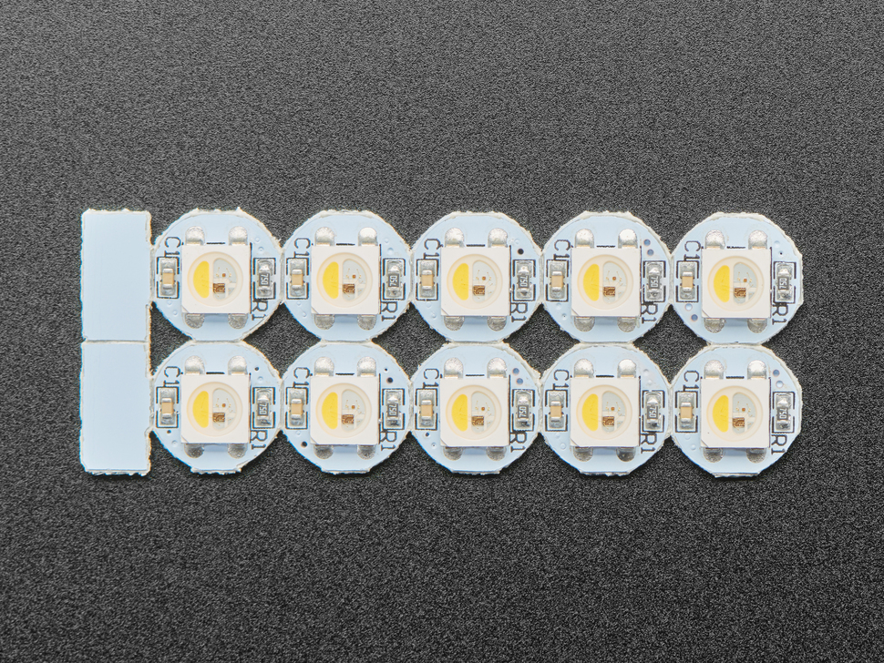

# Adafruit NeoPixel RGBW Mini Button PCB (Individual Units)

## Details

- **Location**: Cabinet-1, Bin 33
- **Category**: Neopixel LEDs
- **Part Number**: Adafruit 4776
- **Size**: 9.1mm x 9.1mm x 3.1mm (0.36" x 0.36" x 0.125")
- **Color**: RGBW (Red, Green, Blue, White)
- **Voltage**: 5V DC (can run as low as 3.5V but dimmed)
- **Current**: 18.5mA per LED (~75mA max total per pixel)
- **Quantity**: 6 individual PCBs
- **Product URL**: https://www.adafruit.com/product/4776
- **DigiKey URL**: https://www.digikey.com/en/products/detail/adafruit-industries-llc/4776/13550158

## Description

These are the smallest NeoPixel breakouts available! Each unit is a tiny, bright RGBW pixel on an individual PCB measuring only 9.1mm x 9.1mm. These ultra-bright LEDs have a constant-current driver built right into the LED package using the SK6812 chip.

The NeoPixel is 'split' - one half contains the RGB LEDs you know and love, while the other half is a white LED with yellow phosphor. When unlit, it resembles a school bus color. When lit, these are extremely bright and can be controlled with 8-bit PWM per channel (32-bit color overall).

Each PCB has two sets of three pads on the back for easy wire soldering. The pixels are chainable, requiring only one pin/wire to control as many LEDs as desired.

## Specifications

- **LED Type**: SK6812 (RGBW)
- **Supply Voltage**: 5V DC (3.5V minimum, but dimmed)
- **Current per LED**: 18.5mA constant current
- **Maximum Current**: ~75mA per pixel (all four RGBW LEDs at full brightness)
- **PWM Frequency**: 800 KHz protocol
- **Interface**: PWM (chainable design)
- **Color Depth**: 32-bit (24-bit RGB + 8-bit White)
- **Dimensions**: 9.1mm x 9.1mm x 3.1mm
- **Weight**: 0.3g per PCB
- **Operating Temperature**: Standard LED operating range

## Image

## Applications

- Wearable electronics projects
- Costume and cosplay lighting
- Small decorative lighting installations
- Status indicators with color + white capability
- Miniature art projects
- Jewelry with embedded lighting
- Model lighting (trains, buildings, etc.)
- Interactive displays requiring individual pixel control

## Technical Notes

- **RGBW Library Required**: These require a NeoPixel library with RGBW support, not standard RGB libraries
- **Color Mixing**: The blue LED element is close to the white phosphor, causing blue light to mix with white
- **Power Considerations**: Each pixel can draw up to 75mA at full brightness white
- **Arduino Limitations**: An Arduino can drive up to 350 pixels at 30 FPS before running out of RAM
- **Cable Length**: Using ribbon cable, pixels can be spaced up to 6" apart before signal degradation

## Assembly Notes

- Two sets of three pads on the back for soldering wires
- Chainable design allows daisy-chaining multiple pixels
- Constant current driver provides stable brightness regardless of voltage fluctuations
- Requires 5V power supply for optimal brightness and color accuracy

## Purchasing Notes

- Adafruit sells these in packs of 10 for $4.95
- Individual units are not sold separately
- Current inventory: 6 individual PCBs (from opened pack)

## Tags

neopixel, rgbw, addressable, mini-button, sk6812, pcb, adafruit, wearable, chainable
