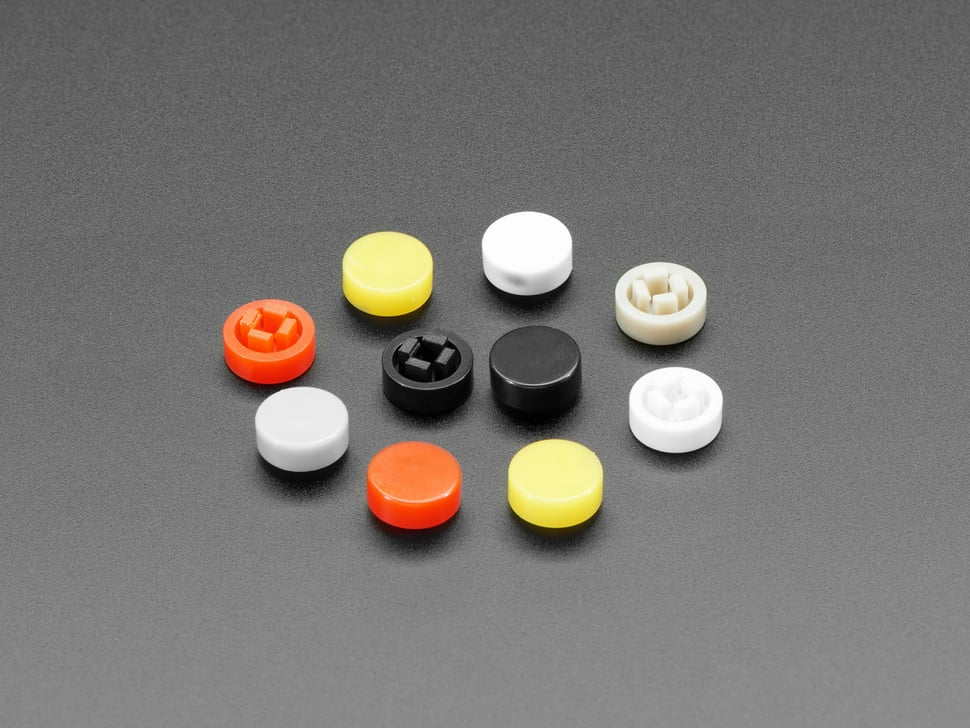

# Adafruit Plastic Button Caps For Square Top

## Details

- **Location**: Cabinet-5, Bin 13
- **Category**: Switches & Controls
- **Brand**: Adafruit Industries
- **Part Number**: 4228
- **Model**: Plastic Button Caps For Square Top
- **Package**: Plastic Button Caps
- **Quantity**: 15 caps (from 10-pack sets)
- **Status**: Available
- **Price Range**: $0.95 (per 10-pack)
- **Product URL**: https://www.adafruit.com/product/4228

## Description

Adafruit's plastic button caps are designed to snap perfectly onto tactile switches with 2.4mm square tops, providing a satisfying 8mm diameter surface area for finger presses. These colorful caps transform basic tactile switches into professional-looking user interface elements, perfect for gaming controllers, control panels, and interactive projects. The caps come in candy colors and provide both aesthetic appeal and improved tactile feedback.

## Specifications

### Physical Characteristics

- **Cap Diameter**: 8mm
- **Cap Height**: 3mm tall
- **Fit**: 2.4mm square top tactile switches
- **Material**: Durable plastic
- **Mounting**: Snap-on friction fit
- **Colors Available**: Red, yellow, white, gray, Adafruit black

### Compatibility

- **Switch Type**: 2.4mm square top tactile switches
- **Common Applications**: PyGamer, Arduino projects, control panels
- **Mounting**: Snap-fit design for secure attachment
- **Removal**: Caps can be removed and reused

## Image

## Applications

Common use cases and applications for these button caps:

- **Gaming Controllers**: PyGamer, custom game controllers, arcade buttons
- **Arduino Projects**: User interface improvements for microcontroller projects
- **Control Panels**: Professional appearance for industrial and hobby control panels
- **Prototyping**: Enhanced user experience during development and testing
- **Educational Projects**: Color-coded buttons for learning and demonstration
- **Interactive Art**: Colorful interface elements for art installations
- **Robotics**: User control interfaces for robotic systems
- **Test Equipment**: Improved button identification and operation
- **Consumer Electronics**: Enhanced tactile feedback for device interfaces
- **Accessibility**: Larger button surface for easier operation

## Color Coding Applications

### Functional Color Schemes
- **Red**: Emergency stops, power controls, critical functions
- **Yellow**: Caution functions, warning controls, attention-getting actions
- **White**: General purpose, neutral functions, common operations
- **Gray**: Secondary functions, less frequently used controls
- **Black**: Standard functions, professional appearance, stealth mode

### Gaming Applications
- **Action Buttons**: Different colors for different game functions
- **Menu Navigation**: Color-coded menu controls
- **Player Identification**: Different colors for multiplayer games
- **Difficulty Levels**: Color coding for different skill levels

## Technical Notes

Important considerations for button cap usage:

- **Proper Fit**: Ensure tactile switch has 2.4mm square top for proper fit
- **Secure Attachment**: Caps snap on firmly but can be removed if needed
- **Height Clearance**: Consider 3mm additional height in enclosure design
- **Color Selection**: Choose colors that match functional requirements
- **Durability**: Plastic construction suitable for repeated use
- **Cleaning**: Caps can be removed for cleaning if necessary

## Installation

### Mounting Process
1. Verify tactile switch has 2.4mm square top
2. Align button cap with switch actuator
3. Press down firmly until cap snaps into place
4. Test button operation to ensure proper fit
5. Verify cap doesn't interfere with enclosure

### Removal Process
1. Gently pry cap from switch using small tool
2. Work around edges to release snap-fit
3. Avoid excessive force to prevent damage
4. Clean cap and switch if needed before reinstallation

## Design Considerations

### Enclosure Design
- **Clearance**: Provide adequate clearance for 8mm diameter caps
- **Height**: Account for 3mm additional height above switch
- **Spacing**: Ensure adequate spacing between adjacent buttons
- **Access**: Design openings for easy cap installation/removal

### User Interface Design
- **Color Coding**: Use consistent color scheme for similar functions
- **Spacing**: Provide adequate spacing for comfortable finger operation
- **Labeling**: Consider additional labeling if color coding isn't sufficient
- **Accessibility**: Ensure button size and spacing meet accessibility requirements

## PyGamer Compatibility

These caps were specifically designed for the Adafruit PyGamer:

- **Perfect Fit**: Designed to match PyGamer tactile switches
- **Color Options**: Multiple colors for customization
- **Gaming Feel**: Improved tactile feedback for gaming
- **Easy Installation**: Snap-on design for user customization
- **Durability**: Suitable for gaming use and repeated pressing

## Maintenance

### Care Instructions
- Clean with mild soap and water if needed
- Dry thoroughly before reinstallation
- Inspect for cracks or wear periodically
- Replace if caps become loose or damaged
- Store spare caps in organized manner

### Troubleshooting
- **Loose Caps**: Check switch top dimensions, replace if worn
- **Difficult Installation**: Verify switch compatibility
- **Cap Removal**: Use gentle prying motion, avoid excessive force
- **Color Fading**: Normal with extended UV exposure

## Tags

adafruit, button-caps, plastic, tactile-switch, 8mm, colorful, pygamer, arduino #cabinet-5 #bin-13 #status-available

## Notes

These Adafruit plastic button caps are excellent for transforming basic tactile switches into professional-looking user interface elements. The 8mm diameter provides a comfortable pressing surface, while the variety of colors allows for functional color coding. Originally designed for the PyGamer, they're perfect for any project using 2.4mm square top tactile switches. The snap-on design makes them easy to install and remove, allowing for customization and maintenance. Quality Adafruit construction ensures durability and reliable operation in both hobby and professional applications.
