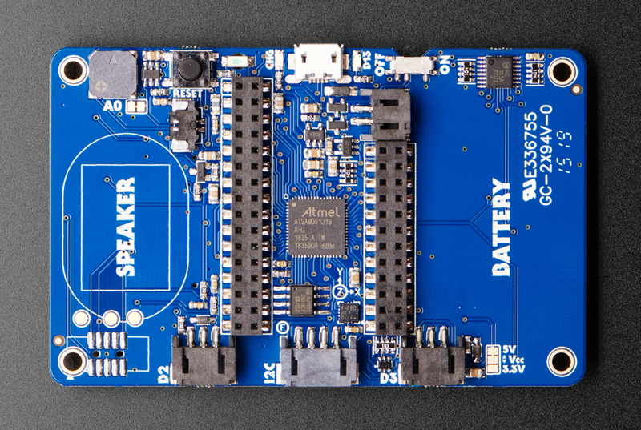

# Adafruit PyBadge for MakeCode Arcade, CircuitPython, or Arduino

## Overview

The Adafruit PyBadge is a compact, credit card-sized development board designed for learning programming through game development. Built around the powerful ATSAMD51 microcontroller, it features a bright color display, gaming controls, and built-in sensors, making it perfect for educational projects, game development, and interactive applications.

## Specifications

- **Microcontroller**: ATSAMD51J19 @ 120MHz
- **Memory**: 512KB Flash + 192KB RAM
- **Storage**: 2MB SPI Flash for file storage
- **Display**: 1.8" 160x128 Color TFT with dimmable backlight
- **Controls**: 8 game/control buttons with silicone tops
- **Audio**: Built-in buzzer + Class-D amplifier for external speakers
- **Connectivity**: Micro USB port
- **Power**: LiPoly battery connector with charging circuit
- **Dimensions**: 86.3mm x 54.3mm (credit card size)

## Features

- **High-Performance Processor**: SAMD51 with 3.3V logic and fast DMA
- **Gaming Controls**: 8 responsive buttons with excellent tactile feel
- **Bright Color Display**: 160x128 TFT connected to dedicated SPI port
- **Built-in Sensors**:
  - 3-axis accelerometer (motion sensor)
  - Light sensor (reverse-mounted, faces forward)
- **Audio System**: Built-in buzzer plus amplifier for 4-8 ohm speakers (up to 2W)
- **5 NeoPixel LEDs**: Programmable RGB LEDs for visual feedback
- **Feather Compatibility**: Two female headers with Feather-compatible pinout

## Built-in Hardware

### Display & Graphics

- 1.8" TFT LCD with 160x128 resolution
- 16-bit color depth (65,536 colors)
- Dimmable LED backlight
- Connected to dedicated SPI port for fast updates

### Input Controls

- 8 game/control buttons with silicone button tops
- Excellent tactile feedback and responsiveness
- Arranged for comfortable gaming experience
- Reset button for system restart

### Sensors & Peripherals

- Triple-axis accelerometer for motion detection
- Light sensor for ambient light measurement
- 5x NeoPixel RGB LEDs for badge effects or game feedback
- Built-in buzzer/mini-speaker
- Mono Class-D speaker driver (up to 2W output)

### Connectivity & Expansion

- Micro USB port for programming, debugging, and charging
- LiPoly battery port with built-in recharging capability
- Two female header strips (Feather-compatible pinout)
- JST ports for NeoPixels, sensor input, and I2C
- I2C Grove connector compatibility
- On/Off switch for power management

## Pinout Diagrams

### Official Adafruit PyBadge Pinouts




## Basic Wiring Examples

### External Speaker Connection

```
8Ω Speaker + → PyBadge Speaker Terminal +
8Ω Speaker - → PyBadge Speaker Terminal -

Note: Built-in Class-D amplifier supports up to 2W speakers
```

### NeoPixel Strip Connection (JST Port)

```
NeoPixel Strip VCC → PyBadge JST Port + (3.3V)
NeoPixel Strip GND → PyBadge JST Port - (GND)
NeoPixel Strip DIN → PyBadge JST Port Signal

Code: import neopixel; pixels = neopixel.NeoPixel(board.NEOPIXEL, 30)
```

### I2C Sensor Connection (STEMMA)

```
I2C Sensor VCC → PyBadge STEMMA 3.3V
I2C Sensor GND → PyBadge STEMMA GND
I2C Sensor SDA → PyBadge STEMMA SDA
I2C Sensor SCL → PyBadge STEMMA SCL

Note: Compatible with Grove I2C sensors
```

### Feather Wing Connection

```
Feather Wing → PyBadge Female Headers
Connect any Adafruit FeatherWing for expanded functionality

Note: PyBadge provides Feather-compatible pinout
```

### Battery Power Connection

```
3.7V LiPo Battery + → PyBadge JST Battery Connector +
3.7V LiPo Battery - → PyBadge JST Battery Connector -

Note: Built-in charging circuit when USB connected
```

### External Button Connection (Feather Pins)

```
Button → PyBadge Pin A1 → 10kΩ Pull-up → 3.3V
Button → PyBadge GND

Code: import digitalio; button = digitalio.DigitalInOut(board.A1)
```

## Programming Setup Guide

### MakeCode Arcade Setup (Recommended for Beginners)

1. Visit makecode.com/\_Kx0wWyKAcsx in web browser
2. Create new project or choose template
3. Drag and drop blocks to create games
4. Click Download to get UF2 file
5. Double-click RESET button to enter bootloader
6. Drag UF2 file to PYBADGEBOOT drive

### CircuitPython Setup

1. Download CircuitPython UF2 for PyBadge from circuitpython.org
2. Double-click RESET button to enter bootloader
3. Drag UF2 file to PYBADGEBOOT drive
4. Board reboots as CIRCUITPY drive
5. Install required libraries in lib folder

### Arduino IDE Setup

1. Install Arduino IDE 1.8.19 or later
2. Add Adafruit board package URL in preferences
3. Install "Adafruit SAMD Boards" package
4. Install required libraries:
   - Adafruit Arcada Library
   - Adafruit GFX Library
   - Adafruit ST7735 and ST7789 Library
   - Adafruit NeoPixel Library
5. Select "Adafruit PyBadge M4" from Tools → Board

## Programming Examples

### MakeCode Arcade - Simple Platformer Game

```javascript
// Create player sprite
let player = sprites.create(
  img`
    . . . . . . f f f f . . . . . .
    . . . . f f f 2 2 f f f . . . .
    . . . f f f 2 2 2 2 f f f . . .
    . . f f f e e e e e e f f f . .
    . . f f e 2 2 2 2 2 2 e e f . .
    . . f e 2 f f f f f f 2 e f . .
    . . f f f f e e e e f f f f . .
    . f f e f b f 4 4 f b f e f f .
    . f e e 4 1 f d d f 1 4 e e f .
    . . f e e d d d d d d e e f . .
    . . . f e e 4 4 4 4 e e f . . .
    . . e 4 f 2 2 2 2 2 2 f 4 e . .
    . . 4 d f 2 2 2 2 2 2 f d 4 . .
    . . 4 4 f 4 4 5 5 4 4 f 4 4 . .
    . . . . . f f f f f f . . . . .
    . . . . . f f . . f f . . . . .
`,
  SpriteKind.Player
);

// Set player physics
player.ay = 500; // Gravity
player.setPosition(20, 100);

// Create platforms
let platform = sprites.create(
  img`
    f f f f f f f f f f f f f f f f
    f 1 1 1 1 1 1 1 1 1 1 1 1 1 1 f
    f 1 1 1 1 1 1 1 1 1 1 1 1 1 1 f
    f f f f f f f f f f f f f f f f
`,
  SpriteKind.Platform
);
platform.setPosition(80, 110);
platform.setFlag(SpriteFlag.Invisible, false);

// Player controls
controller.A.onEvent(ControllerButtonEvent.Pressed, function () {
  if (player.isHittingTile(CollisionDirection.Bottom)) {
    player.vy = -200; // Jump
  }
});

controller.left.onEvent(ControllerButtonEvent.Pressed, function () {
  player.vx = -100;
});

controller.right.onEvent(ControllerButtonEvent.Pressed, function () {
  player.vx = 100;
});

// Stop horizontal movement when not pressing buttons
controller.left.onEvent(ControllerButtonEvent.Released, function () {
  if (!controller.right.isPressed()) {
    player.vx = 0;
  }
});

controller.right.onEvent(ControllerButtonEvent.Released, function () {
  if (!controller.left.isPressed()) {
    player.vx = 0;
  }
});

// Set up camera to follow player
scene.cameraFollowSprite(player);

// Create collectible coins
for (let i = 0; i < 5; i++) {
  let coin = sprites.create(
    img`
        . . b b b b . .
        . b 5 5 5 5 b .
        b 5 d 3 3 d 5 b
        b 5 3 5 5 3 5 b
        b 5 d 3 3 d 5 b
        . b 5 5 5 5 b .
        . . b b b b . .
    `,
    SpriteKind.Food
  );
  coin.setPosition(randint(10, 150), randint(20, 80));
}

// Collect coins
sprites.onOverlap(
  SpriteKind.Player,
  SpriteKind.Food,
  function (sprite, otherSprite) {
    info.changeScoreBy(10);
    otherSprite.destroy();
    music.powerUp.play();
  }
);

// Set background
scene.setBackgroundColor(9);
```

### CircuitPython - Handheld Game Console

```python
import board
import displayio
import terminalio
import time
import random
import digitalio
import analogio
from adafruit_display_text import label
from adafruit_st7735r import ST7735R
import neopixel
import adafruit_lis3dh

# Initialize display
displayio.release_displays()
spi = board.SPI()
tft_cs = board.TFT_CS
tft_dc = board.TFT_DC
tft_reset = board.TFT_RESET

display_bus = displayio.FourWire(spi, command=tft_dc, chip_select=tft_cs, reset=tft_reset)
display = ST7735R(display_bus, width=160, height=128, rotation=90)

# Initialize buttons
button_a = digitalio.DigitalInOut(board.BUTTON_A)
button_a.direction = digitalio.Direction.INPUT
button_a.pull = digitalio.Pull.DOWN

button_b = digitalio.DigitalInOut(board.BUTTON_B)
button_b.direction = digitalio.Direction.INPUT
button_b.pull = digitalio.Pull.DOWN

button_up = digitalio.DigitalInOut(board.BUTTON_UP)
button_up.direction = digitalio.Direction.INPUT
button_up.pull = digitalio.Pull.DOWN

button_down = digitalio.DigitalInOut(board.BUTTON_DOWN)
button_down.direction = digitalio.Direction.INPUT
button_down.pull = digitalio.Pull.DOWN

button_left = digitalio.DigitalInOut(board.BUTTON_LEFT)
button_left.direction = digitalio.Direction.INPUT
button_left.pull = digitalio.Pull.DOWN

button_right = digitalio.DigitalInOut(board.BUTTON_RIGHT)
button_right.direction = digitalio.Direction.INPUT
button_right.pull = digitalio.Pull.DOWN

# Initialize NeoPixels
pixels = neopixel.NeoPixel(board.NEOPIXEL, 5, brightness=0.3)

# Initialize accelerometer
i2c = board.I2C()
lis3dh = adafruit_lis3dh.LIS3DH_I2C(i2c)

# Game variables
player_x = 80
player_y = 64
enemies = []
bullets = []
score = 0
game_over = False

# Create display group
splash = displayio.Group()

# Title
title_label = label.Label(terminalio.FONT, text="PyBadge Shooter", color=0xFFFFFF)
title_label.x = 10
title_label.y = 15
splash.append(title_label)

# Score
score_label = label.Label(terminalio.FONT, text="Score: 0", color=0x00FF00)
score_label.x = 10
score_label.y = 110
splash.append(score_label)

display.show(splash)

class Enemy:
    def __init__(self, x, y):
        self.x = x
        self.y = y
        self.speed = random.randint(1, 3)

    def update(self):
        self.y += self.speed
        if self.y > 128:
            return False  # Remove enemy
        return True

    def draw(self, group):
        # Simple enemy representation
        enemy_label = label.Label(terminalio.FONT, text="X", color=0xFF0000)
        enemy_label.x = self.x
        enemy_label.y = self.y
        group.append(enemy_label)

class Bullet:
    def __init__(self, x, y):
        self.x = x
        self.y = y
        self.speed = 5

    def update(self):
        self.y -= self.speed
        if self.y < 0:
            return False  # Remove bullet
        return True

    def draw(self, group):
        bullet_label = label.Label(terminalio.FONT, text="*", color=0xFFFF00)
        bullet_label.x = self.x
        bullet_label.y = self.y
        group.append(bullet_label)

def check_collision(obj1_x, obj1_y, obj2_x, obj2_y, threshold=10):
    return abs(obj1_x - obj2_x) < threshold and abs(obj1_y - obj2_y) < threshold

# Game loop
last_enemy_spawn = 0
last_bullet_time = 0

while not game_over:
    current_time = time.monotonic()

    # Clear display
    splash = displayio.Group()

    # Handle input
    if button_left.value and player_x > 0:
        player_x -= 3
    if button_right.value and player_x < 150:
        player_x += 3
    if button_up.value and player_y > 20:
        player_y -= 3
    if button_down.value and player_y < 100:
        player_y += 3

    # Shoot bullets
    if button_a.value and current_time - last_bullet_time > 0.2:
        bullets.append(Bullet(player_x, player_y))
        last_bullet_time = current_time
        pixels[0] = (255, 255, 0)  # Flash yellow when shooting
    else:
        pixels[0] = (0, 0, 0)

    # Spawn enemies
    if current_time - last_enemy_spawn > 1.0:
        enemies.append(Enemy(random.randint(10, 150), 0))
        last_enemy_spawn = current_time

    # Update bullets
    bullets = [bullet for bullet in bullets if bullet.update()]

    # Update enemies
    enemies = [enemy for enemy in enemies if enemy.update()]

    # Check bullet-enemy collisions
    for bullet in bullets[:]:
        for enemy in enemies[:]:
            if check_collision(bullet.x, bullet.y, enemy.x, enemy.y):
                bullets.remove(bullet)
                enemies.remove(enemy)
                score += 10
                # Flash green NeoPixels for hit
                for i in range(1, 5):
                    pixels[i] = (0, 255, 0)
                break

    # Check player-enemy collisions
    for enemy in enemies:
        if check_collision(player_x, player_y, enemy.x, enemy.y):
            game_over = True
            # Flash red NeoPixels for game over
            pixels.fill((255, 0, 0))
            break

    # Draw player
    player_label = label.Label(terminalio.FONT, text="A", color=0x0000FF)
    player_label.x = player_x
    player_label.y = player_y
    splash.append(player_label)

    # Draw bullets
    for bullet in bullets:
        bullet.draw(splash)

    # Draw enemies
    for enemy in enemies:
        enemy.draw(splash)

    # Update score
    score_label = label.Label(terminalio.FONT, text=f"Score: {score}", color=0x00FF00)
    score_label.x = 10
    score_label.y = 110
    splash.append(score_label)

    # Show display
    display.show(splash)

    # Fade NeoPixels
    for i in range(1, 5):
        r, g, b = pixels[i]
        pixels[i] = (max(0, r-10), max(0, g-10), max(0, b-10))

    time.sleep(0.05)

# Game over screen
splash = displayio.Group()
game_over_label = label.Label(terminalio.FONT, text="GAME OVER!", color=0xFF0000)
game_over_label.x = 40
game_over_label.y = 50
splash.append(game_over_label)

final_score_label = label.Label(terminalio.FONT, text=f"Final Score: {score}", color=0xFFFFFF)
final_score_label.x = 20
final_score_label.y = 70
splash.append(final_score_label)

display.show(splash)

# Keep red NeoPixels on for game over
pixels.fill((255, 0, 0))
```

## Programming Support

### MakeCode Arcade

- Visual block-based programming environment
- Extensive game development libraries and examples
- Built-in sprite, tilemap, and physics engines
- Easy deployment via drag-and-drop UF2 files

### CircuitPython

- Python-based programming for rapid development
- Extensive hardware abstraction libraries
- Real-time code editing and debugging
- Large community and comprehensive documentation

### Arduino IDE

- Traditional C/C++ development environment
- Adafruit Arcada library for hardware abstraction
- Access to full Arduino library ecosystem
- Advanced performance optimization capabilities

## Applications

- Educational programming and game development
- Interactive badges and conference displays
- Portable gaming device prototyping
- Sensor data collection and visualization
- Art installations and interactive displays
- STEM education projects
- Retro gaming and emulation projects

## Power Management

- **Battery Support**: Compatible with 3.7V LiPoly batteries
- **USB Charging**: Built-in charging circuit for LiPoly batteries
- **Power Switch**: On/off switch for battery conservation
- **USB Power**: Can operate directly from USB power
- **Low Power Modes**: Sleep modes available for battery-powered projects

## Expansion Options

- **FeatherWings**: Compatible with most Adafruit FeatherWings
- **STEMMA/STEMMA QT**: Easy connection to sensor ecosystem
- **Grove Sensors**: I2C Grove connector compatibility
- **JST Connectors**: Multiple JST ports for easy peripheral connection

## Package Contents

- 1x PyBadge PCB (fully assembled)
- 1x Set of female headers (for FeatherWing expansion)
- Getting started documentation and tutorial links

## Educational Value

- **Beginner Friendly**: Multiple programming environments for different skill levels
- **Progressive Learning**: Start with MakeCode, advance to CircuitPython, then Arduino
- **Game Development**: Learn programming through engaging game creation
- **Hardware Integration**: Understand sensors, displays, and embedded systems
- **Community Support**: Extensive tutorials, examples, and community projects

## Important Notes

- **Battery Sold Separately**: Requires LiPoly battery for portable operation
- **Speaker Upgrade**: External speaker recommended for better audio quality
- **Case Options**: Various protective cases and enclosures available
- **Regular Updates**: Continuous firmware and library improvements
- **Compatibility**: While similar to PyGamer, some accessories may differ

### Arduino - Retro Game Console

```cpp
#include <Adafruit_Arcada.h>
#include <Adafruit_NeoPixel.h>

Adafruit_Arcada arcada;

// Game variables
int playerX = 80;
int playerY = 100;
int enemyX = 160;
int enemyY = 20;
int enemySpeed = 2;
int score = 0;
bool gameRunning = true;

void setup() {
  Serial.begin(115200);

  // Initialize Arcada
  if (!arcada.arcadaBegin()) {
    Serial.println("Failed to initialize Arcada!");
    while(1);
  }

  arcada.displayBegin();
  arcada.display->fillScreen(ARCADA_BLACK);
  arcada.display->setTextColor(ARCADA_WHITE);
  arcada.display->setTextSize(1);

  // Initialize NeoPixels
  arcada.pixels.begin();
  arcada.pixels.setBrightness(50);
  arcada.pixels.show();

  Serial.println("PyBadge Retro Game Ready!");
}

void loop() {
  if (!gameRunning) {
    gameOverScreen();
    return;
  }

  // Clear screen
  arcada.display->fillScreen(ARCADA_BLACK);

  // Read buttons
  uint32_t buttons = arcada.readButtons();

  // Player movement
  if (buttons & ARCADA_BUTTONMASK_LEFT && playerX > 5) {
    playerX -= 3;
  }
  if (buttons & ARCADA_BUTTONMASK_RIGHT && playerX < 150) {
    playerX += 3;
  }
  if (buttons & ARCADA_BUTTONMASK_UP && playerY > 20) {
    playerY -= 3;
  }
  if (buttons & ARCADA_BUTTONMASK_DOWN && playerY < 115) {
    playerY += 3;
  }

  // Enemy movement
  enemyX -= enemySpeed;
  if (enemyX < 0) {
    enemyX = 160;
    enemyY = random(20, 100);
    score += 10;
    enemySpeed += 0.5; // Increase difficulty
  }

  // Collision detection
  if (abs(playerX - enemyX) < 10 && abs(playerY - enemyY) < 10) {
    gameRunning = false;
    // Flash red NeoPixels
    for (int i = 0; i < 5; i++) {
      arcada.pixels.setPixelColor(i, arcada.pixels.Color(255, 0, 0));
    }
    arcada.pixels.show();
    arcada.playTone(200, 500); // Game over sound
  }

  // Draw player (blue square)
  arcada.display->fillRect(playerX, playerY, 8, 8, ARCADA_BLUE);

  // Draw enemy (red square)
  arcada.display->fillRect(enemyX, enemyY, 8, 8, ARCADA_RED);

  // Draw score
  arcada.display->setCursor(5, 5);
  arcada.display->setTextColor(ARCADA_WHITE);
  arcada.display->print("Score: ");
  arcada.display->print(score);

  // Update NeoPixels based on score
  int pixelCount = min(5, score / 50);
  for (int i = 0; i < 5; i++) {
    if (i < pixelCount) {
      arcada.pixels.setPixelColor(i, arcada.pixels.Color(0, 255, 0));
    } else {
      arcada.pixels.setPixelColor(i, arcada.pixels.Color(0, 0, 0));
    }
  }
  arcada.pixels.show();

  delay(50);
}

void gameOverScreen() {
  arcada.display->fillScreen(ARCADA_BLACK);
  arcada.display->setTextColor(ARCADA_RED);
  arcada.display->setTextSize(2);
  arcada.display->setCursor(20, 40);
  arcada.display->println("GAME OVER");

  arcada.display->setTextColor(ARCADA_WHITE);
  arcada.display->setTextSize(1);
  arcada.display->setCursor(30, 70);
  arcada.display->print("Final Score: ");
  arcada.display->println(score);

  arcada.display->setCursor(10, 90);
  arcada.display->println("Press SELECT to restart");

  uint32_t buttons = arcada.readButtons();
  if (buttons & ARCADA_BUTTONMASK_SELECT) {
    // Reset game
    playerX = 80;
    playerY = 100;
    enemyX = 160;
    enemyY = 20;
    enemySpeed = 2;
    score = 0;
    gameRunning = true;

    // Clear NeoPixels
    arcada.pixels.clear();
    arcada.pixels.show();

    delay(500); // Debounce
  }
}
```

## Important Notes

### Gaming Performance

- **Frame Rate**: Aim for 30-60 FPS for smooth gameplay
- **Memory Management**: 192KB RAM requires careful sprite management
- **Display Updates**: Use partial screen updates for better performance
- **Audio Quality**: External speaker significantly improves game audio
- **Battery Life**: Typical 4-6 hours of gaming on 500mAh battery

### Development Tips

- **Start Simple**: Begin with basic games before complex projects
- **Test Frequently**: Regular testing on actual hardware is essential
- **Optimize Graphics**: Use efficient sprite drawing techniques
- **Sound Design**: Leverage built-in buzzer and external speaker
- **User Experience**: Consider button layout and ergonomics

### Educational Applications

- **STEM Learning**: Perfect for teaching programming concepts
- **Game Design**: Learn game development principles
- **Electronics**: Understand embedded systems and sensors
- **Problem Solving**: Debug and optimize code performance
- **Creativity**: Design custom games and interactive experiences

## Recommended Accessories

- 3.7V LiPoly battery (350mAh or 500mAh)
- 4-8 ohm external speaker
- Protective case or lanyard
- STEMMA QT sensors for expanded projects
- FeatherWings for additional functionality
