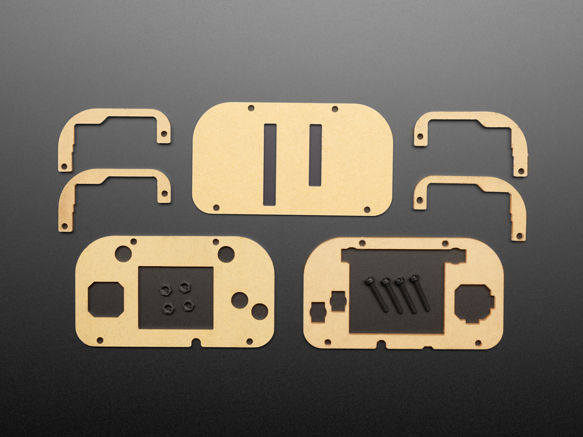

# Adafruit PyGamer Acrylic Enclosure Kit

## Details

- **Location**: Cabinet 4, Bin 9
- **Category**: Enclosures
- **Brand**: Adafruit
- **Part Number**: 4238
- **Package**: Acrylic Kit
- **Quantity**: 2
- **Status**: Available
- **Price Range**: $12.50
- **Product URL**: https://www.adafruit.com/product/4238

## Description

Expertly crafted and laser-cut acrylic enclosure kit designed to protect your Adafruit PyGamer handheld gaming console. This minimalist and elegant enclosure provides complete protection while maintaining access to all controls and ports. Perfect for preventing damage from spills, drops, or general wear while gaming.

## Image

## Specifications

### Physical Characteristics
- **Material**: High-quality acrylic (3mm and 1.5mm thickness)
- **Finish**: Laser-cut precision edges
- **Colors**: Smoke acrylic top, clear acrylic sides and back
- **Form Factor**: Custom-designed for PyGamer dimensions
- **Weight**: Lightweight protection without bulk

### Kit Contents
- **1x 3mm Smoke Acrylic Top Piece**: Stylish dark top panel
- **1x 3mm Clear Acrylic Top Piece**: Alternative clear top option
- **4x 3mm Clear Acrylic Side Pieces**: Transparent side protection
- **1x 1.5mm Clear Acrylic Back Piece**: Rear panel access
- **4x M3 x 18mm Black Nylon Screws**: Assembly hardware
- **4x M3 Black Nylon Hex Nuts**: Secure fastening

### Key Features
- **Complete Protection**: Guards against spills, drops, and wear
- **Precision Fit**: Custom laser-cut for perfect PyGamer compatibility
- **Dual Top Options**: Choice between smoke or clear top panel
- **Easy Assembly**: Simple screw-together construction
- **Access Maintained**: All buttons, ports, and features remain accessible
- **Professional Finish**: Clean, minimalist aesthetic

## Pinout/Connection Information

### Assembly Hardware
- **Screw Type**: M3 x 18mm black nylon screws
- **Nut Type**: M3 black nylon hex nuts
- **Thread Pitch**: Standard M3 metric thread (0.5mm pitch)
- **Material**: Nylon for electrical isolation and durability

### Assembly Points
- **Corner Mounting**: Four corner mounting points
- **Secure Fit**: Hex nuts provide reliable fastening
- **Tool Required**: 2.5mm hex key or small Phillips screwdriver

## Circuit Integration Notes

### PyGamer Compatibility
- **Perfect Fit**: Designed specifically for PyGamer form factor
- **Port Access**: All USB, audio, and expansion ports remain accessible
- **Button Clearance**: All gaming controls fully functional when enclosed
- **Display Protection**: Screen remains visible and touch-accessible

### Assembly Considerations
- **Paper Backing**: Remove protective paper from both sides before assembly
- **Orientation**: Ensure proper alignment of all pieces during assembly
- **Tightening**: Secure screws snugly but avoid over-tightening acrylic
- **Ventilation**: Design allows for adequate airflow

## Technical Specifications

### Material Properties
- **Acrylic Type**: Cast acrylic sheets
- **Thickness**: 3mm for structural pieces, 1.5mm for back panel
- **Clarity**: High optical clarity for clear pieces
- **Durability**: Scratch-resistant and impact-resistant
- **Temperature Range**: Stable from -40°C to 80°C

### Dimensional Standards
- **PyGamer Fit**: Precise dimensions for PyGamer board
- **Mounting Holes**: Standard M3 hole spacing
- **Edge Quality**: Smooth laser-cut edges
- **Tolerance**: ±0.1mm manufacturing tolerance

### Assembly Specifications
- **Hardware**: Corrosion-resistant nylon fasteners
- **Assembly Time**: 10-15 minutes typical
- **Tools Required**: 2.5mm hex key or small screwdriver
- **Skill Level**: Beginner-friendly assembly

## Applications

### Gaming Protection
- **Portable Gaming**: Safe transport and handling during gameplay
- **Event Use**: Protection during gaming events and demonstrations
- **Long-term Storage**: Prevents dust and damage during storage
- **Gift Presentation**: Professional appearance for gifting

### Educational Projects
- **STEM Learning**: Demonstrates mechanical assembly and design
- **Maker Projects**: Integration into larger gaming or display projects
- **Prototyping**: Base for custom modifications and additions

### Display Applications
- **Showcase**: Professional presentation of PyGamer projects
- **Museum/Exhibit**: Protection in public display environments
- **Demonstration**: Safe handling during educational presentations

## Troubleshooting

### Common Assembly Issues
1. **Tight Fit**: Ensure all protective paper is removed from acrylic
2. **Misalignment**: Check piece orientation before final tightening
3. **Cracking**: Avoid over-tightening screws on acrylic pieces
4. **Button Access**: Verify all controls are properly aligned

### Best Practices
- **Clean Assembly**: Use lint-free cloth to clean acrylic before assembly
- **Gradual Tightening**: Tighten screws gradually in cross pattern
- **Storage**: Store unused pieces with protective paper until needed
- **Handling**: Support acrylic pieces during assembly to prevent stress

## Compatibility Notes

### PyGamer Integration
- **Board Compatibility**: Designed specifically for Adafruit PyGamer
- **Accessory Clearance**: Compatible with standard PyGamer accessories
- **Modification Friendly**: Can be modified for custom additions

### Alternative Uses
- **Similar Boards**: May fit other handheld gaming devices with modification
- **Custom Projects**: Base for custom enclosure designs
- **Educational Kits**: Component for electronics education projects

## Notes

This enclosure kit provides excellent protection for your PyGamer while maintaining the device's portability and functionality. The dual top panel options allow for customization based on preference - the smoke acrylic provides a sleek, professional look while the clear option offers full visibility of the internal components.

The laser-cut precision ensures a perfect fit, and the nylon hardware provides durability without the risk of electrical shorts. Assembly is straightforward and requires only basic tools, making it accessible for users of all skill levels.

## Related Components

- [[adafruit-pygamer]] - The PyGamer handheld gaming console this enclosure protects
- [[enclosures]] - Other protective enclosures and cases
- [[acrylic-components]] - Additional acrylic parts and accessories
- [[gaming-accessories]] - Other gaming-related components and accessories
