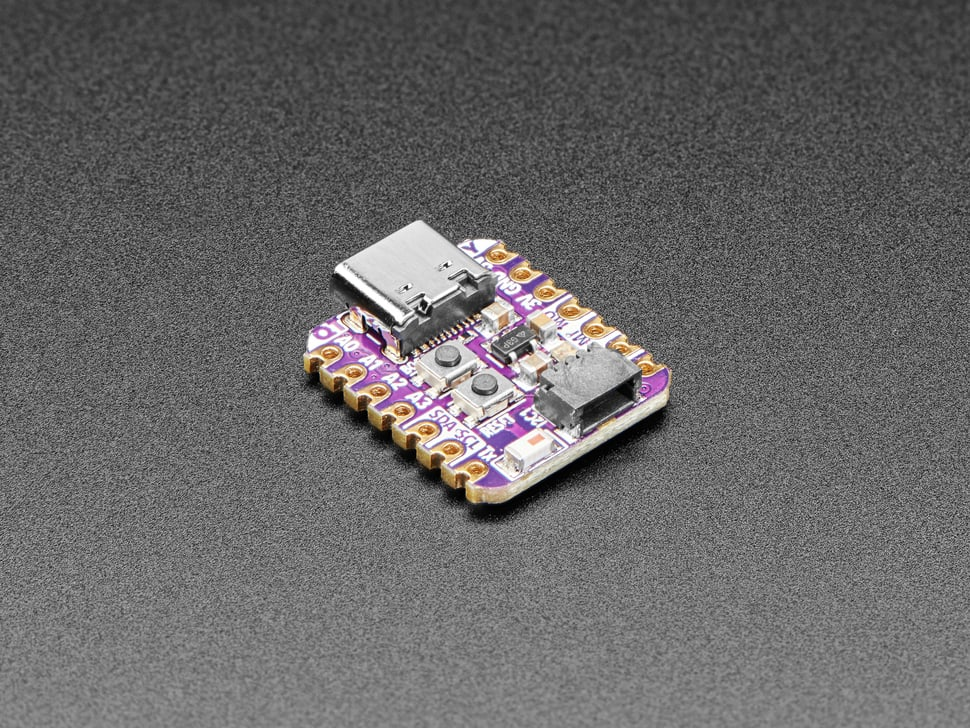

# Adafruit QT Py ESP32-S2 WiFi Dev Board with STEMMA QT

## Details

- **Location**: Cabinet-1, Bin 26
- **Category**: Microcontroller Boards
- **Type**: WiFi Development Board with STEMMA QT
- **Microcontroller**: ESP32-S2
- **Brand**: Adafruit
- **Part Number**: 5325
- **Quantity**: 10
- **Product URL**: https://www.adafruit.com/product/5325

## Description

The cutest ESP32-S2 development board! This diminutive dev board features the ESP32-S2 with built-in native USB, WiFi connectivity, and STEMMA QT connector for easy sensor integration. Compatible with Seeed Xiao form factor with castellated pads for direct PCB mounting.

## Specifications

- **Part Number**: 5325
- **Microcontroller**: ESP32-S2 (single-core)
- **Architecture**: Xtensa LX7 32-bit
- **Clock Speed**: 240MHz
- **Operating Voltage**: 3.3V
- **Flash Memory**: 4MB
- **PSRAM**: 2MB
- **Dimensions**: 21.8mm x 17.9mm x 5.7mm
- **Weight**: 2.1g

## Image

## Features

- **Native USB**: Built-in USB support - can act as keyboard/mouse, MIDI device, disk drive
- **WiFi Connectivity**: 2.4 GHz Wi-Fi 802.11 b/g/n
- **STEMMA QT Connector**: Plug-and-play I2C sensor connectivity
- **USB-C Connector**: Modern connector for programming and power
- **RGB NeoPixel**: Built-in addressable LED with power control
- **Xiao Compatible**: Same pinout and form factor as Seeed Xiao
- **Castellated Pads**: Can be soldered directly to PCB
- **Reset & Boot Buttons**: Easy programming and debugging

## Pin Configuration

- **Digital I/O**: 13 GPIO pins (11 on breakout, 2 on QT connector)
- **Analog Inputs**: 10 pins (12-bit ADC)
- **Analog Output**: 1 pin (8-bit DAC)
- **PWM**: Available on any pin
- **I2C**: Two ports (breakout pads + STEMMA QT)
- **SPI**: Hardware SPI on high-speed peripheral pins
- **UART**: Hardware UART
- **I2S**: Hardware I2S on any pins
- **Capacitive Touch**: 5 pins with no additional components

## Power Specifications

- **Operating Voltage**: 3.3V
- **Input Voltage**: 5V (USB-C) or up to 6V (battery pads)
- **Regulator**: 3.3V with 600mA peak output
- **Current Consumption**: 
  - Light sleep: 2-4mA
  - Deep sleep: ~70µA (hardware rev C)
- **Battery Support**: Underside pads with diode protection

## Applications

- IoT sensor nodes with WiFi connectivity
- USB HID devices (keyboard, mouse, MIDI)
- Wearable electronics projects
- STEMMA QT sensor networks
- CircuitPython projects
- Arduino WiFi projects
- Portable data loggers
- Smart home controllers

## Programming

- **Arduino IDE**: Full support with ESP32 board package
- **CircuitPython**: Native support with USB drive functionality
- **ESP-IDF**: Espressif development framework
- **USB Programming**: No external programmer needed
- **Libraries**: WiFi, HTTP, MQTT, sensor libraries

## STEMMA QT Ecosystem

- **Plug-and-Play**: No soldering required for I2C sensors
- **Chainable**: Multiple sensors can be daisy-chained
- **Compatible**: Works with SparkFun Qwiic and Seeed Grove I2C
- **Extensive**: Large ecosystem of compatible sensors and displays

## Advantages

- **Native USB**: Advanced USB functionality built-in
- **Compact Size**: Tiny form factor for space-constrained projects
- **Easy Connectivity**: STEMMA QT eliminates wiring complexity
- **Dual Programming**: Arduino IDE and CircuitPython support
- **Low Power**: Excellent for battery-powered applications
- **WiFi Built-in**: No additional modules needed for connectivity

## Hardware Revisions

- **Rev B (before Feb 28, 2022)**: Deep sleep draws ~6mA (hardware bug)
- **Rev C (after Feb 28, 2022)**: Fixed deep sleep (~70µA), improved antenna

## Notes

- Single-core ESP32-S2 (not dual-core like ESP32)
- No Bluetooth support (WiFi only)
- Native USB unlocks advanced interfacing capabilities
- 4MB Flash + 2MB PSRAM allows for complex applications
- Perfect for IoT projects requiring WiFi connectivity
- STEMMA QT connector makes sensor integration effortless
- Compatible with Xiao ecosystem accessories

## Tags

microcontroller, esp32-s2, wifi, qt-py, stemma-qt, usb-c, adafruit, iot, circuitpython
